These figures show emissions mapped across fuels, sectors and greenhouse gases. In most cases the contribution of fossil fuels to industrial processes is unknown.

Please cite the figures or data as follows: Lamb, W. F. (2026). Tidy GHG Inventories (v2) [Data set]. Zenodo. https://doi.org/10.5281/zenodo.14512139

<select onchange="if (this.value) window.location.hash=this.value"><option value=''>Jump to country…</option><option value='albania'>Albania</option>
<option value='algeria'>Algeria</option>
<option value='argentina'>Argentina</option>
<option value='armenia'>Armenia</option>
<option value='australia'>Australia</option>
<option value='austria'>Austria</option>
<option value='azerbaijan'>Azerbaijan</option>
<option value='bahrain'>Bahrain</option>
<option value='belarus'>Belarus</option>
<option value='belgium'>Belgium</option>
<option value='belize'>Belize</option>
<option value='bhutan'>Bhutan</option>
<option value='brazil'>Brazil</option>
<option value='brunei'>Brunei</option>
<option value='bulgaria'>Bulgaria</option>
<option value='burkina-faso'>Burkina Faso</option>
<option value='burundi'>Burundi</option>
<option value='canada'>Canada</option>
<option value='chile'>Chile</option>
<option value='china'>China</option>
<option value='colombia'>Colombia</option>
<option value='costa-rica'>Costa Rica</option>
<option value='croatia'>Croatia</option>
<option value='cuba'>Cuba</option>
<option value='cyprus'>Cyprus</option>
<option value='czechia'>Czechia</option>
<option value='denmark'>Denmark</option>
<option value='egypt'>Egypt</option>
<option value='estonia'>Estonia</option>
<option value='eswatini'>Eswatini</option>
<option value='european-union'>European Union</option>
<option value='finland'>Finland</option>
<option value='france'>France</option>
<option value='gabon'>Gabon</option>
<option value='georgia'>Georgia</option>
<option value='germany'>Germany</option>
<option value='ghana'>Ghana</option>
<option value='greece'>Greece</option>
<option value='guatemala'>Guatemala</option>
<option value='guinea-bissau'>Guinea-Bissau</option>
<option value='guyana'>Guyana</option>
<option value='honduras'>Honduras</option>
<option value='hungary'>Hungary</option>
<option value='iceland'>Iceland</option>
<option value='india'>India</option>
<option value='indonesia'>Indonesia</option>
<option value='iraq'>Iraq</option>
<option value='ireland'>Ireland</option>
<option value='israel'>Israel</option>
<option value='italy'>Italy</option>
<option value='japan'>Japan</option>
<option value='kazakhstan'>Kazakhstan</option>
<option value='kenya'>Kenya</option>
<option value='laos'>Laos</option>
<option value='latvia'>Latvia</option>
<option value='lebanon'>Lebanon</option>
<option value='liechtenstein'>Liechtenstein</option>
<option value='lithuania'>Lithuania</option>
<option value='luxembourg'>Luxembourg</option>
<option value='malaysia'>Malaysia</option>
<option value='maldives'>Maldives</option>
<option value='malta'>Malta</option>
<option value='mauritius'>Mauritius</option>
<option value='mexico'>Mexico</option>
<option value='moldova'>Moldova</option>
<option value='monaco'>Monaco</option>
<option value='mongolia'>Mongolia</option>
<option value='morocco'>Morocco</option>
<option value='namibia'>Namibia</option>
<option value='nepal'>Nepal</option>
<option value='netherlands'>Netherlands</option>
<option value='new-zealand'>New Zealand</option>
<option value='nigeria'>Nigeria</option>
<option value='norway'>Norway</option>
<option value='oman'>Oman</option>
<option value='panama'>Panama</option>
<option value='poland'>Poland</option>
<option value='portugal'>Portugal</option>
<option value='romania'>Romania</option>
<option value='russia'>Russia</option>
<option value='rwanda'>Rwanda</option>
<option value='saudi-arabia'>Saudi Arabia</option>
<option value='serbia'>Serbia</option>
<option value='singapore'>Singapore</option>
<option value='slovakia'>Slovakia</option>
<option value='slovenia'>Slovenia</option>
<option value='solomon-islands'>Solomon Islands</option>
<option value='south-africa'>South Africa</option>
<option value='south-korea'>South Korea</option>
<option value='spain'>Spain</option>
<option value='sweden'>Sweden</option>
<option value='switzerland'>Switzerland</option>
<option value='tajikistan'>Tajikistan</option>
<option value='thailand'>Thailand</option>
<option value='turkey'>Turkey</option>
<option value='ukraine'>Ukraine</option>
<option value='united-kingdom'>United Kingdom</option>
<option value='united-states'>United States</option>
<option value='uruguay'>Uruguay</option>
<option value='uzbekistan'>Uzbekistan</option>
<option value='vatican-city'>Vatican City</option>
<option value='zambia'>Zambia</option></select>

- 
  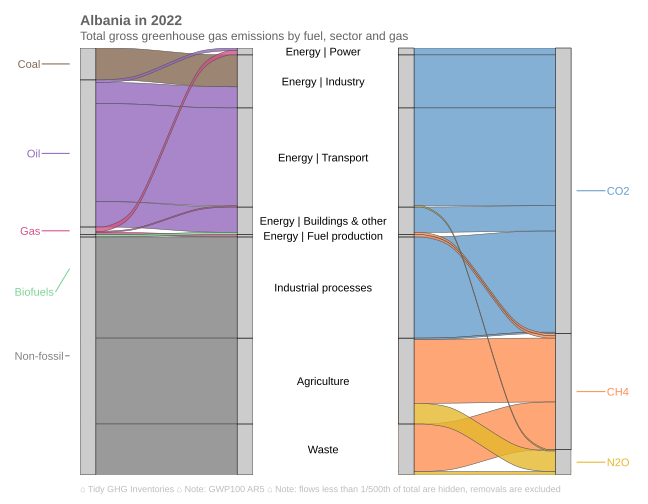
  <a target='_blank' href='https://raw.githubusercontent.com/lambwf/Tidy-GHG-Inventories/main/plots/countries/sankeys/Albania-sankey.xlsx'>data</a> | <a target='_blank' href='https://raw.githubusercontent.com/lambwf/Tidy-GHG-Inventories/main/plots/countries/sankeys/Albania-sankey.png'>png</a> | <a target='_blank' href='https://raw.githubusercontent.com/lambwf/Tidy-GHG-Inventories/main/plots/countries/sankeys/Albania-sankey.pdf'>pdf</a> | <a target='_blank' href='https://raw.githubusercontent.com/lambwf/Tidy-GHG-Inventories/main/plots/countries/sankeys/Albania-sankey.svg'>svg</a>

- 
  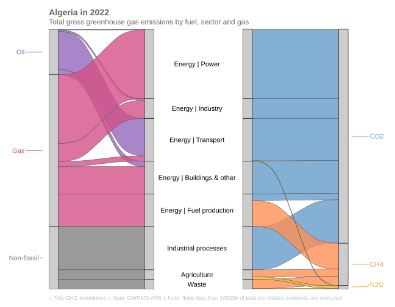
  <a target='_blank' href='https://raw.githubusercontent.com/lambwf/Tidy-GHG-Inventories/main/plots/countries/sankeys/Algeria-sankey.xlsx'>data</a> | <a target='_blank' href='https://raw.githubusercontent.com/lambwf/Tidy-GHG-Inventories/main/plots/countries/sankeys/Algeria-sankey.png'>png</a> | <a target='_blank' href='https://raw.githubusercontent.com/lambwf/Tidy-GHG-Inventories/main/plots/countries/sankeys/Algeria-sankey.pdf'>pdf</a> | <a target='_blank' href='https://raw.githubusercontent.com/lambwf/Tidy-GHG-Inventories/main/plots/countries/sankeys/Algeria-sankey.svg'>svg</a>

- 
  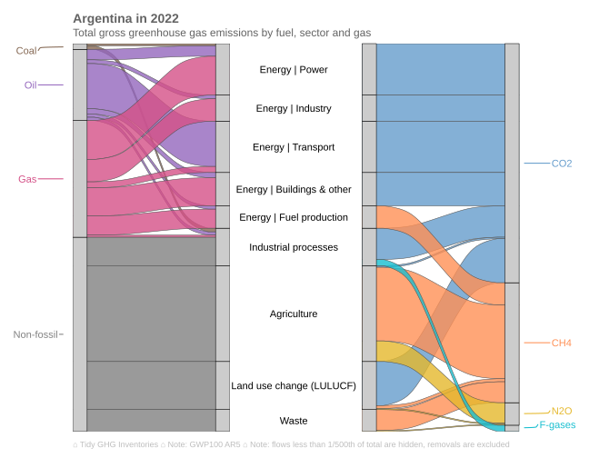
  <a target='_blank' href='https://raw.githubusercontent.com/lambwf/Tidy-GHG-Inventories/main/plots/countries/sankeys/Argentina-sankey.xlsx'>data</a> | <a target='_blank' href='https://raw.githubusercontent.com/lambwf/Tidy-GHG-Inventories/main/plots/countries/sankeys/Argentina-sankey.png'>png</a> | <a target='_blank' href='https://raw.githubusercontent.com/lambwf/Tidy-GHG-Inventories/main/plots/countries/sankeys/Argentina-sankey.pdf'>pdf</a> | <a target='_blank' href='https://raw.githubusercontent.com/lambwf/Tidy-GHG-Inventories/main/plots/countries/sankeys/Argentina-sankey.svg'>svg</a>

- 
  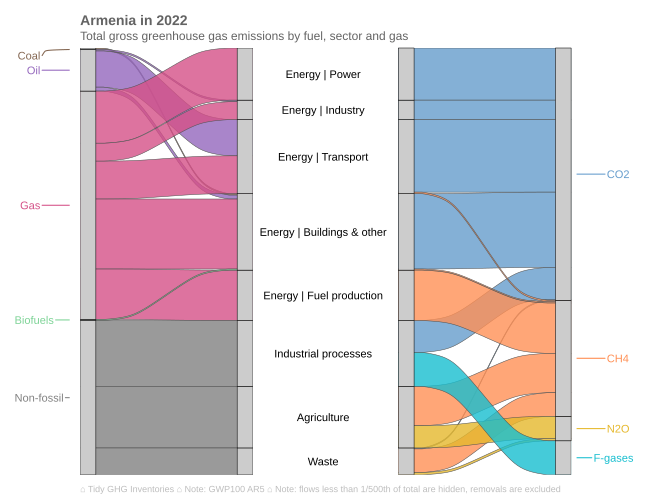
  <a target='_blank' href='https://raw.githubusercontent.com/lambwf/Tidy-GHG-Inventories/main/plots/countries/sankeys/Armenia-sankey.xlsx'>data</a> | <a target='_blank' href='https://raw.githubusercontent.com/lambwf/Tidy-GHG-Inventories/main/plots/countries/sankeys/Armenia-sankey.png'>png</a> | <a target='_blank' href='https://raw.githubusercontent.com/lambwf/Tidy-GHG-Inventories/main/plots/countries/sankeys/Armenia-sankey.pdf'>pdf</a> | <a target='_blank' href='https://raw.githubusercontent.com/lambwf/Tidy-GHG-Inventories/main/plots/countries/sankeys/Armenia-sankey.svg'>svg</a>

- 
  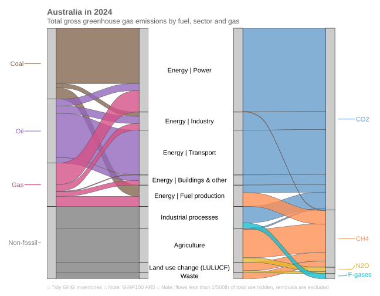
  <a target='_blank' href='https://raw.githubusercontent.com/lambwf/Tidy-GHG-Inventories/main/plots/countries/sankeys/Australia-sankey.xlsx'>data</a> | <a target='_blank' href='https://raw.githubusercontent.com/lambwf/Tidy-GHG-Inventories/main/plots/countries/sankeys/Australia-sankey.png'>png</a> | <a target='_blank' href='https://raw.githubusercontent.com/lambwf/Tidy-GHG-Inventories/main/plots/countries/sankeys/Australia-sankey.pdf'>pdf</a> | <a target='_blank' href='https://raw.githubusercontent.com/lambwf/Tidy-GHG-Inventories/main/plots/countries/sankeys/Australia-sankey.svg'>svg</a>

- 
  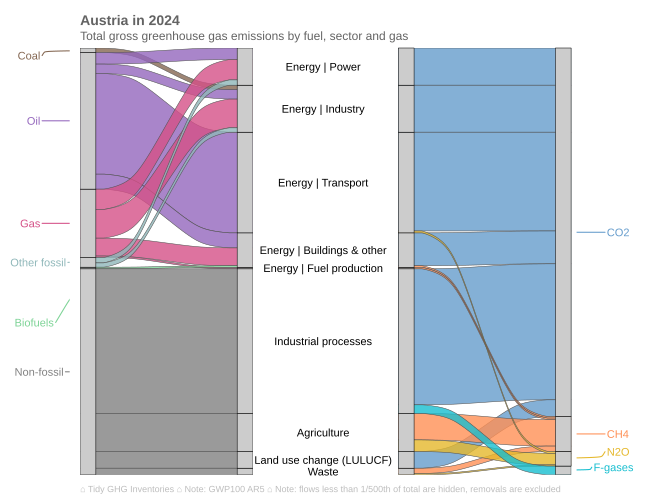
  <a target='_blank' href='https://raw.githubusercontent.com/lambwf/Tidy-GHG-Inventories/main/plots/countries/sankeys/Austria-sankey.xlsx'>data</a> | <a target='_blank' href='https://raw.githubusercontent.com/lambwf/Tidy-GHG-Inventories/main/plots/countries/sankeys/Austria-sankey.png'>png</a> | <a target='_blank' href='https://raw.githubusercontent.com/lambwf/Tidy-GHG-Inventories/main/plots/countries/sankeys/Austria-sankey.pdf'>pdf</a> | <a target='_blank' href='https://raw.githubusercontent.com/lambwf/Tidy-GHG-Inventories/main/plots/countries/sankeys/Austria-sankey.svg'>svg</a>

- 
  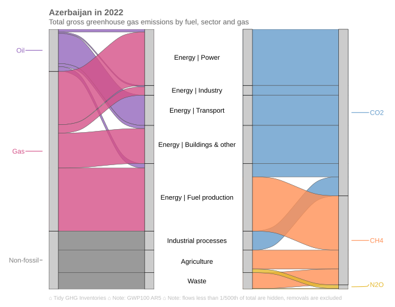
  <a target='_blank' href='https://raw.githubusercontent.com/lambwf/Tidy-GHG-Inventories/main/plots/countries/sankeys/Azerbaijan-sankey.xlsx'>data</a> | <a target='_blank' href='https://raw.githubusercontent.com/lambwf/Tidy-GHG-Inventories/main/plots/countries/sankeys/Azerbaijan-sankey.png'>png</a> | <a target='_blank' href='https://raw.githubusercontent.com/lambwf/Tidy-GHG-Inventories/main/plots/countries/sankeys/Azerbaijan-sankey.pdf'>pdf</a> | <a target='_blank' href='https://raw.githubusercontent.com/lambwf/Tidy-GHG-Inventories/main/plots/countries/sankeys/Azerbaijan-sankey.svg'>svg</a>

- 
  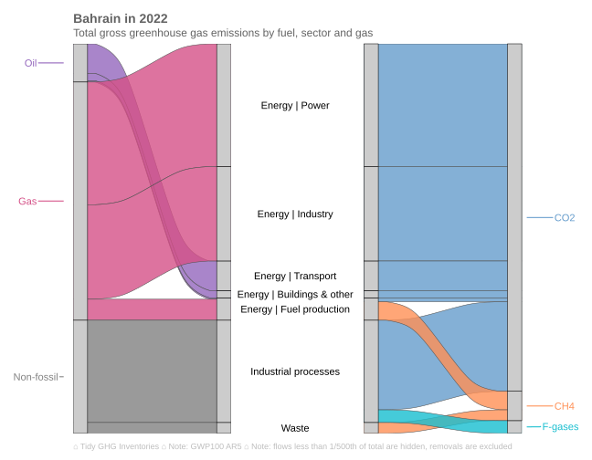
  <a target='_blank' href='https://raw.githubusercontent.com/lambwf/Tidy-GHG-Inventories/main/plots/countries/sankeys/Bahrain-sankey.xlsx'>data</a> | <a target='_blank' href='https://raw.githubusercontent.com/lambwf/Tidy-GHG-Inventories/main/plots/countries/sankeys/Bahrain-sankey.png'>png</a> | <a target='_blank' href='https://raw.githubusercontent.com/lambwf/Tidy-GHG-Inventories/main/plots/countries/sankeys/Bahrain-sankey.pdf'>pdf</a> | <a target='_blank' href='https://raw.githubusercontent.com/lambwf/Tidy-GHG-Inventories/main/plots/countries/sankeys/Bahrain-sankey.svg'>svg</a>

- 
  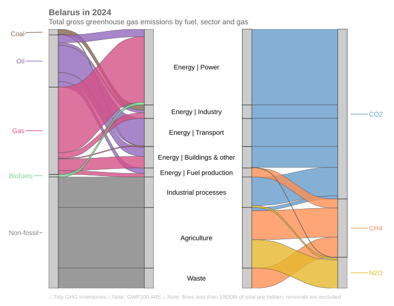
  <a target='_blank' href='https://raw.githubusercontent.com/lambwf/Tidy-GHG-Inventories/main/plots/countries/sankeys/Belarus-sankey.xlsx'>data</a> | <a target='_blank' href='https://raw.githubusercontent.com/lambwf/Tidy-GHG-Inventories/main/plots/countries/sankeys/Belarus-sankey.png'>png</a> | <a target='_blank' href='https://raw.githubusercontent.com/lambwf/Tidy-GHG-Inventories/main/plots/countries/sankeys/Belarus-sankey.pdf'>pdf</a> | <a target='_blank' href='https://raw.githubusercontent.com/lambwf/Tidy-GHG-Inventories/main/plots/countries/sankeys/Belarus-sankey.svg'>svg</a>

- 
  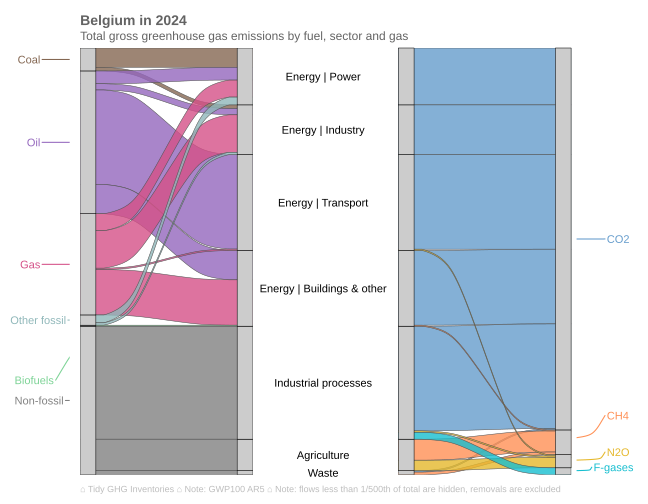
  <a target='_blank' href='https://raw.githubusercontent.com/lambwf/Tidy-GHG-Inventories/main/plots/countries/sankeys/Belgium-sankey.xlsx'>data</a> | <a target='_blank' href='https://raw.githubusercontent.com/lambwf/Tidy-GHG-Inventories/main/plots/countries/sankeys/Belgium-sankey.png'>png</a> | <a target='_blank' href='https://raw.githubusercontent.com/lambwf/Tidy-GHG-Inventories/main/plots/countries/sankeys/Belgium-sankey.pdf'>pdf</a> | <a target='_blank' href='https://raw.githubusercontent.com/lambwf/Tidy-GHG-Inventories/main/plots/countries/sankeys/Belgium-sankey.svg'>svg</a>

- 
  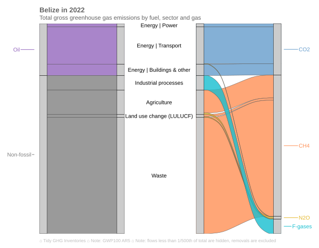
  <a target='_blank' href='https://raw.githubusercontent.com/lambwf/Tidy-GHG-Inventories/main/plots/countries/sankeys/Belize-sankey.xlsx'>data</a> | <a target='_blank' href='https://raw.githubusercontent.com/lambwf/Tidy-GHG-Inventories/main/plots/countries/sankeys/Belize-sankey.png'>png</a> | <a target='_blank' href='https://raw.githubusercontent.com/lambwf/Tidy-GHG-Inventories/main/plots/countries/sankeys/Belize-sankey.pdf'>pdf</a> | <a target='_blank' href='https://raw.githubusercontent.com/lambwf/Tidy-GHG-Inventories/main/plots/countries/sankeys/Belize-sankey.svg'>svg</a>

- 
  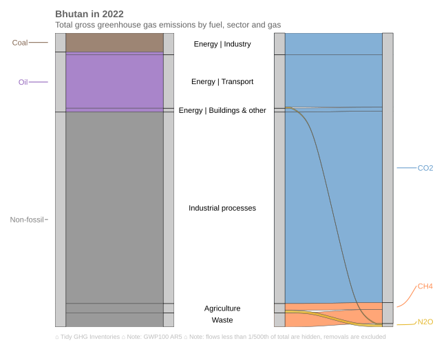
  <a target='_blank' href='https://raw.githubusercontent.com/lambwf/Tidy-GHG-Inventories/main/plots/countries/sankeys/Bhutan-sankey.xlsx'>data</a> | <a target='_blank' href='https://raw.githubusercontent.com/lambwf/Tidy-GHG-Inventories/main/plots/countries/sankeys/Bhutan-sankey.png'>png</a> | <a target='_blank' href='https://raw.githubusercontent.com/lambwf/Tidy-GHG-Inventories/main/plots/countries/sankeys/Bhutan-sankey.pdf'>pdf</a> | <a target='_blank' href='https://raw.githubusercontent.com/lambwf/Tidy-GHG-Inventories/main/plots/countries/sankeys/Bhutan-sankey.svg'>svg</a>

- 
  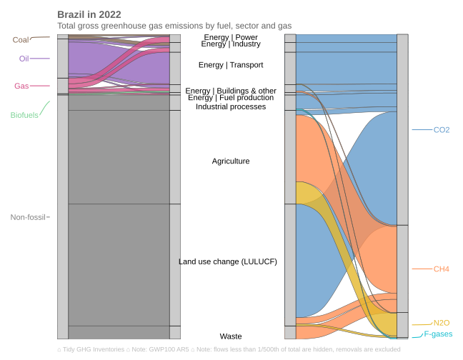
  <a target='_blank' href='https://raw.githubusercontent.com/lambwf/Tidy-GHG-Inventories/main/plots/countries/sankeys/Brazil-sankey.xlsx'>data</a> | <a target='_blank' href='https://raw.githubusercontent.com/lambwf/Tidy-GHG-Inventories/main/plots/countries/sankeys/Brazil-sankey.png'>png</a> | <a target='_blank' href='https://raw.githubusercontent.com/lambwf/Tidy-GHG-Inventories/main/plots/countries/sankeys/Brazil-sankey.pdf'>pdf</a> | <a target='_blank' href='https://raw.githubusercontent.com/lambwf/Tidy-GHG-Inventories/main/plots/countries/sankeys/Brazil-sankey.svg'>svg</a>

- 
  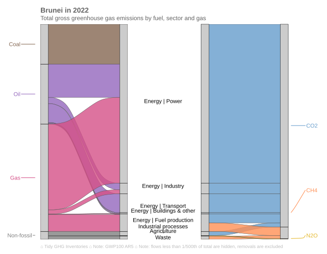
  <a target='_blank' href='https://raw.githubusercontent.com/lambwf/Tidy-GHG-Inventories/main/plots/countries/sankeys/Brunei-sankey.xlsx'>data</a> | <a target='_blank' href='https://raw.githubusercontent.com/lambwf/Tidy-GHG-Inventories/main/plots/countries/sankeys/Brunei-sankey.png'>png</a> | <a target='_blank' href='https://raw.githubusercontent.com/lambwf/Tidy-GHG-Inventories/main/plots/countries/sankeys/Brunei-sankey.pdf'>pdf</a> | <a target='_blank' href='https://raw.githubusercontent.com/lambwf/Tidy-GHG-Inventories/main/plots/countries/sankeys/Brunei-sankey.svg'>svg</a>

- 
  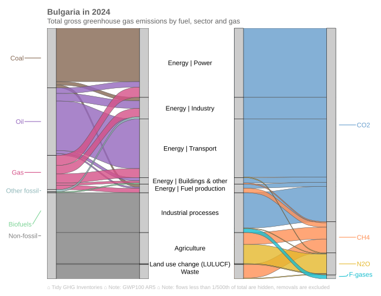
  <a target='_blank' href='https://raw.githubusercontent.com/lambwf/Tidy-GHG-Inventories/main/plots/countries/sankeys/Bulgaria-sankey.xlsx'>data</a> | <a target='_blank' href='https://raw.githubusercontent.com/lambwf/Tidy-GHG-Inventories/main/plots/countries/sankeys/Bulgaria-sankey.png'>png</a> | <a target='_blank' href='https://raw.githubusercontent.com/lambwf/Tidy-GHG-Inventories/main/plots/countries/sankeys/Bulgaria-sankey.pdf'>pdf</a> | <a target='_blank' href='https://raw.githubusercontent.com/lambwf/Tidy-GHG-Inventories/main/plots/countries/sankeys/Bulgaria-sankey.svg'>svg</a>

- 
  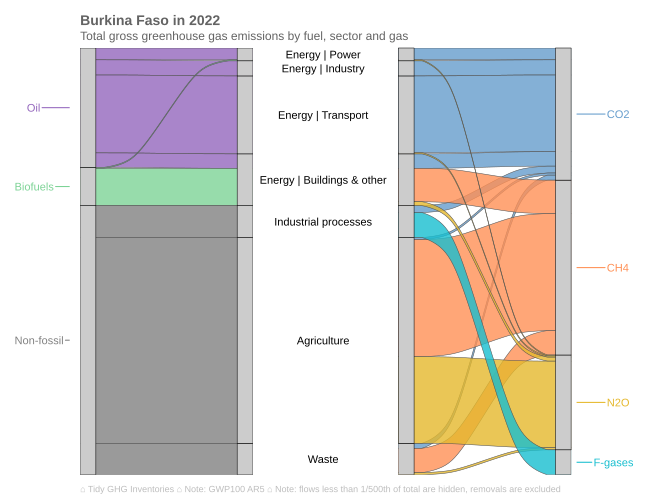
  <a target='_blank' href='https://raw.githubusercontent.com/lambwf/Tidy-GHG-Inventories/main/plots/countries/sankeys/Burkina Faso-sankey.xlsx'>data</a> | <a target='_blank' href='https://raw.githubusercontent.com/lambwf/Tidy-GHG-Inventories/main/plots/countries/sankeys/Burkina Faso-sankey.png'>png</a> | <a target='_blank' href='https://raw.githubusercontent.com/lambwf/Tidy-GHG-Inventories/main/plots/countries/sankeys/Burkina Faso-sankey.pdf'>pdf</a> | <a target='_blank' href='https://raw.githubusercontent.com/lambwf/Tidy-GHG-Inventories/main/plots/countries/sankeys/Burkina Faso-sankey.svg'>svg</a>

- 
  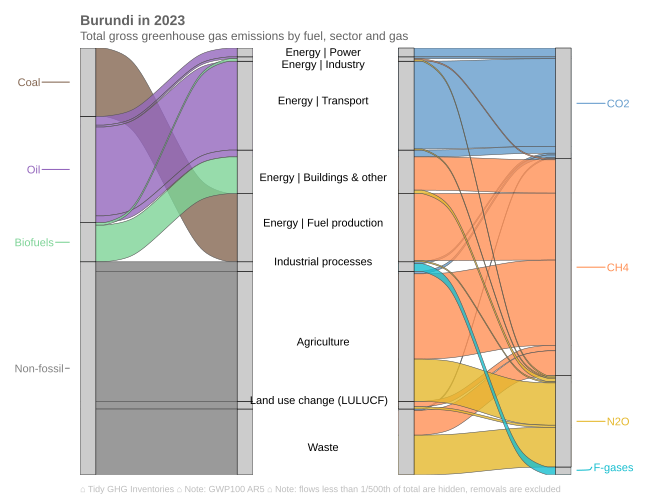
  <a target='_blank' href='https://raw.githubusercontent.com/lambwf/Tidy-GHG-Inventories/main/plots/countries/sankeys/Burundi-sankey.xlsx'>data</a> | <a target='_blank' href='https://raw.githubusercontent.com/lambwf/Tidy-GHG-Inventories/main/plots/countries/sankeys/Burundi-sankey.png'>png</a> | <a target='_blank' href='https://raw.githubusercontent.com/lambwf/Tidy-GHG-Inventories/main/plots/countries/sankeys/Burundi-sankey.pdf'>pdf</a> | <a target='_blank' href='https://raw.githubusercontent.com/lambwf/Tidy-GHG-Inventories/main/plots/countries/sankeys/Burundi-sankey.svg'>svg</a>

- 
  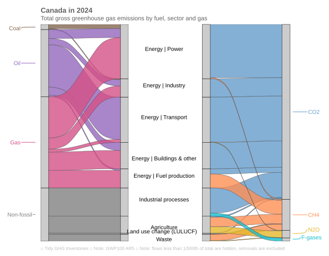
  <a target='_blank' href='https://raw.githubusercontent.com/lambwf/Tidy-GHG-Inventories/main/plots/countries/sankeys/Canada-sankey.xlsx'>data</a> | <a target='_blank' href='https://raw.githubusercontent.com/lambwf/Tidy-GHG-Inventories/main/plots/countries/sankeys/Canada-sankey.png'>png</a> | <a target='_blank' href='https://raw.githubusercontent.com/lambwf/Tidy-GHG-Inventories/main/plots/countries/sankeys/Canada-sankey.pdf'>pdf</a> | <a target='_blank' href='https://raw.githubusercontent.com/lambwf/Tidy-GHG-Inventories/main/plots/countries/sankeys/Canada-sankey.svg'>svg</a>

- 
  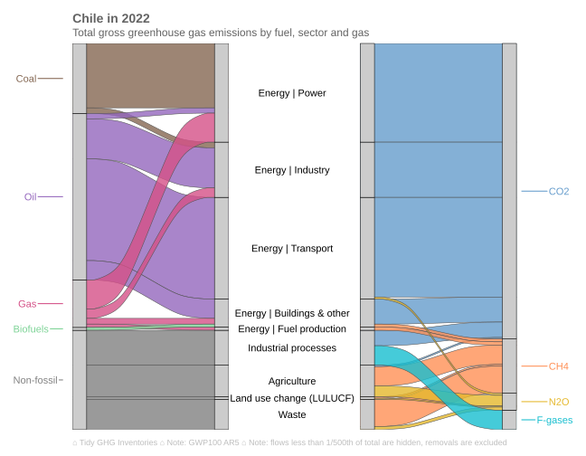
  <a target='_blank' href='https://raw.githubusercontent.com/lambwf/Tidy-GHG-Inventories/main/plots/countries/sankeys/Chile-sankey.xlsx'>data</a> | <a target='_blank' href='https://raw.githubusercontent.com/lambwf/Tidy-GHG-Inventories/main/plots/countries/sankeys/Chile-sankey.png'>png</a> | <a target='_blank' href='https://raw.githubusercontent.com/lambwf/Tidy-GHG-Inventories/main/plots/countries/sankeys/Chile-sankey.pdf'>pdf</a> | <a target='_blank' href='https://raw.githubusercontent.com/lambwf/Tidy-GHG-Inventories/main/plots/countries/sankeys/Chile-sankey.svg'>svg</a>

- 
  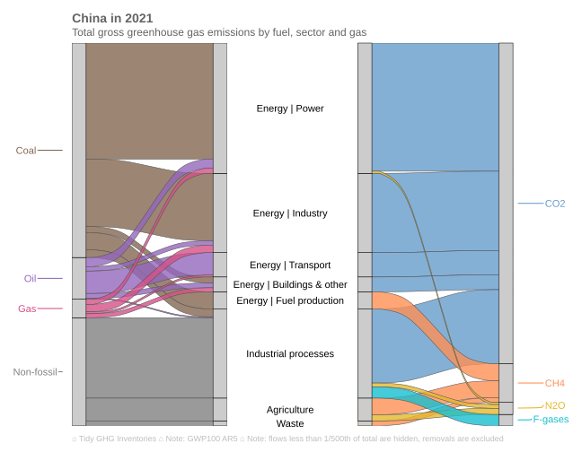
  <a target='_blank' href='https://raw.githubusercontent.com/lambwf/Tidy-GHG-Inventories/main/plots/countries/sankeys/China-sankey.xlsx'>data</a> | <a target='_blank' href='https://raw.githubusercontent.com/lambwf/Tidy-GHG-Inventories/main/plots/countries/sankeys/China-sankey.png'>png</a> | <a target='_blank' href='https://raw.githubusercontent.com/lambwf/Tidy-GHG-Inventories/main/plots/countries/sankeys/China-sankey.pdf'>pdf</a> | <a target='_blank' href='https://raw.githubusercontent.com/lambwf/Tidy-GHG-Inventories/main/plots/countries/sankeys/China-sankey.svg'>svg</a>

- 
  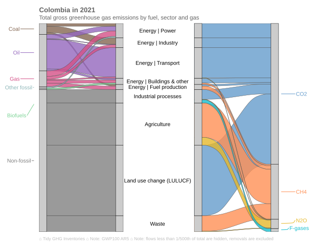
  <a target='_blank' href='https://raw.githubusercontent.com/lambwf/Tidy-GHG-Inventories/main/plots/countries/sankeys/Colombia-sankey.xlsx'>data</a> | <a target='_blank' href='https://raw.githubusercontent.com/lambwf/Tidy-GHG-Inventories/main/plots/countries/sankeys/Colombia-sankey.png'>png</a> | <a target='_blank' href='https://raw.githubusercontent.com/lambwf/Tidy-GHG-Inventories/main/plots/countries/sankeys/Colombia-sankey.pdf'>pdf</a> | <a target='_blank' href='https://raw.githubusercontent.com/lambwf/Tidy-GHG-Inventories/main/plots/countries/sankeys/Colombia-sankey.svg'>svg</a>

- 
  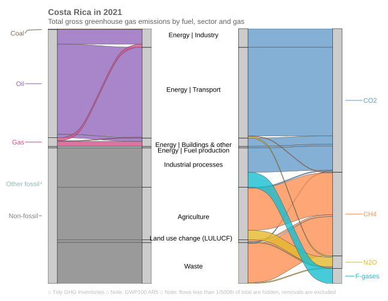
  <a target='_blank' href='https://raw.githubusercontent.com/lambwf/Tidy-GHG-Inventories/main/plots/countries/sankeys/Costa Rica-sankey.xlsx'>data</a> | <a target='_blank' href='https://raw.githubusercontent.com/lambwf/Tidy-GHG-Inventories/main/plots/countries/sankeys/Costa Rica-sankey.png'>png</a> | <a target='_blank' href='https://raw.githubusercontent.com/lambwf/Tidy-GHG-Inventories/main/plots/countries/sankeys/Costa Rica-sankey.pdf'>pdf</a> | <a target='_blank' href='https://raw.githubusercontent.com/lambwf/Tidy-GHG-Inventories/main/plots/countries/sankeys/Costa Rica-sankey.svg'>svg</a>

- 
  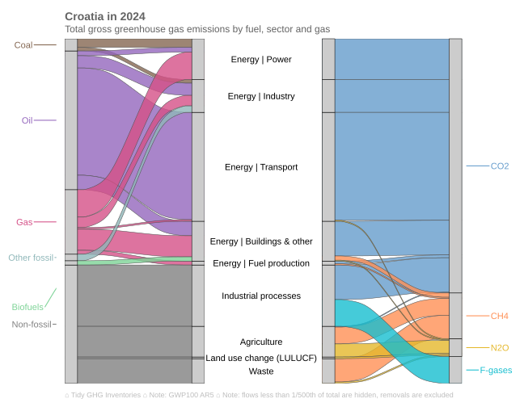
  <a target='_blank' href='https://raw.githubusercontent.com/lambwf/Tidy-GHG-Inventories/main/plots/countries/sankeys/Croatia-sankey.xlsx'>data</a> | <a target='_blank' href='https://raw.githubusercontent.com/lambwf/Tidy-GHG-Inventories/main/plots/countries/sankeys/Croatia-sankey.png'>png</a> | <a target='_blank' href='https://raw.githubusercontent.com/lambwf/Tidy-GHG-Inventories/main/plots/countries/sankeys/Croatia-sankey.pdf'>pdf</a> | <a target='_blank' href='https://raw.githubusercontent.com/lambwf/Tidy-GHG-Inventories/main/plots/countries/sankeys/Croatia-sankey.svg'>svg</a>

- 
  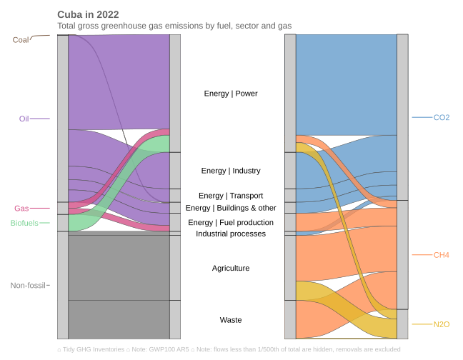
  <a target='_blank' href='https://raw.githubusercontent.com/lambwf/Tidy-GHG-Inventories/main/plots/countries/sankeys/Cuba-sankey.xlsx'>data</a> | <a target='_blank' href='https://raw.githubusercontent.com/lambwf/Tidy-GHG-Inventories/main/plots/countries/sankeys/Cuba-sankey.png'>png</a> | <a target='_blank' href='https://raw.githubusercontent.com/lambwf/Tidy-GHG-Inventories/main/plots/countries/sankeys/Cuba-sankey.pdf'>pdf</a> | <a target='_blank' href='https://raw.githubusercontent.com/lambwf/Tidy-GHG-Inventories/main/plots/countries/sankeys/Cuba-sankey.svg'>svg</a>

- 
  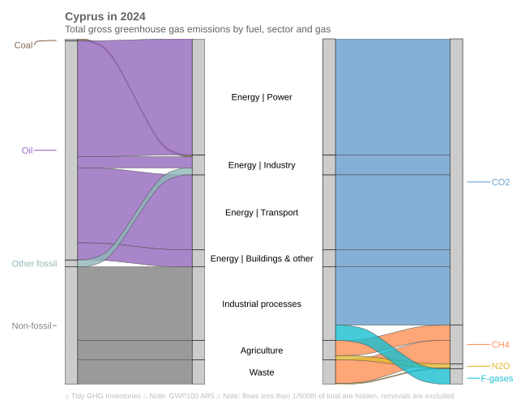
  <a target='_blank' href='https://raw.githubusercontent.com/lambwf/Tidy-GHG-Inventories/main/plots/countries/sankeys/Cyprus-sankey.xlsx'>data</a> | <a target='_blank' href='https://raw.githubusercontent.com/lambwf/Tidy-GHG-Inventories/main/plots/countries/sankeys/Cyprus-sankey.png'>png</a> | <a target='_blank' href='https://raw.githubusercontent.com/lambwf/Tidy-GHG-Inventories/main/plots/countries/sankeys/Cyprus-sankey.pdf'>pdf</a> | <a target='_blank' href='https://raw.githubusercontent.com/lambwf/Tidy-GHG-Inventories/main/plots/countries/sankeys/Cyprus-sankey.svg'>svg</a>

- 
  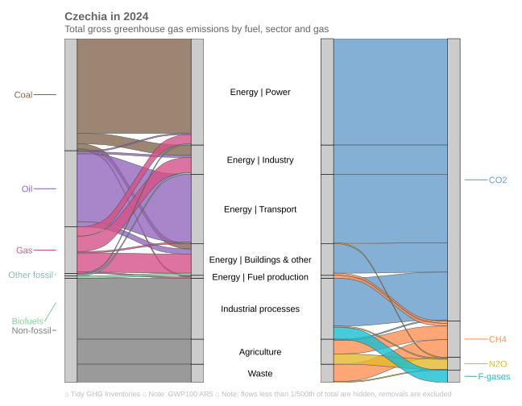
  <a target='_blank' href='https://raw.githubusercontent.com/lambwf/Tidy-GHG-Inventories/main/plots/countries/sankeys/Czechia-sankey.xlsx'>data</a> | <a target='_blank' href='https://raw.githubusercontent.com/lambwf/Tidy-GHG-Inventories/main/plots/countries/sankeys/Czechia-sankey.png'>png</a> | <a target='_blank' href='https://raw.githubusercontent.com/lambwf/Tidy-GHG-Inventories/main/plots/countries/sankeys/Czechia-sankey.pdf'>pdf</a> | <a target='_blank' href='https://raw.githubusercontent.com/lambwf/Tidy-GHG-Inventories/main/plots/countries/sankeys/Czechia-sankey.svg'>svg</a>

- 
  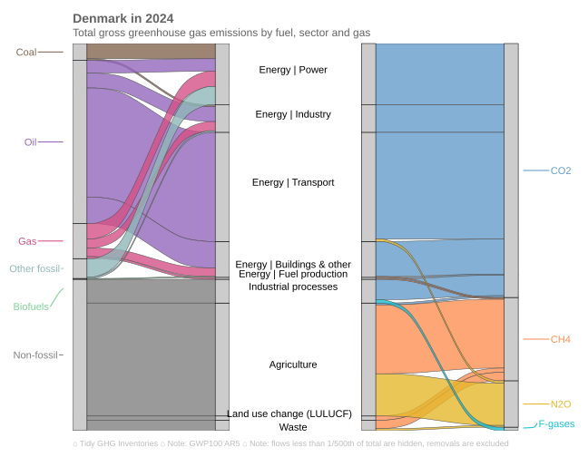
  <a target='_blank' href='https://raw.githubusercontent.com/lambwf/Tidy-GHG-Inventories/main/plots/countries/sankeys/Denmark-sankey.xlsx'>data</a> | <a target='_blank' href='https://raw.githubusercontent.com/lambwf/Tidy-GHG-Inventories/main/plots/countries/sankeys/Denmark-sankey.png'>png</a> | <a target='_blank' href='https://raw.githubusercontent.com/lambwf/Tidy-GHG-Inventories/main/plots/countries/sankeys/Denmark-sankey.pdf'>pdf</a> | <a target='_blank' href='https://raw.githubusercontent.com/lambwf/Tidy-GHG-Inventories/main/plots/countries/sankeys/Denmark-sankey.svg'>svg</a>

- 
  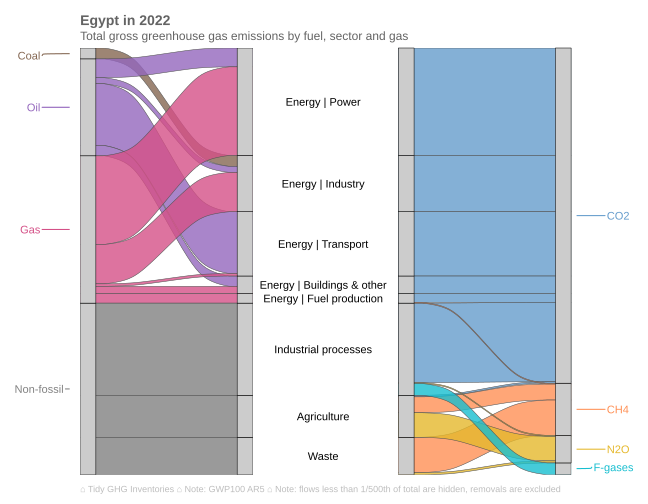
  <a target='_blank' href='https://raw.githubusercontent.com/lambwf/Tidy-GHG-Inventories/main/plots/countries/sankeys/Egypt-sankey.xlsx'>data</a> | <a target='_blank' href='https://raw.githubusercontent.com/lambwf/Tidy-GHG-Inventories/main/plots/countries/sankeys/Egypt-sankey.png'>png</a> | <a target='_blank' href='https://raw.githubusercontent.com/lambwf/Tidy-GHG-Inventories/main/plots/countries/sankeys/Egypt-sankey.pdf'>pdf</a> | <a target='_blank' href='https://raw.githubusercontent.com/lambwf/Tidy-GHG-Inventories/main/plots/countries/sankeys/Egypt-sankey.svg'>svg</a>

- 
  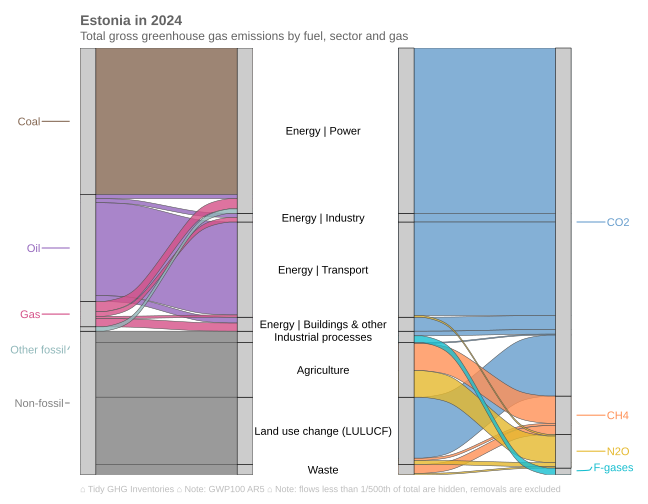
  <a target='_blank' href='https://raw.githubusercontent.com/lambwf/Tidy-GHG-Inventories/main/plots/countries/sankeys/Estonia-sankey.xlsx'>data</a> | <a target='_blank' href='https://raw.githubusercontent.com/lambwf/Tidy-GHG-Inventories/main/plots/countries/sankeys/Estonia-sankey.png'>png</a> | <a target='_blank' href='https://raw.githubusercontent.com/lambwf/Tidy-GHG-Inventories/main/plots/countries/sankeys/Estonia-sankey.pdf'>pdf</a> | <a target='_blank' href='https://raw.githubusercontent.com/lambwf/Tidy-GHG-Inventories/main/plots/countries/sankeys/Estonia-sankey.svg'>svg</a>

- 
  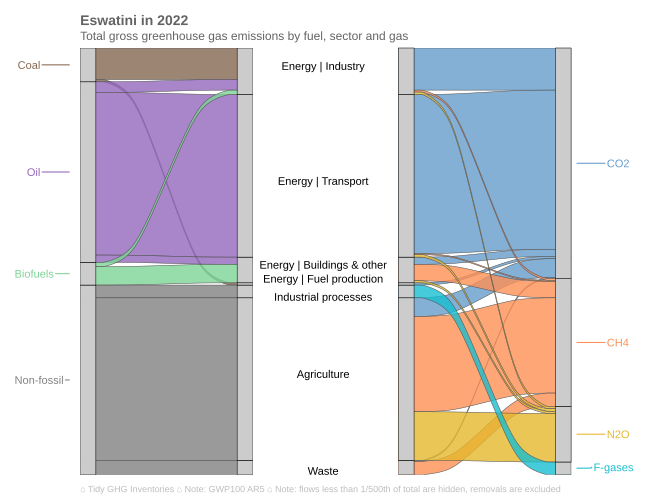
  <a target='_blank' href='https://raw.githubusercontent.com/lambwf/Tidy-GHG-Inventories/main/plots/countries/sankeys/Eswatini-sankey.xlsx'>data</a> | <a target='_blank' href='https://raw.githubusercontent.com/lambwf/Tidy-GHG-Inventories/main/plots/countries/sankeys/Eswatini-sankey.png'>png</a> | <a target='_blank' href='https://raw.githubusercontent.com/lambwf/Tidy-GHG-Inventories/main/plots/countries/sankeys/Eswatini-sankey.pdf'>pdf</a> | <a target='_blank' href='https://raw.githubusercontent.com/lambwf/Tidy-GHG-Inventories/main/plots/countries/sankeys/Eswatini-sankey.svg'>svg</a>

- 
  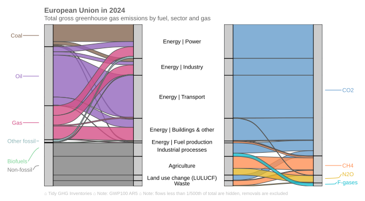
  <a target='_blank' href='https://raw.githubusercontent.com/lambwf/Tidy-GHG-Inventories/main/plots/countries/sankeys/European Union-sankey.xlsx'>data</a> | <a target='_blank' href='https://raw.githubusercontent.com/lambwf/Tidy-GHG-Inventories/main/plots/countries/sankeys/European Union-sankey.png'>png</a> | <a target='_blank' href='https://raw.githubusercontent.com/lambwf/Tidy-GHG-Inventories/main/plots/countries/sankeys/European Union-sankey.pdf'>pdf</a> | <a target='_blank' href='https://raw.githubusercontent.com/lambwf/Tidy-GHG-Inventories/main/plots/countries/sankeys/European Union-sankey.svg'>svg</a>

- 
  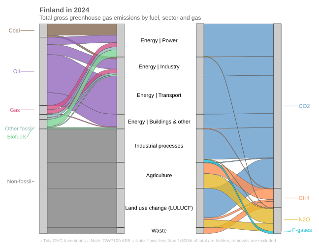
  <a target='_blank' href='https://raw.githubusercontent.com/lambwf/Tidy-GHG-Inventories/main/plots/countries/sankeys/Finland-sankey.xlsx'>data</a> | <a target='_blank' href='https://raw.githubusercontent.com/lambwf/Tidy-GHG-Inventories/main/plots/countries/sankeys/Finland-sankey.png'>png</a> | <a target='_blank' href='https://raw.githubusercontent.com/lambwf/Tidy-GHG-Inventories/main/plots/countries/sankeys/Finland-sankey.pdf'>pdf</a> | <a target='_blank' href='https://raw.githubusercontent.com/lambwf/Tidy-GHG-Inventories/main/plots/countries/sankeys/Finland-sankey.svg'>svg</a>

- 
  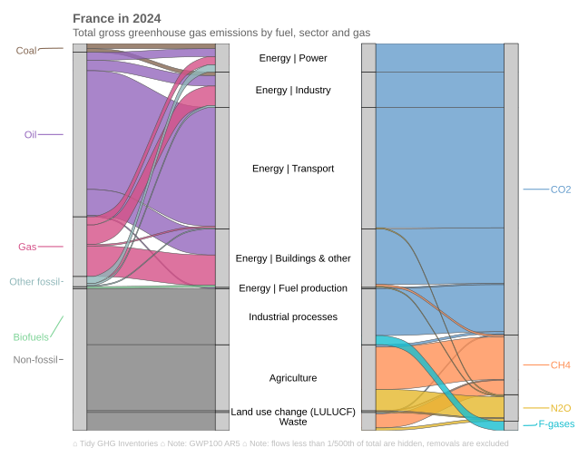
  <a target='_blank' href='https://raw.githubusercontent.com/lambwf/Tidy-GHG-Inventories/main/plots/countries/sankeys/France-sankey.xlsx'>data</a> | <a target='_blank' href='https://raw.githubusercontent.com/lambwf/Tidy-GHG-Inventories/main/plots/countries/sankeys/France-sankey.png'>png</a> | <a target='_blank' href='https://raw.githubusercontent.com/lambwf/Tidy-GHG-Inventories/main/plots/countries/sankeys/France-sankey.pdf'>pdf</a> | <a target='_blank' href='https://raw.githubusercontent.com/lambwf/Tidy-GHG-Inventories/main/plots/countries/sankeys/France-sankey.svg'>svg</a>

- 
  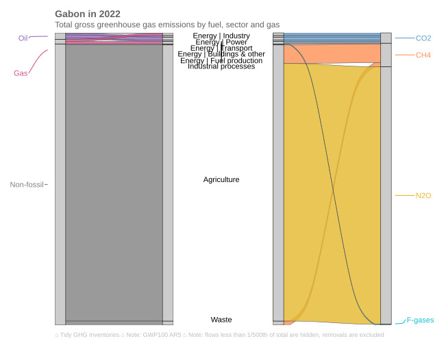
  <a target='_blank' href='https://raw.githubusercontent.com/lambwf/Tidy-GHG-Inventories/main/plots/countries/sankeys/Gabon-sankey.xlsx'>data</a> | <a target='_blank' href='https://raw.githubusercontent.com/lambwf/Tidy-GHG-Inventories/main/plots/countries/sankeys/Gabon-sankey.png'>png</a> | <a target='_blank' href='https://raw.githubusercontent.com/lambwf/Tidy-GHG-Inventories/main/plots/countries/sankeys/Gabon-sankey.pdf'>pdf</a> | <a target='_blank' href='https://raw.githubusercontent.com/lambwf/Tidy-GHG-Inventories/main/plots/countries/sankeys/Gabon-sankey.svg'>svg</a>

- 
  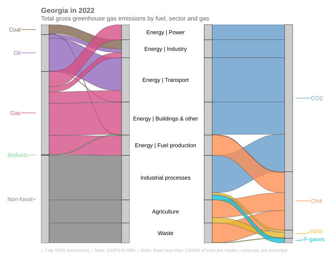
  <a target='_blank' href='https://raw.githubusercontent.com/lambwf/Tidy-GHG-Inventories/main/plots/countries/sankeys/Georgia-sankey.xlsx'>data</a> | <a target='_blank' href='https://raw.githubusercontent.com/lambwf/Tidy-GHG-Inventories/main/plots/countries/sankeys/Georgia-sankey.png'>png</a> | <a target='_blank' href='https://raw.githubusercontent.com/lambwf/Tidy-GHG-Inventories/main/plots/countries/sankeys/Georgia-sankey.pdf'>pdf</a> | <a target='_blank' href='https://raw.githubusercontent.com/lambwf/Tidy-GHG-Inventories/main/plots/countries/sankeys/Georgia-sankey.svg'>svg</a>

- 
  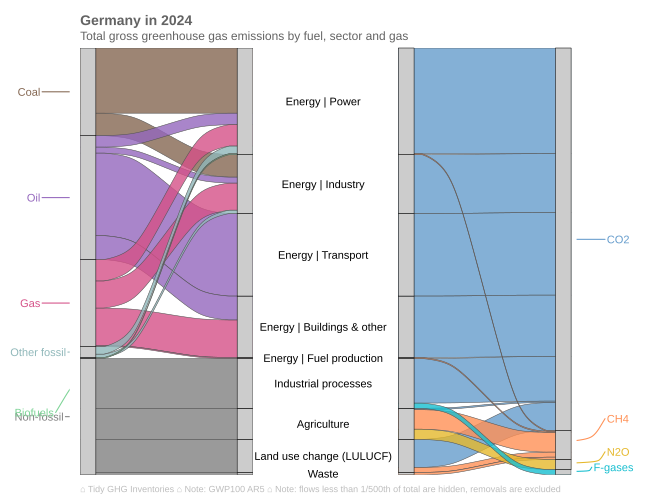
  <a target='_blank' href='https://raw.githubusercontent.com/lambwf/Tidy-GHG-Inventories/main/plots/countries/sankeys/Germany-sankey.xlsx'>data</a> | <a target='_blank' href='https://raw.githubusercontent.com/lambwf/Tidy-GHG-Inventories/main/plots/countries/sankeys/Germany-sankey.png'>png</a> | <a target='_blank' href='https://raw.githubusercontent.com/lambwf/Tidy-GHG-Inventories/main/plots/countries/sankeys/Germany-sankey.pdf'>pdf</a> | <a target='_blank' href='https://raw.githubusercontent.com/lambwf/Tidy-GHG-Inventories/main/plots/countries/sankeys/Germany-sankey.svg'>svg</a>

- 
  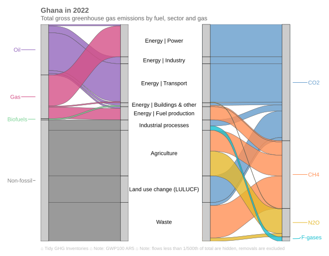
  <a target='_blank' href='https://raw.githubusercontent.com/lambwf/Tidy-GHG-Inventories/main/plots/countries/sankeys/Ghana-sankey.xlsx'>data</a> | <a target='_blank' href='https://raw.githubusercontent.com/lambwf/Tidy-GHG-Inventories/main/plots/countries/sankeys/Ghana-sankey.png'>png</a> | <a target='_blank' href='https://raw.githubusercontent.com/lambwf/Tidy-GHG-Inventories/main/plots/countries/sankeys/Ghana-sankey.pdf'>pdf</a> | <a target='_blank' href='https://raw.githubusercontent.com/lambwf/Tidy-GHG-Inventories/main/plots/countries/sankeys/Ghana-sankey.svg'>svg</a>

- 
  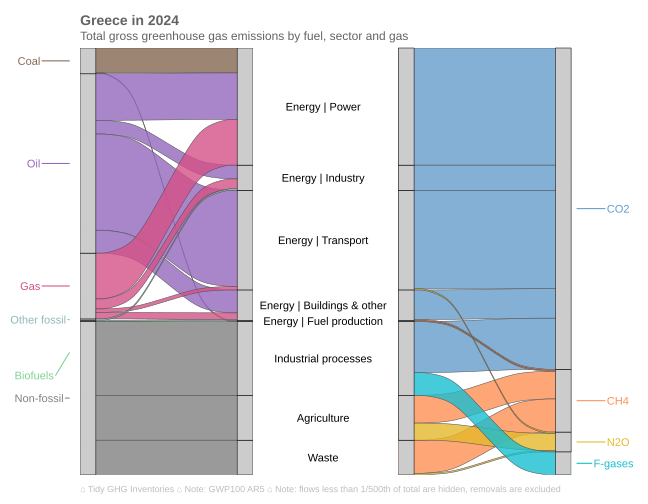
  <a target='_blank' href='https://raw.githubusercontent.com/lambwf/Tidy-GHG-Inventories/main/plots/countries/sankeys/Greece-sankey.xlsx'>data</a> | <a target='_blank' href='https://raw.githubusercontent.com/lambwf/Tidy-GHG-Inventories/main/plots/countries/sankeys/Greece-sankey.png'>png</a> | <a target='_blank' href='https://raw.githubusercontent.com/lambwf/Tidy-GHG-Inventories/main/plots/countries/sankeys/Greece-sankey.pdf'>pdf</a> | <a target='_blank' href='https://raw.githubusercontent.com/lambwf/Tidy-GHG-Inventories/main/plots/countries/sankeys/Greece-sankey.svg'>svg</a>

- 
  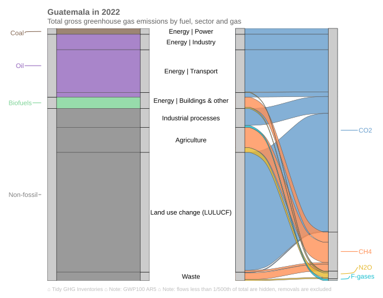
  <a target='_blank' href='https://raw.githubusercontent.com/lambwf/Tidy-GHG-Inventories/main/plots/countries/sankeys/Guatemala-sankey.xlsx'>data</a> | <a target='_blank' href='https://raw.githubusercontent.com/lambwf/Tidy-GHG-Inventories/main/plots/countries/sankeys/Guatemala-sankey.png'>png</a> | <a target='_blank' href='https://raw.githubusercontent.com/lambwf/Tidy-GHG-Inventories/main/plots/countries/sankeys/Guatemala-sankey.pdf'>pdf</a> | <a target='_blank' href='https://raw.githubusercontent.com/lambwf/Tidy-GHG-Inventories/main/plots/countries/sankeys/Guatemala-sankey.svg'>svg</a>

- 
  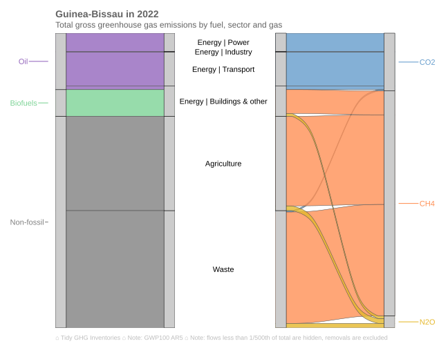
  <a target='_blank' href='https://raw.githubusercontent.com/lambwf/Tidy-GHG-Inventories/main/plots/countries/sankeys/Guinea-Bissau-sankey.xlsx'>data</a> | <a target='_blank' href='https://raw.githubusercontent.com/lambwf/Tidy-GHG-Inventories/main/plots/countries/sankeys/Guinea-Bissau-sankey.png'>png</a> | <a target='_blank' href='https://raw.githubusercontent.com/lambwf/Tidy-GHG-Inventories/main/plots/countries/sankeys/Guinea-Bissau-sankey.pdf'>pdf</a> | <a target='_blank' href='https://raw.githubusercontent.com/lambwf/Tidy-GHG-Inventories/main/plots/countries/sankeys/Guinea-Bissau-sankey.svg'>svg</a>

- 
  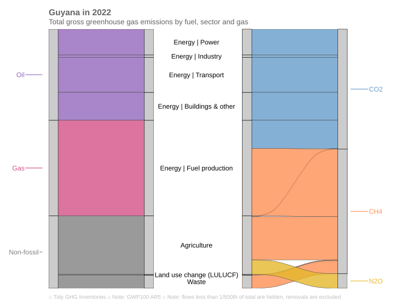
  <a target='_blank' href='https://raw.githubusercontent.com/lambwf/Tidy-GHG-Inventories/main/plots/countries/sankeys/Guyana-sankey.xlsx'>data</a> | <a target='_blank' href='https://raw.githubusercontent.com/lambwf/Tidy-GHG-Inventories/main/plots/countries/sankeys/Guyana-sankey.png'>png</a> | <a target='_blank' href='https://raw.githubusercontent.com/lambwf/Tidy-GHG-Inventories/main/plots/countries/sankeys/Guyana-sankey.pdf'>pdf</a> | <a target='_blank' href='https://raw.githubusercontent.com/lambwf/Tidy-GHG-Inventories/main/plots/countries/sankeys/Guyana-sankey.svg'>svg</a>

- 
  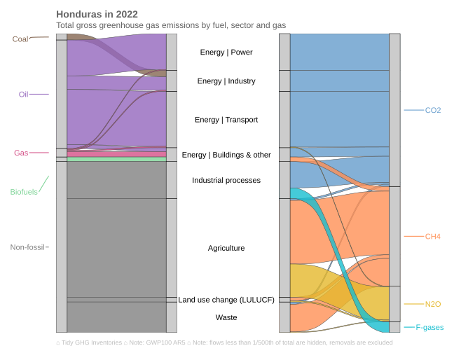
  <a target='_blank' href='https://raw.githubusercontent.com/lambwf/Tidy-GHG-Inventories/main/plots/countries/sankeys/Honduras-sankey.xlsx'>data</a> | <a target='_blank' href='https://raw.githubusercontent.com/lambwf/Tidy-GHG-Inventories/main/plots/countries/sankeys/Honduras-sankey.png'>png</a> | <a target='_blank' href='https://raw.githubusercontent.com/lambwf/Tidy-GHG-Inventories/main/plots/countries/sankeys/Honduras-sankey.pdf'>pdf</a> | <a target='_blank' href='https://raw.githubusercontent.com/lambwf/Tidy-GHG-Inventories/main/plots/countries/sankeys/Honduras-sankey.svg'>svg</a>

- 
  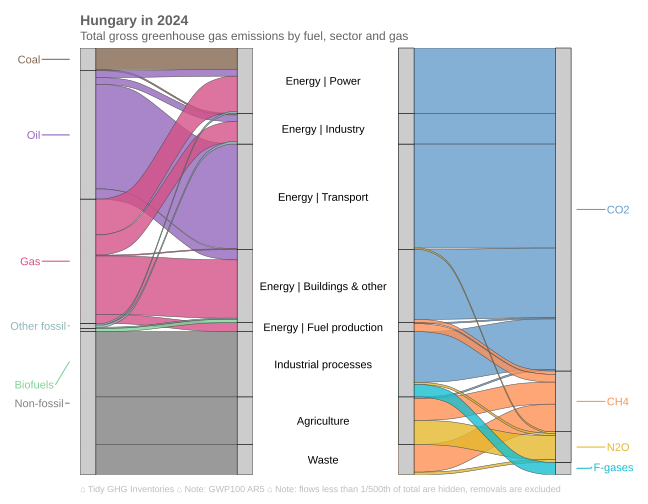
  <a target='_blank' href='https://raw.githubusercontent.com/lambwf/Tidy-GHG-Inventories/main/plots/countries/sankeys/Hungary-sankey.xlsx'>data</a> | <a target='_blank' href='https://raw.githubusercontent.com/lambwf/Tidy-GHG-Inventories/main/plots/countries/sankeys/Hungary-sankey.png'>png</a> | <a target='_blank' href='https://raw.githubusercontent.com/lambwf/Tidy-GHG-Inventories/main/plots/countries/sankeys/Hungary-sankey.pdf'>pdf</a> | <a target='_blank' href='https://raw.githubusercontent.com/lambwf/Tidy-GHG-Inventories/main/plots/countries/sankeys/Hungary-sankey.svg'>svg</a>

- 
  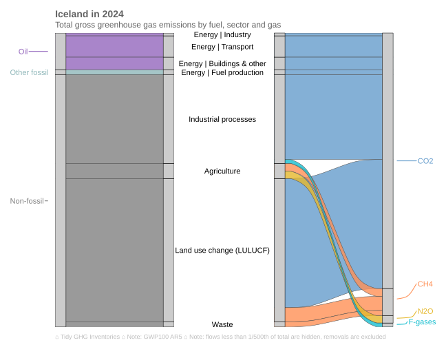
  <a target='_blank' href='https://raw.githubusercontent.com/lambwf/Tidy-GHG-Inventories/main/plots/countries/sankeys/Iceland-sankey.xlsx'>data</a> | <a target='_blank' href='https://raw.githubusercontent.com/lambwf/Tidy-GHG-Inventories/main/plots/countries/sankeys/Iceland-sankey.png'>png</a> | <a target='_blank' href='https://raw.githubusercontent.com/lambwf/Tidy-GHG-Inventories/main/plots/countries/sankeys/Iceland-sankey.pdf'>pdf</a> | <a target='_blank' href='https://raw.githubusercontent.com/lambwf/Tidy-GHG-Inventories/main/plots/countries/sankeys/Iceland-sankey.svg'>svg</a>

- 
  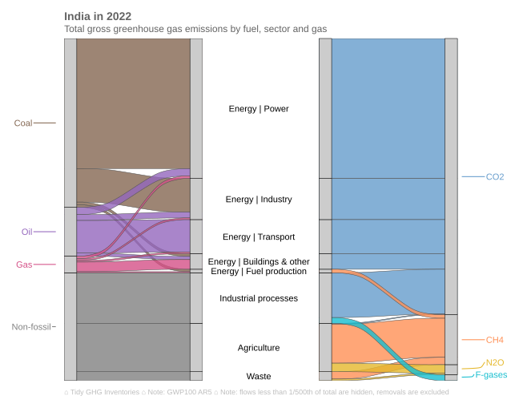
  <a target='_blank' href='https://raw.githubusercontent.com/lambwf/Tidy-GHG-Inventories/main/plots/countries/sankeys/India-sankey.xlsx'>data</a> | <a target='_blank' href='https://raw.githubusercontent.com/lambwf/Tidy-GHG-Inventories/main/plots/countries/sankeys/India-sankey.png'>png</a> | <a target='_blank' href='https://raw.githubusercontent.com/lambwf/Tidy-GHG-Inventories/main/plots/countries/sankeys/India-sankey.pdf'>pdf</a> | <a target='_blank' href='https://raw.githubusercontent.com/lambwf/Tidy-GHG-Inventories/main/plots/countries/sankeys/India-sankey.svg'>svg</a>

- 
  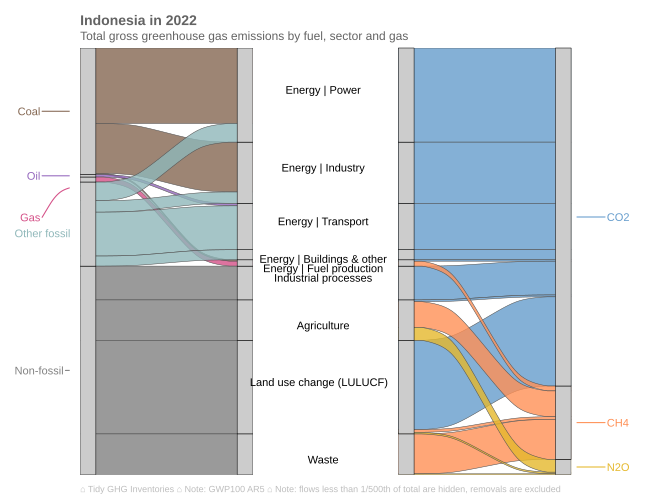
  <a target='_blank' href='https://raw.githubusercontent.com/lambwf/Tidy-GHG-Inventories/main/plots/countries/sankeys/Indonesia-sankey.xlsx'>data</a> | <a target='_blank' href='https://raw.githubusercontent.com/lambwf/Tidy-GHG-Inventories/main/plots/countries/sankeys/Indonesia-sankey.png'>png</a> | <a target='_blank' href='https://raw.githubusercontent.com/lambwf/Tidy-GHG-Inventories/main/plots/countries/sankeys/Indonesia-sankey.pdf'>pdf</a> | <a target='_blank' href='https://raw.githubusercontent.com/lambwf/Tidy-GHG-Inventories/main/plots/countries/sankeys/Indonesia-sankey.svg'>svg</a>

- 
  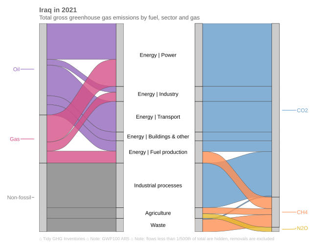
  <a target='_blank' href='https://raw.githubusercontent.com/lambwf/Tidy-GHG-Inventories/main/plots/countries/sankeys/Iraq-sankey.xlsx'>data</a> | <a target='_blank' href='https://raw.githubusercontent.com/lambwf/Tidy-GHG-Inventories/main/plots/countries/sankeys/Iraq-sankey.png'>png</a> | <a target='_blank' href='https://raw.githubusercontent.com/lambwf/Tidy-GHG-Inventories/main/plots/countries/sankeys/Iraq-sankey.pdf'>pdf</a> | <a target='_blank' href='https://raw.githubusercontent.com/lambwf/Tidy-GHG-Inventories/main/plots/countries/sankeys/Iraq-sankey.svg'>svg</a>

- 
  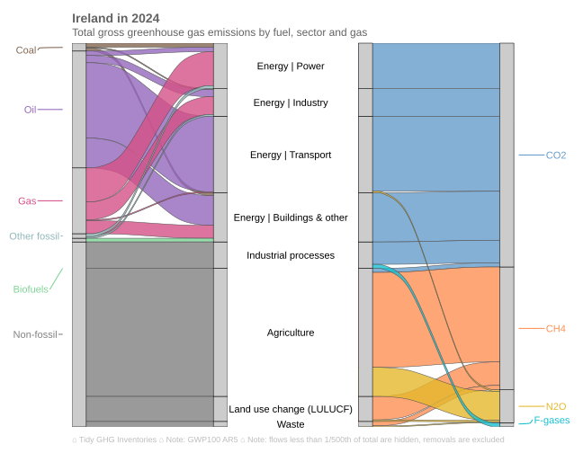
  <a target='_blank' href='https://raw.githubusercontent.com/lambwf/Tidy-GHG-Inventories/main/plots/countries/sankeys/Ireland-sankey.xlsx'>data</a> | <a target='_blank' href='https://raw.githubusercontent.com/lambwf/Tidy-GHG-Inventories/main/plots/countries/sankeys/Ireland-sankey.png'>png</a> | <a target='_blank' href='https://raw.githubusercontent.com/lambwf/Tidy-GHG-Inventories/main/plots/countries/sankeys/Ireland-sankey.pdf'>pdf</a> | <a target='_blank' href='https://raw.githubusercontent.com/lambwf/Tidy-GHG-Inventories/main/plots/countries/sankeys/Ireland-sankey.svg'>svg</a>

- 
  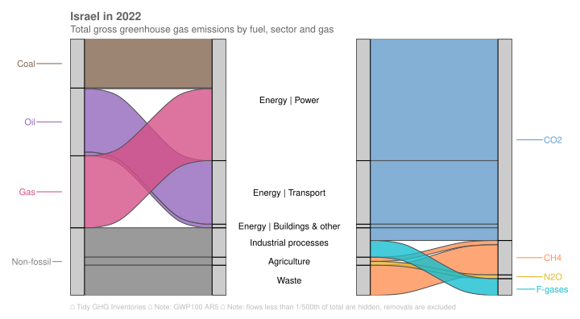
  <a target='_blank' href='https://raw.githubusercontent.com/lambwf/Tidy-GHG-Inventories/main/plots/countries/sankeys/Israel-sankey.xlsx'>data</a> | <a target='_blank' href='https://raw.githubusercontent.com/lambwf/Tidy-GHG-Inventories/main/plots/countries/sankeys/Israel-sankey.png'>png</a> | <a target='_blank' href='https://raw.githubusercontent.com/lambwf/Tidy-GHG-Inventories/main/plots/countries/sankeys/Israel-sankey.pdf'>pdf</a> | <a target='_blank' href='https://raw.githubusercontent.com/lambwf/Tidy-GHG-Inventories/main/plots/countries/sankeys/Israel-sankey.svg'>svg</a>

- 
  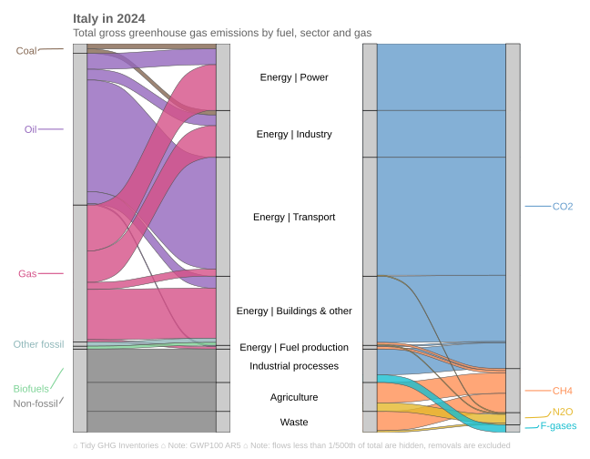
  <a target='_blank' href='https://raw.githubusercontent.com/lambwf/Tidy-GHG-Inventories/main/plots/countries/sankeys/Italy-sankey.xlsx'>data</a> | <a target='_blank' href='https://raw.githubusercontent.com/lambwf/Tidy-GHG-Inventories/main/plots/countries/sankeys/Italy-sankey.png'>png</a> | <a target='_blank' href='https://raw.githubusercontent.com/lambwf/Tidy-GHG-Inventories/main/plots/countries/sankeys/Italy-sankey.pdf'>pdf</a> | <a target='_blank' href='https://raw.githubusercontent.com/lambwf/Tidy-GHG-Inventories/main/plots/countries/sankeys/Italy-sankey.svg'>svg</a>

- 
  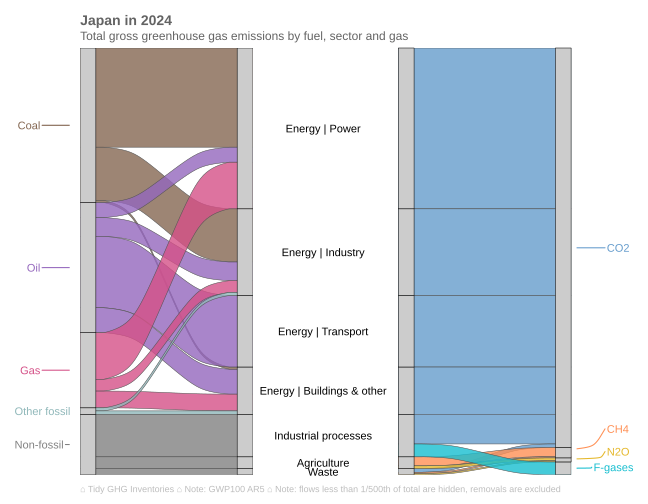
  <a target='_blank' href='https://raw.githubusercontent.com/lambwf/Tidy-GHG-Inventories/main/plots/countries/sankeys/Japan-sankey.xlsx'>data</a> | <a target='_blank' href='https://raw.githubusercontent.com/lambwf/Tidy-GHG-Inventories/main/plots/countries/sankeys/Japan-sankey.png'>png</a> | <a target='_blank' href='https://raw.githubusercontent.com/lambwf/Tidy-GHG-Inventories/main/plots/countries/sankeys/Japan-sankey.pdf'>pdf</a> | <a target='_blank' href='https://raw.githubusercontent.com/lambwf/Tidy-GHG-Inventories/main/plots/countries/sankeys/Japan-sankey.svg'>svg</a>

- 
  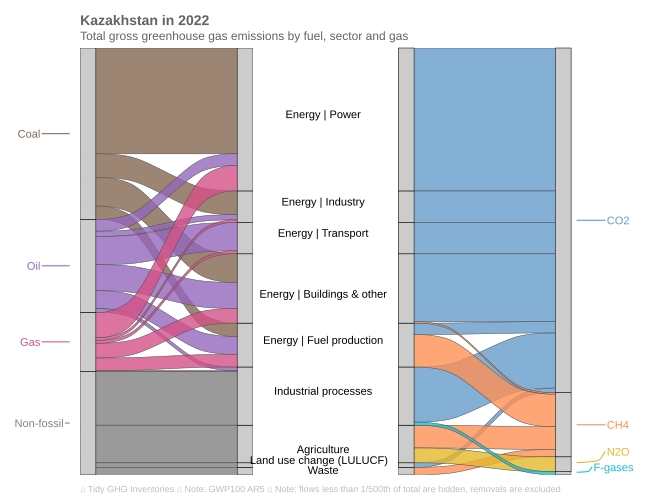
  <a target='_blank' href='https://raw.githubusercontent.com/lambwf/Tidy-GHG-Inventories/main/plots/countries/sankeys/Kazakhstan-sankey.xlsx'>data</a> | <a target='_blank' href='https://raw.githubusercontent.com/lambwf/Tidy-GHG-Inventories/main/plots/countries/sankeys/Kazakhstan-sankey.png'>png</a> | <a target='_blank' href='https://raw.githubusercontent.com/lambwf/Tidy-GHG-Inventories/main/plots/countries/sankeys/Kazakhstan-sankey.pdf'>pdf</a> | <a target='_blank' href='https://raw.githubusercontent.com/lambwf/Tidy-GHG-Inventories/main/plots/countries/sankeys/Kazakhstan-sankey.svg'>svg</a>

- 
  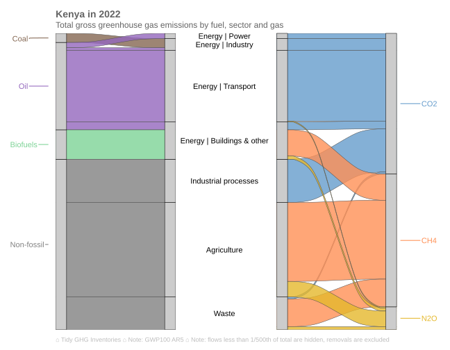
  <a target='_blank' href='https://raw.githubusercontent.com/lambwf/Tidy-GHG-Inventories/main/plots/countries/sankeys/Kenya-sankey.xlsx'>data</a> | <a target='_blank' href='https://raw.githubusercontent.com/lambwf/Tidy-GHG-Inventories/main/plots/countries/sankeys/Kenya-sankey.png'>png</a> | <a target='_blank' href='https://raw.githubusercontent.com/lambwf/Tidy-GHG-Inventories/main/plots/countries/sankeys/Kenya-sankey.pdf'>pdf</a> | <a target='_blank' href='https://raw.githubusercontent.com/lambwf/Tidy-GHG-Inventories/main/plots/countries/sankeys/Kenya-sankey.svg'>svg</a>

- 
  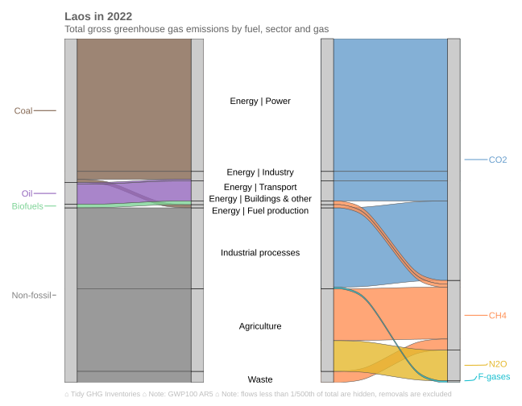
  <a target='_blank' href='https://raw.githubusercontent.com/lambwf/Tidy-GHG-Inventories/main/plots/countries/sankeys/Laos-sankey.xlsx'>data</a> | <a target='_blank' href='https://raw.githubusercontent.com/lambwf/Tidy-GHG-Inventories/main/plots/countries/sankeys/Laos-sankey.png'>png</a> | <a target='_blank' href='https://raw.githubusercontent.com/lambwf/Tidy-GHG-Inventories/main/plots/countries/sankeys/Laos-sankey.pdf'>pdf</a> | <a target='_blank' href='https://raw.githubusercontent.com/lambwf/Tidy-GHG-Inventories/main/plots/countries/sankeys/Laos-sankey.svg'>svg</a>

- 
  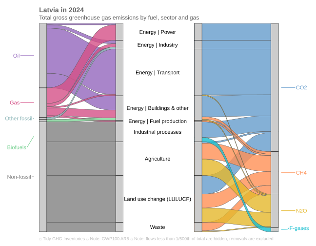
  <a target='_blank' href='https://raw.githubusercontent.com/lambwf/Tidy-GHG-Inventories/main/plots/countries/sankeys/Latvia-sankey.xlsx'>data</a> | <a target='_blank' href='https://raw.githubusercontent.com/lambwf/Tidy-GHG-Inventories/main/plots/countries/sankeys/Latvia-sankey.png'>png</a> | <a target='_blank' href='https://raw.githubusercontent.com/lambwf/Tidy-GHG-Inventories/main/plots/countries/sankeys/Latvia-sankey.pdf'>pdf</a> | <a target='_blank' href='https://raw.githubusercontent.com/lambwf/Tidy-GHG-Inventories/main/plots/countries/sankeys/Latvia-sankey.svg'>svg</a>

- 
  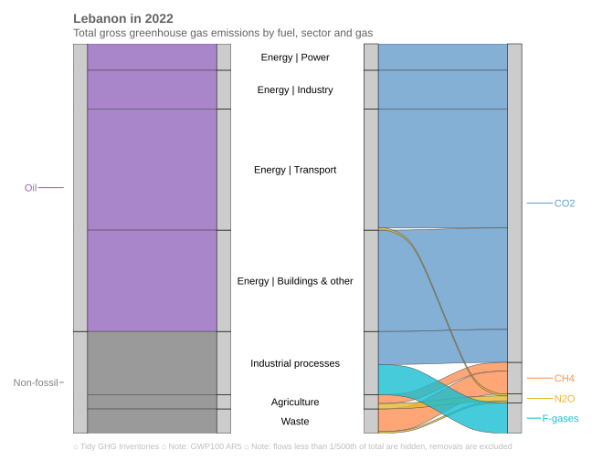
  <a target='_blank' href='https://raw.githubusercontent.com/lambwf/Tidy-GHG-Inventories/main/plots/countries/sankeys/Lebanon-sankey.xlsx'>data</a> | <a target='_blank' href='https://raw.githubusercontent.com/lambwf/Tidy-GHG-Inventories/main/plots/countries/sankeys/Lebanon-sankey.png'>png</a> | <a target='_blank' href='https://raw.githubusercontent.com/lambwf/Tidy-GHG-Inventories/main/plots/countries/sankeys/Lebanon-sankey.pdf'>pdf</a> | <a target='_blank' href='https://raw.githubusercontent.com/lambwf/Tidy-GHG-Inventories/main/plots/countries/sankeys/Lebanon-sankey.svg'>svg</a>

- 
  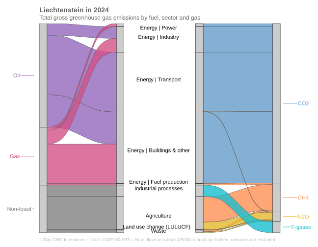
  <a target='_blank' href='https://raw.githubusercontent.com/lambwf/Tidy-GHG-Inventories/main/plots/countries/sankeys/Liechtenstein-sankey.xlsx'>data</a> | <a target='_blank' href='https://raw.githubusercontent.com/lambwf/Tidy-GHG-Inventories/main/plots/countries/sankeys/Liechtenstein-sankey.png'>png</a> | <a target='_blank' href='https://raw.githubusercontent.com/lambwf/Tidy-GHG-Inventories/main/plots/countries/sankeys/Liechtenstein-sankey.pdf'>pdf</a> | <a target='_blank' href='https://raw.githubusercontent.com/lambwf/Tidy-GHG-Inventories/main/plots/countries/sankeys/Liechtenstein-sankey.svg'>svg</a>

- 
  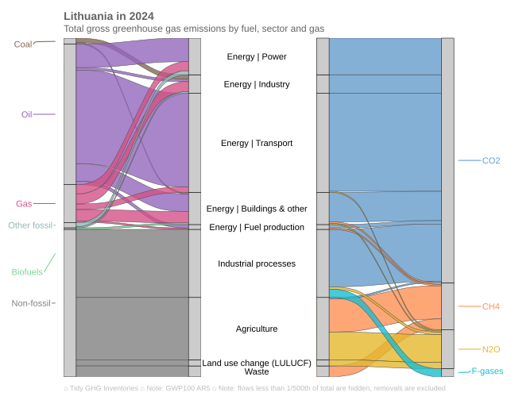
  <a target='_blank' href='https://raw.githubusercontent.com/lambwf/Tidy-GHG-Inventories/main/plots/countries/sankeys/Lithuania-sankey.xlsx'>data</a> | <a target='_blank' href='https://raw.githubusercontent.com/lambwf/Tidy-GHG-Inventories/main/plots/countries/sankeys/Lithuania-sankey.png'>png</a> | <a target='_blank' href='https://raw.githubusercontent.com/lambwf/Tidy-GHG-Inventories/main/plots/countries/sankeys/Lithuania-sankey.pdf'>pdf</a> | <a target='_blank' href='https://raw.githubusercontent.com/lambwf/Tidy-GHG-Inventories/main/plots/countries/sankeys/Lithuania-sankey.svg'>svg</a>

- 
  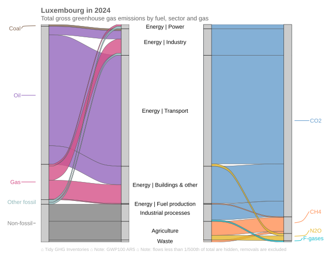
  <a target='_blank' href='https://raw.githubusercontent.com/lambwf/Tidy-GHG-Inventories/main/plots/countries/sankeys/Luxembourg-sankey.xlsx'>data</a> | <a target='_blank' href='https://raw.githubusercontent.com/lambwf/Tidy-GHG-Inventories/main/plots/countries/sankeys/Luxembourg-sankey.png'>png</a> | <a target='_blank' href='https://raw.githubusercontent.com/lambwf/Tidy-GHG-Inventories/main/plots/countries/sankeys/Luxembourg-sankey.pdf'>pdf</a> | <a target='_blank' href='https://raw.githubusercontent.com/lambwf/Tidy-GHG-Inventories/main/plots/countries/sankeys/Luxembourg-sankey.svg'>svg</a>

- 
  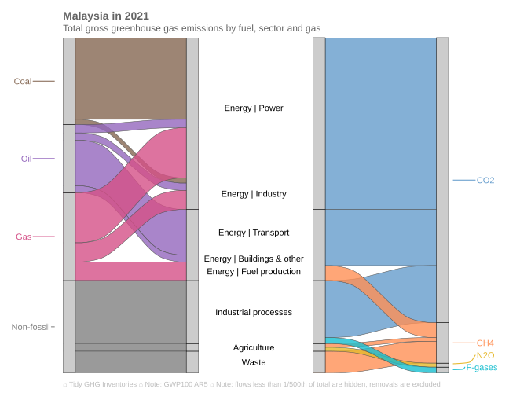
  <a target='_blank' href='https://raw.githubusercontent.com/lambwf/Tidy-GHG-Inventories/main/plots/countries/sankeys/Malaysia-sankey.xlsx'>data</a> | <a target='_blank' href='https://raw.githubusercontent.com/lambwf/Tidy-GHG-Inventories/main/plots/countries/sankeys/Malaysia-sankey.png'>png</a> | <a target='_blank' href='https://raw.githubusercontent.com/lambwf/Tidy-GHG-Inventories/main/plots/countries/sankeys/Malaysia-sankey.pdf'>pdf</a> | <a target='_blank' href='https://raw.githubusercontent.com/lambwf/Tidy-GHG-Inventories/main/plots/countries/sankeys/Malaysia-sankey.svg'>svg</a>

- 
  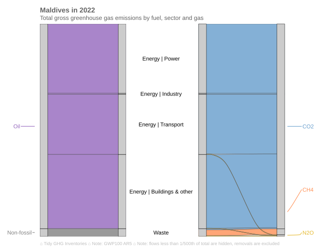
  <a target='_blank' href='https://raw.githubusercontent.com/lambwf/Tidy-GHG-Inventories/main/plots/countries/sankeys/Maldives-sankey.xlsx'>data</a> | <a target='_blank' href='https://raw.githubusercontent.com/lambwf/Tidy-GHG-Inventories/main/plots/countries/sankeys/Maldives-sankey.png'>png</a> | <a target='_blank' href='https://raw.githubusercontent.com/lambwf/Tidy-GHG-Inventories/main/plots/countries/sankeys/Maldives-sankey.pdf'>pdf</a> | <a target='_blank' href='https://raw.githubusercontent.com/lambwf/Tidy-GHG-Inventories/main/plots/countries/sankeys/Maldives-sankey.svg'>svg</a>

- 
  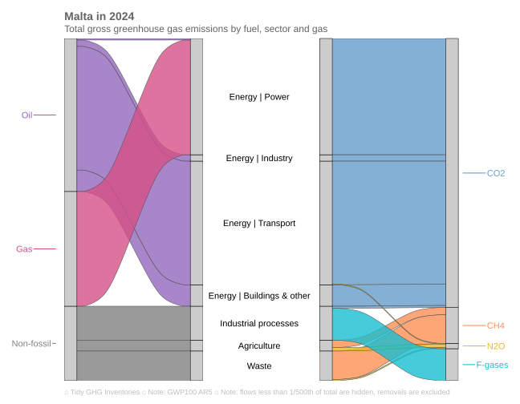
  <a target='_blank' href='https://raw.githubusercontent.com/lambwf/Tidy-GHG-Inventories/main/plots/countries/sankeys/Malta-sankey.xlsx'>data</a> | <a target='_blank' href='https://raw.githubusercontent.com/lambwf/Tidy-GHG-Inventories/main/plots/countries/sankeys/Malta-sankey.png'>png</a> | <a target='_blank' href='https://raw.githubusercontent.com/lambwf/Tidy-GHG-Inventories/main/plots/countries/sankeys/Malta-sankey.pdf'>pdf</a> | <a target='_blank' href='https://raw.githubusercontent.com/lambwf/Tidy-GHG-Inventories/main/plots/countries/sankeys/Malta-sankey.svg'>svg</a>

- 
  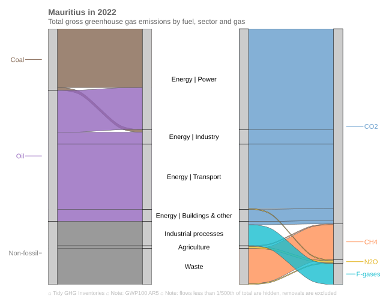
  <a target='_blank' href='https://raw.githubusercontent.com/lambwf/Tidy-GHG-Inventories/main/plots/countries/sankeys/Mauritius-sankey.xlsx'>data</a> | <a target='_blank' href='https://raw.githubusercontent.com/lambwf/Tidy-GHG-Inventories/main/plots/countries/sankeys/Mauritius-sankey.png'>png</a> | <a target='_blank' href='https://raw.githubusercontent.com/lambwf/Tidy-GHG-Inventories/main/plots/countries/sankeys/Mauritius-sankey.pdf'>pdf</a> | <a target='_blank' href='https://raw.githubusercontent.com/lambwf/Tidy-GHG-Inventories/main/plots/countries/sankeys/Mauritius-sankey.svg'>svg</a>

- 
  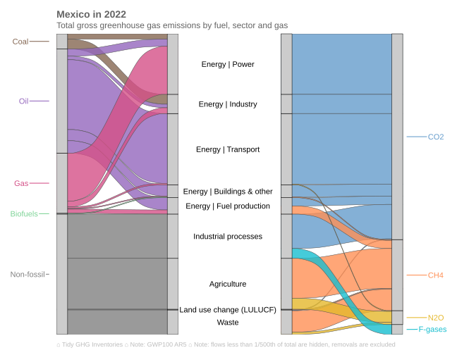
  <a target='_blank' href='https://raw.githubusercontent.com/lambwf/Tidy-GHG-Inventories/main/plots/countries/sankeys/Mexico-sankey.xlsx'>data</a> | <a target='_blank' href='https://raw.githubusercontent.com/lambwf/Tidy-GHG-Inventories/main/plots/countries/sankeys/Mexico-sankey.png'>png</a> | <a target='_blank' href='https://raw.githubusercontent.com/lambwf/Tidy-GHG-Inventories/main/plots/countries/sankeys/Mexico-sankey.pdf'>pdf</a> | <a target='_blank' href='https://raw.githubusercontent.com/lambwf/Tidy-GHG-Inventories/main/plots/countries/sankeys/Mexico-sankey.svg'>svg</a>

- 
  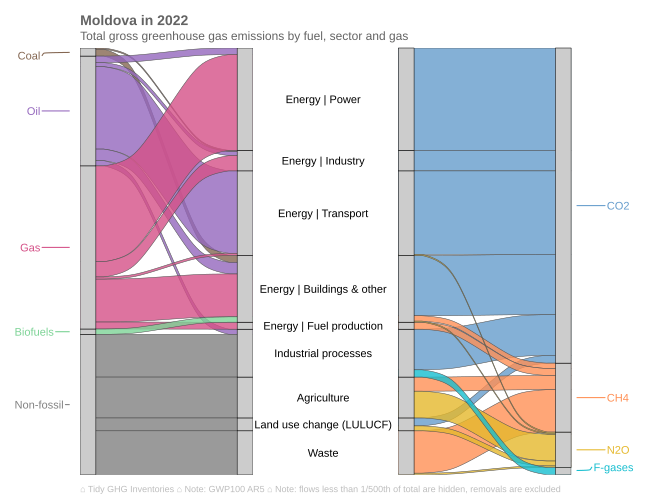
  <a target='_blank' href='https://raw.githubusercontent.com/lambwf/Tidy-GHG-Inventories/main/plots/countries/sankeys/Moldova-sankey.xlsx'>data</a> | <a target='_blank' href='https://raw.githubusercontent.com/lambwf/Tidy-GHG-Inventories/main/plots/countries/sankeys/Moldova-sankey.png'>png</a> | <a target='_blank' href='https://raw.githubusercontent.com/lambwf/Tidy-GHG-Inventories/main/plots/countries/sankeys/Moldova-sankey.pdf'>pdf</a> | <a target='_blank' href='https://raw.githubusercontent.com/lambwf/Tidy-GHG-Inventories/main/plots/countries/sankeys/Moldova-sankey.svg'>svg</a>

- 
  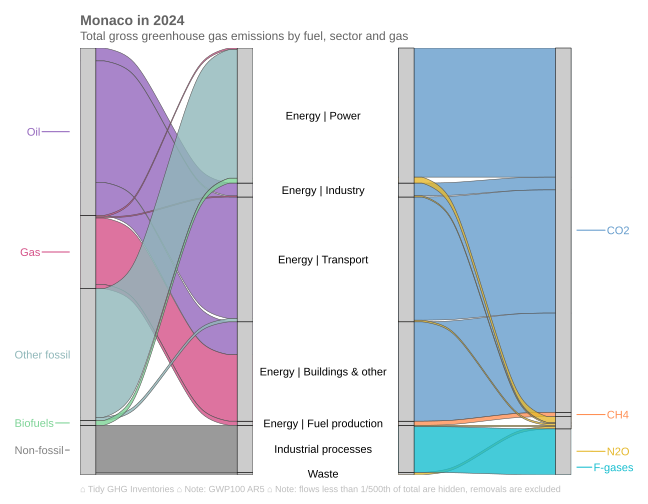
  <a target='_blank' href='https://raw.githubusercontent.com/lambwf/Tidy-GHG-Inventories/main/plots/countries/sankeys/Monaco-sankey.xlsx'>data</a> | <a target='_blank' href='https://raw.githubusercontent.com/lambwf/Tidy-GHG-Inventories/main/plots/countries/sankeys/Monaco-sankey.png'>png</a> | <a target='_blank' href='https://raw.githubusercontent.com/lambwf/Tidy-GHG-Inventories/main/plots/countries/sankeys/Monaco-sankey.pdf'>pdf</a> | <a target='_blank' href='https://raw.githubusercontent.com/lambwf/Tidy-GHG-Inventories/main/plots/countries/sankeys/Monaco-sankey.svg'>svg</a>

- 
  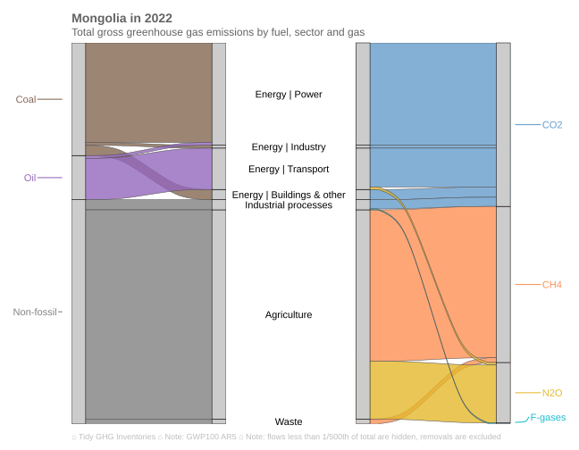
  <a target='_blank' href='https://raw.githubusercontent.com/lambwf/Tidy-GHG-Inventories/main/plots/countries/sankeys/Mongolia-sankey.xlsx'>data</a> | <a target='_blank' href='https://raw.githubusercontent.com/lambwf/Tidy-GHG-Inventories/main/plots/countries/sankeys/Mongolia-sankey.png'>png</a> | <a target='_blank' href='https://raw.githubusercontent.com/lambwf/Tidy-GHG-Inventories/main/plots/countries/sankeys/Mongolia-sankey.pdf'>pdf</a> | <a target='_blank' href='https://raw.githubusercontent.com/lambwf/Tidy-GHG-Inventories/main/plots/countries/sankeys/Mongolia-sankey.svg'>svg</a>

- 
  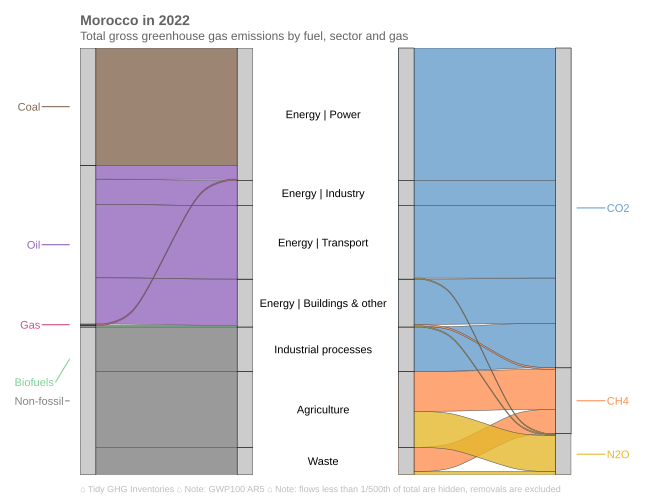
  <a target='_blank' href='https://raw.githubusercontent.com/lambwf/Tidy-GHG-Inventories/main/plots/countries/sankeys/Morocco-sankey.xlsx'>data</a> | <a target='_blank' href='https://raw.githubusercontent.com/lambwf/Tidy-GHG-Inventories/main/plots/countries/sankeys/Morocco-sankey.png'>png</a> | <a target='_blank' href='https://raw.githubusercontent.com/lambwf/Tidy-GHG-Inventories/main/plots/countries/sankeys/Morocco-sankey.pdf'>pdf</a> | <a target='_blank' href='https://raw.githubusercontent.com/lambwf/Tidy-GHG-Inventories/main/plots/countries/sankeys/Morocco-sankey.svg'>svg</a>

- 
  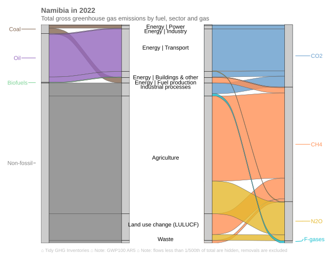
  <a target='_blank' href='https://raw.githubusercontent.com/lambwf/Tidy-GHG-Inventories/main/plots/countries/sankeys/Namibia-sankey.xlsx'>data</a> | <a target='_blank' href='https://raw.githubusercontent.com/lambwf/Tidy-GHG-Inventories/main/plots/countries/sankeys/Namibia-sankey.png'>png</a> | <a target='_blank' href='https://raw.githubusercontent.com/lambwf/Tidy-GHG-Inventories/main/plots/countries/sankeys/Namibia-sankey.pdf'>pdf</a> | <a target='_blank' href='https://raw.githubusercontent.com/lambwf/Tidy-GHG-Inventories/main/plots/countries/sankeys/Namibia-sankey.svg'>svg</a>

- 
  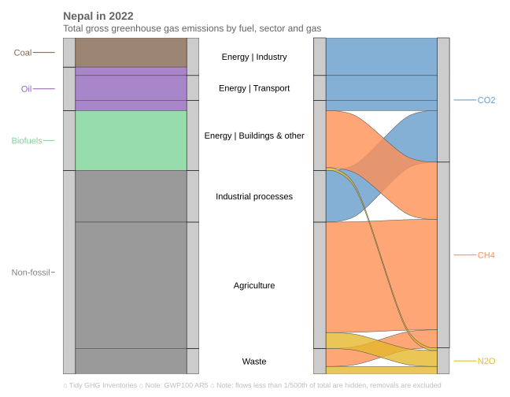
  <a target='_blank' href='https://raw.githubusercontent.com/lambwf/Tidy-GHG-Inventories/main/plots/countries/sankeys/Nepal-sankey.xlsx'>data</a> | <a target='_blank' href='https://raw.githubusercontent.com/lambwf/Tidy-GHG-Inventories/main/plots/countries/sankeys/Nepal-sankey.png'>png</a> | <a target='_blank' href='https://raw.githubusercontent.com/lambwf/Tidy-GHG-Inventories/main/plots/countries/sankeys/Nepal-sankey.pdf'>pdf</a> | <a target='_blank' href='https://raw.githubusercontent.com/lambwf/Tidy-GHG-Inventories/main/plots/countries/sankeys/Nepal-sankey.svg'>svg</a>

- 
  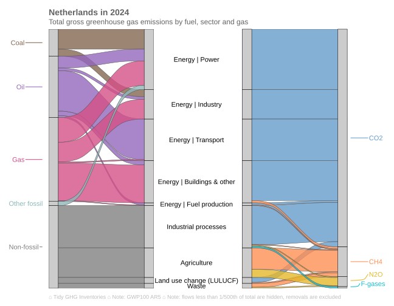
  <a target='_blank' href='https://raw.githubusercontent.com/lambwf/Tidy-GHG-Inventories/main/plots/countries/sankeys/Netherlands-sankey.xlsx'>data</a> | <a target='_blank' href='https://raw.githubusercontent.com/lambwf/Tidy-GHG-Inventories/main/plots/countries/sankeys/Netherlands-sankey.png'>png</a> | <a target='_blank' href='https://raw.githubusercontent.com/lambwf/Tidy-GHG-Inventories/main/plots/countries/sankeys/Netherlands-sankey.pdf'>pdf</a> | <a target='_blank' href='https://raw.githubusercontent.com/lambwf/Tidy-GHG-Inventories/main/plots/countries/sankeys/Netherlands-sankey.svg'>svg</a>

- 
  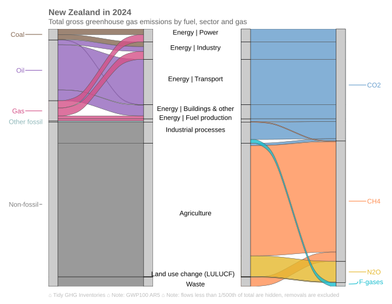
  <a target='_blank' href='https://raw.githubusercontent.com/lambwf/Tidy-GHG-Inventories/main/plots/countries/sankeys/New Zealand-sankey.xlsx'>data</a> | <a target='_blank' href='https://raw.githubusercontent.com/lambwf/Tidy-GHG-Inventories/main/plots/countries/sankeys/New Zealand-sankey.png'>png</a> | <a target='_blank' href='https://raw.githubusercontent.com/lambwf/Tidy-GHG-Inventories/main/plots/countries/sankeys/New Zealand-sankey.pdf'>pdf</a> | <a target='_blank' href='https://raw.githubusercontent.com/lambwf/Tidy-GHG-Inventories/main/plots/countries/sankeys/New Zealand-sankey.svg'>svg</a>

- 
  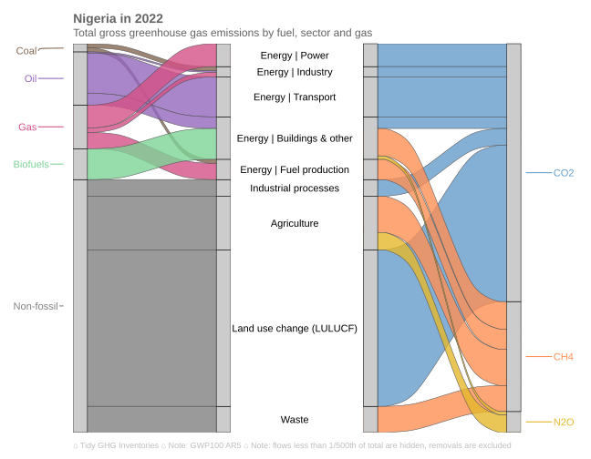
  <a target='_blank' href='https://raw.githubusercontent.com/lambwf/Tidy-GHG-Inventories/main/plots/countries/sankeys/Nigeria-sankey.xlsx'>data</a> | <a target='_blank' href='https://raw.githubusercontent.com/lambwf/Tidy-GHG-Inventories/main/plots/countries/sankeys/Nigeria-sankey.png'>png</a> | <a target='_blank' href='https://raw.githubusercontent.com/lambwf/Tidy-GHG-Inventories/main/plots/countries/sankeys/Nigeria-sankey.pdf'>pdf</a> | <a target='_blank' href='https://raw.githubusercontent.com/lambwf/Tidy-GHG-Inventories/main/plots/countries/sankeys/Nigeria-sankey.svg'>svg</a>

- 
  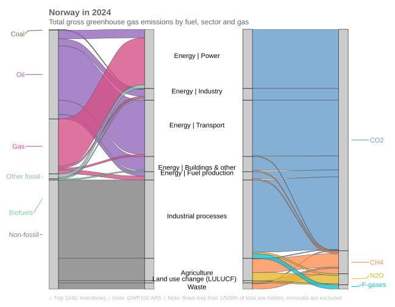
  <a target='_blank' href='https://raw.githubusercontent.com/lambwf/Tidy-GHG-Inventories/main/plots/countries/sankeys/Norway-sankey.xlsx'>data</a> | <a target='_blank' href='https://raw.githubusercontent.com/lambwf/Tidy-GHG-Inventories/main/plots/countries/sankeys/Norway-sankey.png'>png</a> | <a target='_blank' href='https://raw.githubusercontent.com/lambwf/Tidy-GHG-Inventories/main/plots/countries/sankeys/Norway-sankey.pdf'>pdf</a> | <a target='_blank' href='https://raw.githubusercontent.com/lambwf/Tidy-GHG-Inventories/main/plots/countries/sankeys/Norway-sankey.svg'>svg</a>

- 
  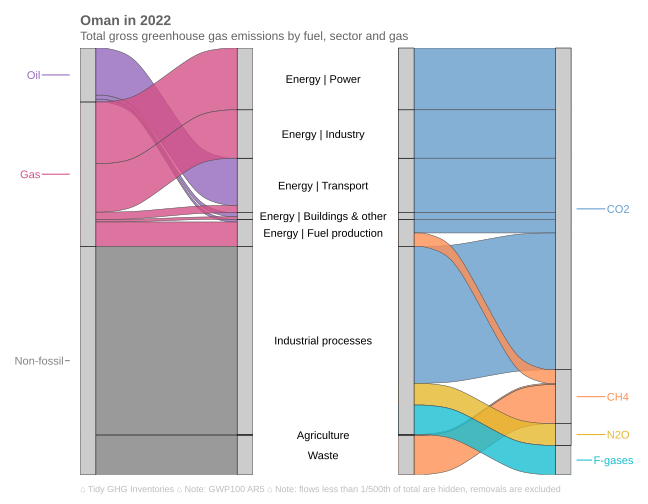
  <a target='_blank' href='https://raw.githubusercontent.com/lambwf/Tidy-GHG-Inventories/main/plots/countries/sankeys/Oman-sankey.xlsx'>data</a> | <a target='_blank' href='https://raw.githubusercontent.com/lambwf/Tidy-GHG-Inventories/main/plots/countries/sankeys/Oman-sankey.png'>png</a> | <a target='_blank' href='https://raw.githubusercontent.com/lambwf/Tidy-GHG-Inventories/main/plots/countries/sankeys/Oman-sankey.pdf'>pdf</a> | <a target='_blank' href='https://raw.githubusercontent.com/lambwf/Tidy-GHG-Inventories/main/plots/countries/sankeys/Oman-sankey.svg'>svg</a>

- 
  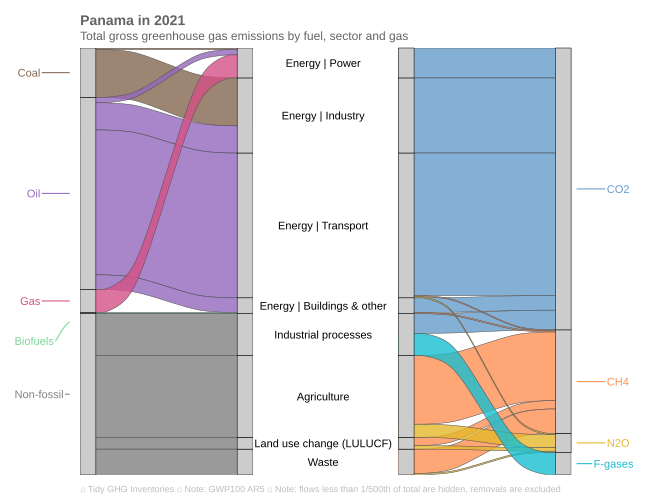
  <a target='_blank' href='https://raw.githubusercontent.com/lambwf/Tidy-GHG-Inventories/main/plots/countries/sankeys/Panama-sankey.xlsx'>data</a> | <a target='_blank' href='https://raw.githubusercontent.com/lambwf/Tidy-GHG-Inventories/main/plots/countries/sankeys/Panama-sankey.png'>png</a> | <a target='_blank' href='https://raw.githubusercontent.com/lambwf/Tidy-GHG-Inventories/main/plots/countries/sankeys/Panama-sankey.pdf'>pdf</a> | <a target='_blank' href='https://raw.githubusercontent.com/lambwf/Tidy-GHG-Inventories/main/plots/countries/sankeys/Panama-sankey.svg'>svg</a>

- 
  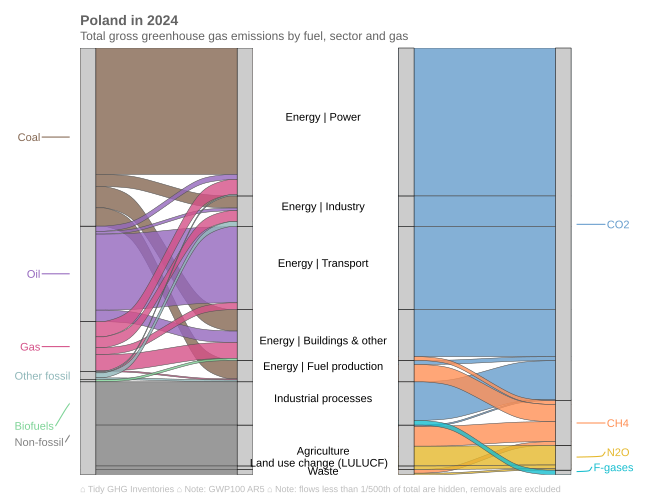
  <a target='_blank' href='https://raw.githubusercontent.com/lambwf/Tidy-GHG-Inventories/main/plots/countries/sankeys/Poland-sankey.xlsx'>data</a> | <a target='_blank' href='https://raw.githubusercontent.com/lambwf/Tidy-GHG-Inventories/main/plots/countries/sankeys/Poland-sankey.png'>png</a> | <a target='_blank' href='https://raw.githubusercontent.com/lambwf/Tidy-GHG-Inventories/main/plots/countries/sankeys/Poland-sankey.pdf'>pdf</a> | <a target='_blank' href='https://raw.githubusercontent.com/lambwf/Tidy-GHG-Inventories/main/plots/countries/sankeys/Poland-sankey.svg'>svg</a>

- 
  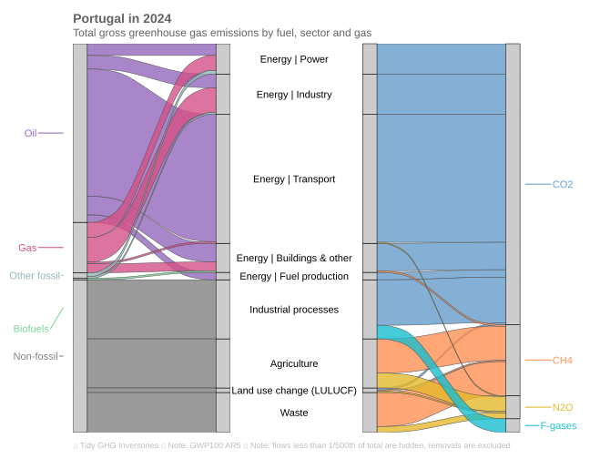
  <a target='_blank' href='https://raw.githubusercontent.com/lambwf/Tidy-GHG-Inventories/main/plots/countries/sankeys/Portugal-sankey.xlsx'>data</a> | <a target='_blank' href='https://raw.githubusercontent.com/lambwf/Tidy-GHG-Inventories/main/plots/countries/sankeys/Portugal-sankey.png'>png</a> | <a target='_blank' href='https://raw.githubusercontent.com/lambwf/Tidy-GHG-Inventories/main/plots/countries/sankeys/Portugal-sankey.pdf'>pdf</a> | <a target='_blank' href='https://raw.githubusercontent.com/lambwf/Tidy-GHG-Inventories/main/plots/countries/sankeys/Portugal-sankey.svg'>svg</a>

- 
  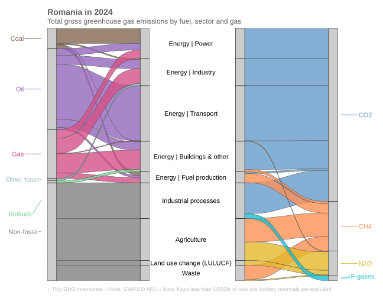
  <a target='_blank' href='https://raw.githubusercontent.com/lambwf/Tidy-GHG-Inventories/main/plots/countries/sankeys/Romania-sankey.xlsx'>data</a> | <a target='_blank' href='https://raw.githubusercontent.com/lambwf/Tidy-GHG-Inventories/main/plots/countries/sankeys/Romania-sankey.png'>png</a> | <a target='_blank' href='https://raw.githubusercontent.com/lambwf/Tidy-GHG-Inventories/main/plots/countries/sankeys/Romania-sankey.pdf'>pdf</a> | <a target='_blank' href='https://raw.githubusercontent.com/lambwf/Tidy-GHG-Inventories/main/plots/countries/sankeys/Romania-sankey.svg'>svg</a>

- 
  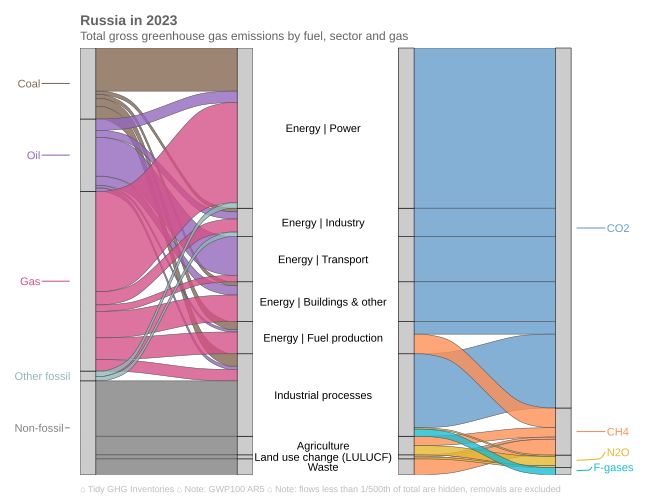
  <a target='_blank' href='https://raw.githubusercontent.com/lambwf/Tidy-GHG-Inventories/main/plots/countries/sankeys/Russia-sankey.xlsx'>data</a> | <a target='_blank' href='https://raw.githubusercontent.com/lambwf/Tidy-GHG-Inventories/main/plots/countries/sankeys/Russia-sankey.png'>png</a> | <a target='_blank' href='https://raw.githubusercontent.com/lambwf/Tidy-GHG-Inventories/main/plots/countries/sankeys/Russia-sankey.pdf'>pdf</a> | <a target='_blank' href='https://raw.githubusercontent.com/lambwf/Tidy-GHG-Inventories/main/plots/countries/sankeys/Russia-sankey.svg'>svg</a>

- 
  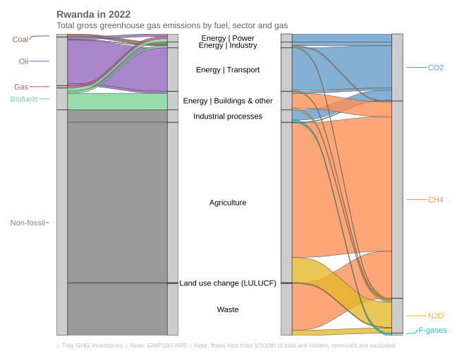
  <a target='_blank' href='https://raw.githubusercontent.com/lambwf/Tidy-GHG-Inventories/main/plots/countries/sankeys/Rwanda-sankey.xlsx'>data</a> | <a target='_blank' href='https://raw.githubusercontent.com/lambwf/Tidy-GHG-Inventories/main/plots/countries/sankeys/Rwanda-sankey.png'>png</a> | <a target='_blank' href='https://raw.githubusercontent.com/lambwf/Tidy-GHG-Inventories/main/plots/countries/sankeys/Rwanda-sankey.pdf'>pdf</a> | <a target='_blank' href='https://raw.githubusercontent.com/lambwf/Tidy-GHG-Inventories/main/plots/countries/sankeys/Rwanda-sankey.svg'>svg</a>

- 
  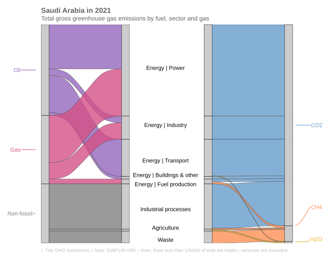
  <a target='_blank' href='https://raw.githubusercontent.com/lambwf/Tidy-GHG-Inventories/main/plots/countries/sankeys/Saudi Arabia-sankey.xlsx'>data</a> | <a target='_blank' href='https://raw.githubusercontent.com/lambwf/Tidy-GHG-Inventories/main/plots/countries/sankeys/Saudi Arabia-sankey.png'>png</a> | <a target='_blank' href='https://raw.githubusercontent.com/lambwf/Tidy-GHG-Inventories/main/plots/countries/sankeys/Saudi Arabia-sankey.pdf'>pdf</a> | <a target='_blank' href='https://raw.githubusercontent.com/lambwf/Tidy-GHG-Inventories/main/plots/countries/sankeys/Saudi Arabia-sankey.svg'>svg</a>

- 
  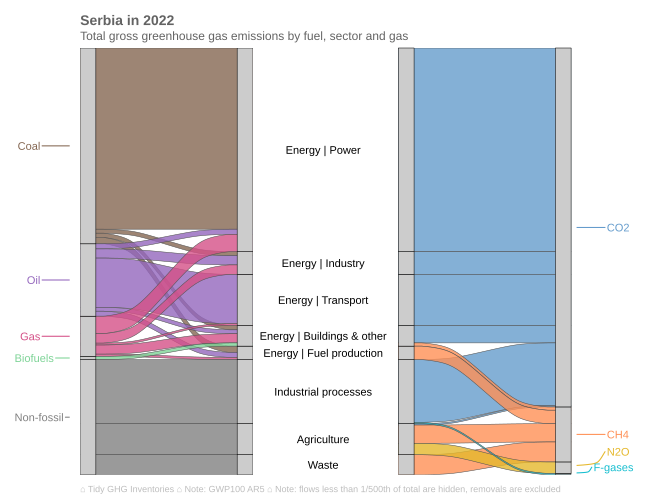
  <a target='_blank' href='https://raw.githubusercontent.com/lambwf/Tidy-GHG-Inventories/main/plots/countries/sankeys/Serbia-sankey.xlsx'>data</a> | <a target='_blank' href='https://raw.githubusercontent.com/lambwf/Tidy-GHG-Inventories/main/plots/countries/sankeys/Serbia-sankey.png'>png</a> | <a target='_blank' href='https://raw.githubusercontent.com/lambwf/Tidy-GHG-Inventories/main/plots/countries/sankeys/Serbia-sankey.pdf'>pdf</a> | <a target='_blank' href='https://raw.githubusercontent.com/lambwf/Tidy-GHG-Inventories/main/plots/countries/sankeys/Serbia-sankey.svg'>svg</a>

- 
  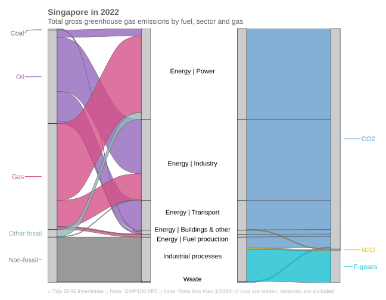
  <a target='_blank' href='https://raw.githubusercontent.com/lambwf/Tidy-GHG-Inventories/main/plots/countries/sankeys/Singapore-sankey.xlsx'>data</a> | <a target='_blank' href='https://raw.githubusercontent.com/lambwf/Tidy-GHG-Inventories/main/plots/countries/sankeys/Singapore-sankey.png'>png</a> | <a target='_blank' href='https://raw.githubusercontent.com/lambwf/Tidy-GHG-Inventories/main/plots/countries/sankeys/Singapore-sankey.pdf'>pdf</a> | <a target='_blank' href='https://raw.githubusercontent.com/lambwf/Tidy-GHG-Inventories/main/plots/countries/sankeys/Singapore-sankey.svg'>svg</a>

- 
  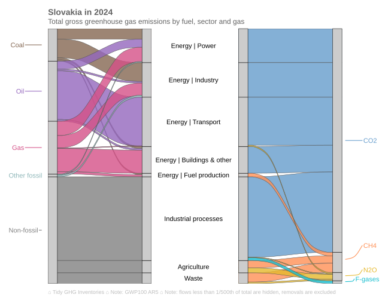
  <a target='_blank' href='https://raw.githubusercontent.com/lambwf/Tidy-GHG-Inventories/main/plots/countries/sankeys/Slovakia-sankey.xlsx'>data</a> | <a target='_blank' href='https://raw.githubusercontent.com/lambwf/Tidy-GHG-Inventories/main/plots/countries/sankeys/Slovakia-sankey.png'>png</a> | <a target='_blank' href='https://raw.githubusercontent.com/lambwf/Tidy-GHG-Inventories/main/plots/countries/sankeys/Slovakia-sankey.pdf'>pdf</a> | <a target='_blank' href='https://raw.githubusercontent.com/lambwf/Tidy-GHG-Inventories/main/plots/countries/sankeys/Slovakia-sankey.svg'>svg</a>

- 
  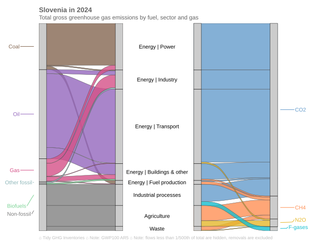
  <a target='_blank' href='https://raw.githubusercontent.com/lambwf/Tidy-GHG-Inventories/main/plots/countries/sankeys/Slovenia-sankey.xlsx'>data</a> | <a target='_blank' href='https://raw.githubusercontent.com/lambwf/Tidy-GHG-Inventories/main/plots/countries/sankeys/Slovenia-sankey.png'>png</a> | <a target='_blank' href='https://raw.githubusercontent.com/lambwf/Tidy-GHG-Inventories/main/plots/countries/sankeys/Slovenia-sankey.pdf'>pdf</a> | <a target='_blank' href='https://raw.githubusercontent.com/lambwf/Tidy-GHG-Inventories/main/plots/countries/sankeys/Slovenia-sankey.svg'>svg</a>

- 
  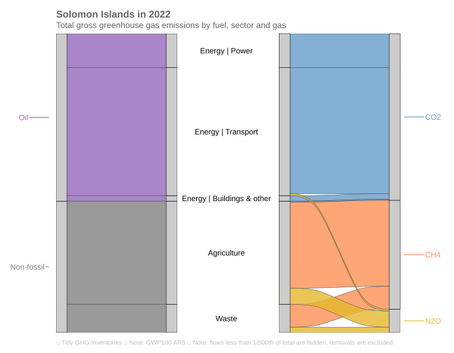
  <a target='_blank' href='https://raw.githubusercontent.com/lambwf/Tidy-GHG-Inventories/main/plots/countries/sankeys/Solomon Islands-sankey.xlsx'>data</a> | <a target='_blank' href='https://raw.githubusercontent.com/lambwf/Tidy-GHG-Inventories/main/plots/countries/sankeys/Solomon Islands-sankey.png'>png</a> | <a target='_blank' href='https://raw.githubusercontent.com/lambwf/Tidy-GHG-Inventories/main/plots/countries/sankeys/Solomon Islands-sankey.pdf'>pdf</a> | <a target='_blank' href='https://raw.githubusercontent.com/lambwf/Tidy-GHG-Inventories/main/plots/countries/sankeys/Solomon Islands-sankey.svg'>svg</a>

- 
  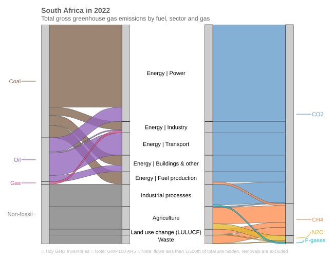
  <a target='_blank' href='https://raw.githubusercontent.com/lambwf/Tidy-GHG-Inventories/main/plots/countries/sankeys/South Africa-sankey.xlsx'>data</a> | <a target='_blank' href='https://raw.githubusercontent.com/lambwf/Tidy-GHG-Inventories/main/plots/countries/sankeys/South Africa-sankey.png'>png</a> | <a target='_blank' href='https://raw.githubusercontent.com/lambwf/Tidy-GHG-Inventories/main/plots/countries/sankeys/South Africa-sankey.pdf'>pdf</a> | <a target='_blank' href='https://raw.githubusercontent.com/lambwf/Tidy-GHG-Inventories/main/plots/countries/sankeys/South Africa-sankey.svg'>svg</a>

- 
  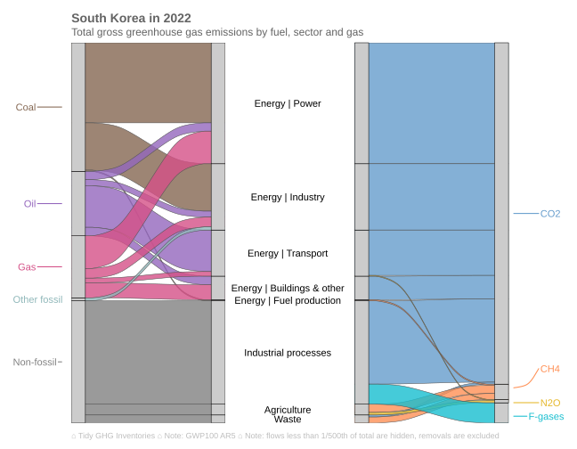
  <a target='_blank' href='https://raw.githubusercontent.com/lambwf/Tidy-GHG-Inventories/main/plots/countries/sankeys/South Korea-sankey.xlsx'>data</a> | <a target='_blank' href='https://raw.githubusercontent.com/lambwf/Tidy-GHG-Inventories/main/plots/countries/sankeys/South Korea-sankey.png'>png</a> | <a target='_blank' href='https://raw.githubusercontent.com/lambwf/Tidy-GHG-Inventories/main/plots/countries/sankeys/South Korea-sankey.pdf'>pdf</a> | <a target='_blank' href='https://raw.githubusercontent.com/lambwf/Tidy-GHG-Inventories/main/plots/countries/sankeys/South Korea-sankey.svg'>svg</a>

- 
  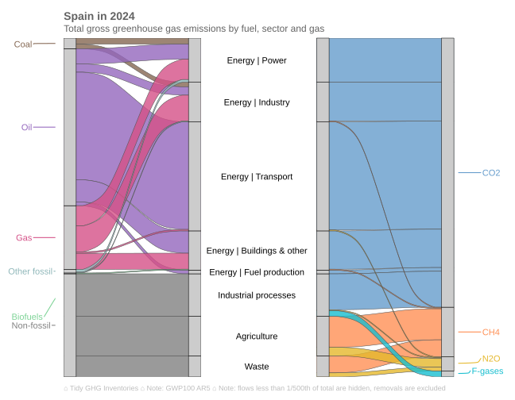
  <a target='_blank' href='https://raw.githubusercontent.com/lambwf/Tidy-GHG-Inventories/main/plots/countries/sankeys/Spain-sankey.xlsx'>data</a> | <a target='_blank' href='https://raw.githubusercontent.com/lambwf/Tidy-GHG-Inventories/main/plots/countries/sankeys/Spain-sankey.png'>png</a> | <a target='_blank' href='https://raw.githubusercontent.com/lambwf/Tidy-GHG-Inventories/main/plots/countries/sankeys/Spain-sankey.pdf'>pdf</a> | <a target='_blank' href='https://raw.githubusercontent.com/lambwf/Tidy-GHG-Inventories/main/plots/countries/sankeys/Spain-sankey.svg'>svg</a>

- 
  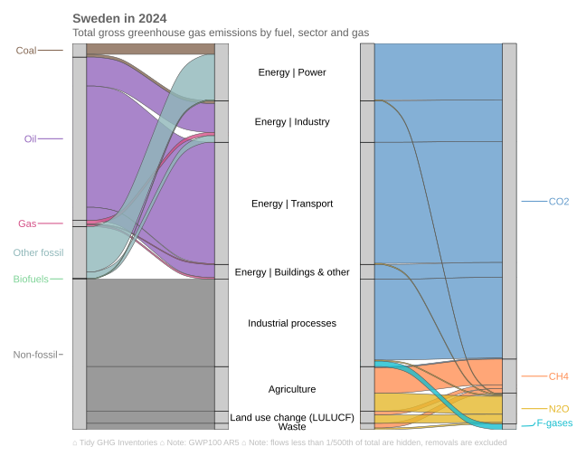
  <a target='_blank' href='https://raw.githubusercontent.com/lambwf/Tidy-GHG-Inventories/main/plots/countries/sankeys/Sweden-sankey.xlsx'>data</a> | <a target='_blank' href='https://raw.githubusercontent.com/lambwf/Tidy-GHG-Inventories/main/plots/countries/sankeys/Sweden-sankey.png'>png</a> | <a target='_blank' href='https://raw.githubusercontent.com/lambwf/Tidy-GHG-Inventories/main/plots/countries/sankeys/Sweden-sankey.pdf'>pdf</a> | <a target='_blank' href='https://raw.githubusercontent.com/lambwf/Tidy-GHG-Inventories/main/plots/countries/sankeys/Sweden-sankey.svg'>svg</a>

- 
  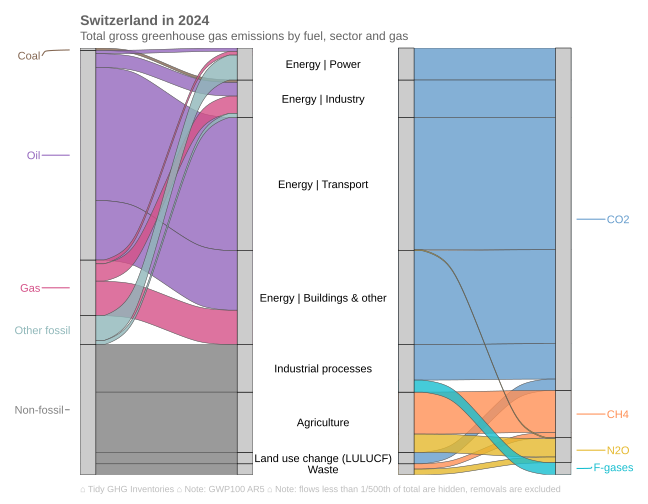
  <a target='_blank' href='https://raw.githubusercontent.com/lambwf/Tidy-GHG-Inventories/main/plots/countries/sankeys/Switzerland-sankey.xlsx'>data</a> | <a target='_blank' href='https://raw.githubusercontent.com/lambwf/Tidy-GHG-Inventories/main/plots/countries/sankeys/Switzerland-sankey.png'>png</a> | <a target='_blank' href='https://raw.githubusercontent.com/lambwf/Tidy-GHG-Inventories/main/plots/countries/sankeys/Switzerland-sankey.pdf'>pdf</a> | <a target='_blank' href='https://raw.githubusercontent.com/lambwf/Tidy-GHG-Inventories/main/plots/countries/sankeys/Switzerland-sankey.svg'>svg</a>

- 
  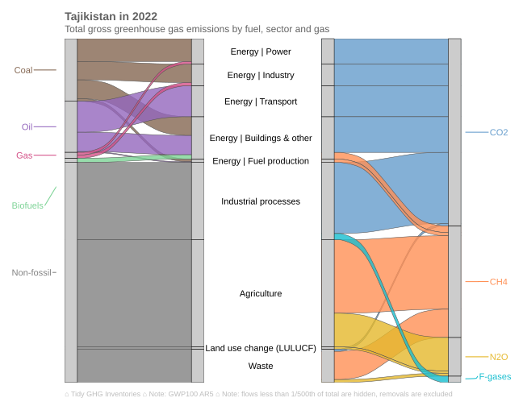
  <a target='_blank' href='https://raw.githubusercontent.com/lambwf/Tidy-GHG-Inventories/main/plots/countries/sankeys/Tajikistan-sankey.xlsx'>data</a> | <a target='_blank' href='https://raw.githubusercontent.com/lambwf/Tidy-GHG-Inventories/main/plots/countries/sankeys/Tajikistan-sankey.png'>png</a> | <a target='_blank' href='https://raw.githubusercontent.com/lambwf/Tidy-GHG-Inventories/main/plots/countries/sankeys/Tajikistan-sankey.pdf'>pdf</a> | <a target='_blank' href='https://raw.githubusercontent.com/lambwf/Tidy-GHG-Inventories/main/plots/countries/sankeys/Tajikistan-sankey.svg'>svg</a>

- 
  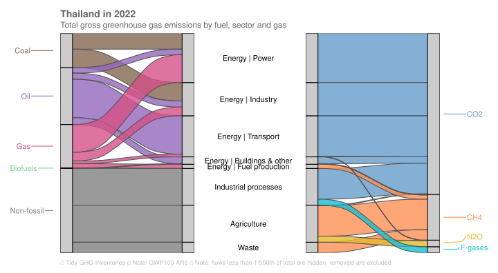
  <a target='_blank' href='https://raw.githubusercontent.com/lambwf/Tidy-GHG-Inventories/main/plots/countries/sankeys/Thailand-sankey.xlsx'>data</a> | <a target='_blank' href='https://raw.githubusercontent.com/lambwf/Tidy-GHG-Inventories/main/plots/countries/sankeys/Thailand-sankey.png'>png</a> | <a target='_blank' href='https://raw.githubusercontent.com/lambwf/Tidy-GHG-Inventories/main/plots/countries/sankeys/Thailand-sankey.pdf'>pdf</a> | <a target='_blank' href='https://raw.githubusercontent.com/lambwf/Tidy-GHG-Inventories/main/plots/countries/sankeys/Thailand-sankey.svg'>svg</a>

- 
  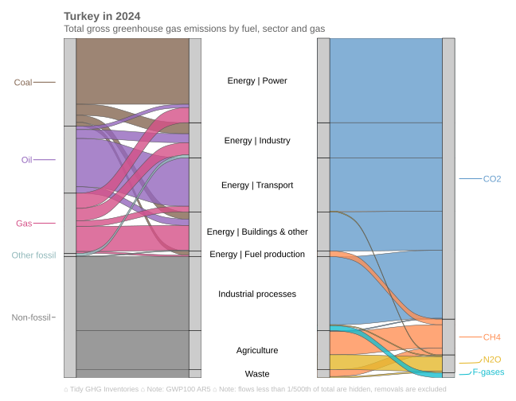
  <a target='_blank' href='https://raw.githubusercontent.com/lambwf/Tidy-GHG-Inventories/main/plots/countries/sankeys/Turkey-sankey.xlsx'>data</a> | <a target='_blank' href='https://raw.githubusercontent.com/lambwf/Tidy-GHG-Inventories/main/plots/countries/sankeys/Turkey-sankey.png'>png</a> | <a target='_blank' href='https://raw.githubusercontent.com/lambwf/Tidy-GHG-Inventories/main/plots/countries/sankeys/Turkey-sankey.pdf'>pdf</a> | <a target='_blank' href='https://raw.githubusercontent.com/lambwf/Tidy-GHG-Inventories/main/plots/countries/sankeys/Turkey-sankey.svg'>svg</a>

- 
  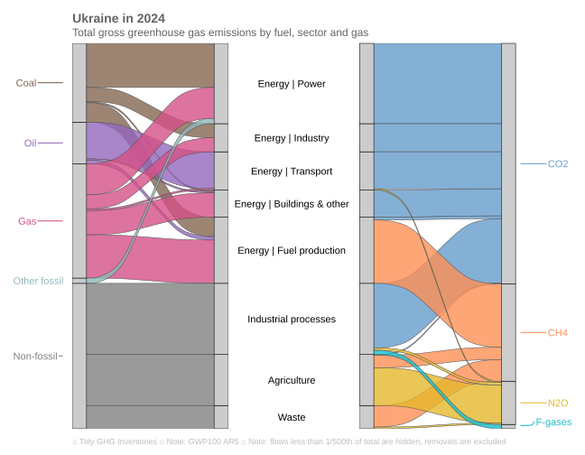
  <a target='_blank' href='https://raw.githubusercontent.com/lambwf/Tidy-GHG-Inventories/main/plots/countries/sankeys/Ukraine-sankey.xlsx'>data</a> | <a target='_blank' href='https://raw.githubusercontent.com/lambwf/Tidy-GHG-Inventories/main/plots/countries/sankeys/Ukraine-sankey.png'>png</a> | <a target='_blank' href='https://raw.githubusercontent.com/lambwf/Tidy-GHG-Inventories/main/plots/countries/sankeys/Ukraine-sankey.pdf'>pdf</a> | <a target='_blank' href='https://raw.githubusercontent.com/lambwf/Tidy-GHG-Inventories/main/plots/countries/sankeys/Ukraine-sankey.svg'>svg</a>

- 
  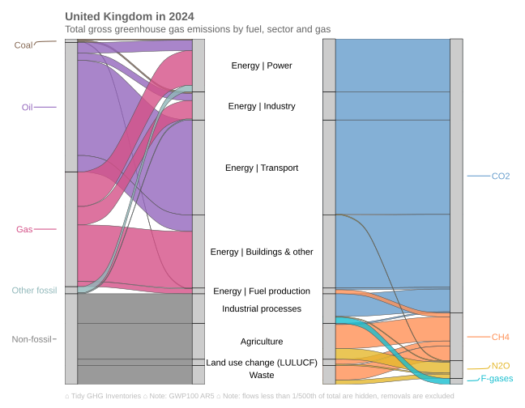
  <a target='_blank' href='https://raw.githubusercontent.com/lambwf/Tidy-GHG-Inventories/main/plots/countries/sankeys/United Kingdom-sankey.xlsx'>data</a> | <a target='_blank' href='https://raw.githubusercontent.com/lambwf/Tidy-GHG-Inventories/main/plots/countries/sankeys/United Kingdom-sankey.png'>png</a> | <a target='_blank' href='https://raw.githubusercontent.com/lambwf/Tidy-GHG-Inventories/main/plots/countries/sankeys/United Kingdom-sankey.pdf'>pdf</a> | <a target='_blank' href='https://raw.githubusercontent.com/lambwf/Tidy-GHG-Inventories/main/plots/countries/sankeys/United Kingdom-sankey.svg'>svg</a>

- 
  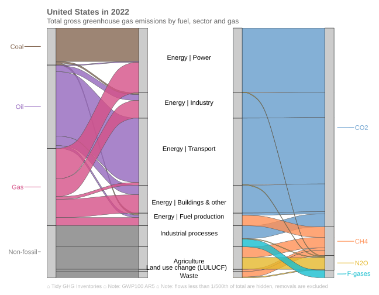
  <a target='_blank' href='https://raw.githubusercontent.com/lambwf/Tidy-GHG-Inventories/main/plots/countries/sankeys/United States-sankey.xlsx'>data</a> | <a target='_blank' href='https://raw.githubusercontent.com/lambwf/Tidy-GHG-Inventories/main/plots/countries/sankeys/United States-sankey.png'>png</a> | <a target='_blank' href='https://raw.githubusercontent.com/lambwf/Tidy-GHG-Inventories/main/plots/countries/sankeys/United States-sankey.pdf'>pdf</a> | <a target='_blank' href='https://raw.githubusercontent.com/lambwf/Tidy-GHG-Inventories/main/plots/countries/sankeys/United States-sankey.svg'>svg</a>

- 
  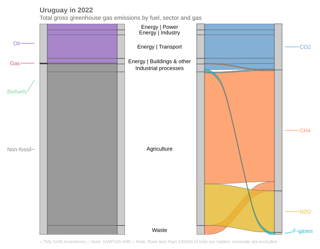
  <a target='_blank' href='https://raw.githubusercontent.com/lambwf/Tidy-GHG-Inventories/main/plots/countries/sankeys/Uruguay-sankey.xlsx'>data</a> | <a target='_blank' href='https://raw.githubusercontent.com/lambwf/Tidy-GHG-Inventories/main/plots/countries/sankeys/Uruguay-sankey.png'>png</a> | <a target='_blank' href='https://raw.githubusercontent.com/lambwf/Tidy-GHG-Inventories/main/plots/countries/sankeys/Uruguay-sankey.pdf'>pdf</a> | <a target='_blank' href='https://raw.githubusercontent.com/lambwf/Tidy-GHG-Inventories/main/plots/countries/sankeys/Uruguay-sankey.svg'>svg</a>

- 
  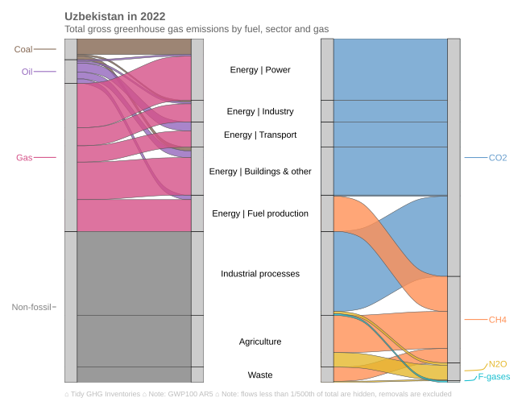
  <a target='_blank' href='https://raw.githubusercontent.com/lambwf/Tidy-GHG-Inventories/main/plots/countries/sankeys/Uzbekistan-sankey.xlsx'>data</a> | <a target='_blank' href='https://raw.githubusercontent.com/lambwf/Tidy-GHG-Inventories/main/plots/countries/sankeys/Uzbekistan-sankey.png'>png</a> | <a target='_blank' href='https://raw.githubusercontent.com/lambwf/Tidy-GHG-Inventories/main/plots/countries/sankeys/Uzbekistan-sankey.pdf'>pdf</a> | <a target='_blank' href='https://raw.githubusercontent.com/lambwf/Tidy-GHG-Inventories/main/plots/countries/sankeys/Uzbekistan-sankey.svg'>svg</a>

- 
  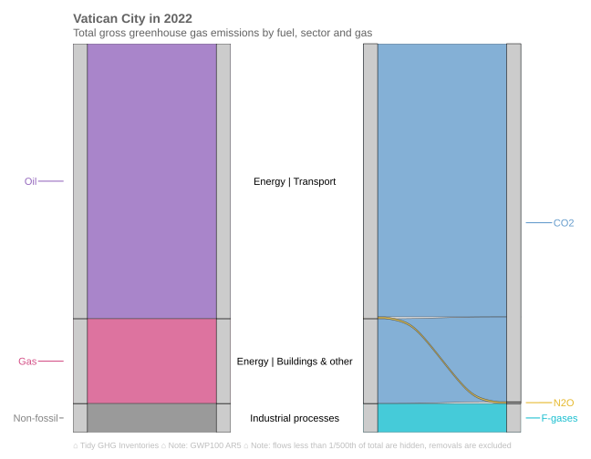
  <a target='_blank' href='https://raw.githubusercontent.com/lambwf/Tidy-GHG-Inventories/main/plots/countries/sankeys/Vatican City-sankey.xlsx'>data</a> | <a target='_blank' href='https://raw.githubusercontent.com/lambwf/Tidy-GHG-Inventories/main/plots/countries/sankeys/Vatican City-sankey.png'>png</a> | <a target='_blank' href='https://raw.githubusercontent.com/lambwf/Tidy-GHG-Inventories/main/plots/countries/sankeys/Vatican City-sankey.pdf'>pdf</a> | <a target='_blank' href='https://raw.githubusercontent.com/lambwf/Tidy-GHG-Inventories/main/plots/countries/sankeys/Vatican City-sankey.svg'>svg</a>

- 
  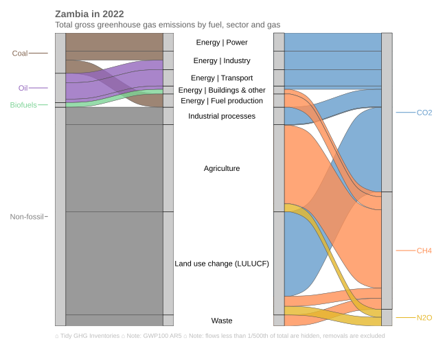
  <a target='_blank' href='https://raw.githubusercontent.com/lambwf/Tidy-GHG-Inventories/main/plots/countries/sankeys/Zambia-sankey.xlsx'>data</a> | <a target='_blank' href='https://raw.githubusercontent.com/lambwf/Tidy-GHG-Inventories/main/plots/countries/sankeys/Zambia-sankey.png'>png</a> | <a target='_blank' href='https://raw.githubusercontent.com/lambwf/Tidy-GHG-Inventories/main/plots/countries/sankeys/Zambia-sankey.pdf'>pdf</a> | <a target='_blank' href='https://raw.githubusercontent.com/lambwf/Tidy-GHG-Inventories/main/plots/countries/sankeys/Zambia-sankey.svg'>svg</a>

