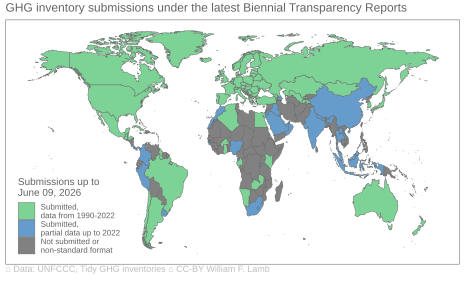

#Tidy GHG Inventories

The Tidy GHG Inventories dataset is a compilation of national greenhouse gas emissions (GHG) inventories, sourced from the Common Reporting Tables (CRTs) that countries submit to the UNFCCC. The CRTs themselves require significant manipulation before one can begin any data analysis. The objective of this dataset is therefore to put the national inventories into a single, tidy and consistently structured table format that better suits user needs.

<a target='_blank' href='https://doi.org/10.5281/zenodo.14512139'>The data repository and documentation is available here.</a>

Not all countries submit complete or timely inventories. Some inventories include only a few years of data, or data in individual years instead of the full time series since 1990. The map below shows how complete the dataset currently is.

