These figures show emissions aggregated across all greenhouse gases to 9 sectors, taking the main categories of national GHG inventories, but also breaking down the Energy sector into its 5 main subsectors.

Please cite the figures or data as follows: Lamb, W. F. (2026). Tidy GHG Inventories (v2) [Data set]. Zenodo. https://doi.org/10.5281/zenodo.14512139

<select onchange="if (this.value) window.location.hash=this.value"><option value=''>Jump to country…</option><option value='albania'>Albania</option>
<option value='algeria'>Algeria</option>
<option value='argentina'>Argentina</option>
<option value='armenia'>Armenia</option>
<option value='australia'>Australia</option>
<option value='austria'>Austria</option>
<option value='azerbaijan'>Azerbaijan</option>
<option value='bahrain'>Bahrain</option>
<option value='belarus'>Belarus</option>
<option value='belgium'>Belgium</option>
<option value='belize'>Belize</option>
<option value='bhutan'>Bhutan</option>
<option value='brazil'>Brazil</option>
<option value='brunei'>Brunei</option>
<option value='bulgaria'>Bulgaria</option>
<option value='burkina-faso'>Burkina Faso</option>
<option value='burundi'>Burundi</option>
<option value='canada'>Canada</option>
<option value='chile'>Chile</option>
<option value='china'>China</option>
<option value='colombia'>Colombia</option>
<option value='costa-rica'>Costa Rica</option>
<option value='croatia'>Croatia</option>
<option value='cuba'>Cuba</option>
<option value='cyprus'>Cyprus</option>
<option value='czechia'>Czechia</option>
<option value='denmark'>Denmark</option>
<option value='egypt'>Egypt</option>
<option value='estonia'>Estonia</option>
<option value='eswatini'>Eswatini</option>
<option value='european-union'>European Union</option>
<option value='finland'>Finland</option>
<option value='france'>France</option>
<option value='gabon'>Gabon</option>
<option value='georgia'>Georgia</option>
<option value='germany'>Germany</option>
<option value='ghana'>Ghana</option>
<option value='greece'>Greece</option>
<option value='guatemala'>Guatemala</option>
<option value='guinea-bissau'>Guinea-Bissau</option>
<option value='guyana'>Guyana</option>
<option value='honduras'>Honduras</option>
<option value='hungary'>Hungary</option>
<option value='iceland'>Iceland</option>
<option value='india'>India</option>
<option value='indonesia'>Indonesia</option>
<option value='iraq'>Iraq</option>
<option value='ireland'>Ireland</option>
<option value='israel'>Israel</option>
<option value='italy'>Italy</option>
<option value='japan'>Japan</option>
<option value='jordan'>Jordan</option>
<option value='kazakhstan'>Kazakhstan</option>
<option value='kenya'>Kenya</option>
<option value='laos'>Laos</option>
<option value='latvia'>Latvia</option>
<option value='lebanon'>Lebanon</option>
<option value='liechtenstein'>Liechtenstein</option>
<option value='lithuania'>Lithuania</option>
<option value='luxembourg'>Luxembourg</option>
<option value='malaysia'>Malaysia</option>
<option value='maldives'>Maldives</option>
<option value='malta'>Malta</option>
<option value='mauritius'>Mauritius</option>
<option value='mexico'>Mexico</option>
<option value='moldova'>Moldova</option>
<option value='monaco'>Monaco</option>
<option value='mongolia'>Mongolia</option>
<option value='morocco'>Morocco</option>
<option value='namibia'>Namibia</option>
<option value='nepal'>Nepal</option>
<option value='netherlands'>Netherlands</option>
<option value='new-zealand'>New Zealand</option>
<option value='nigeria'>Nigeria</option>
<option value='norway'>Norway</option>
<option value='oman'>Oman</option>
<option value='panama'>Panama</option>
<option value='peru'>Peru</option>
<option value='poland'>Poland</option>
<option value='portugal'>Portugal</option>
<option value='romania'>Romania</option>
<option value='russia'>Russia</option>
<option value='rwanda'>Rwanda</option>
<option value='saudi-arabia'>Saudi Arabia</option>
<option value='serbia'>Serbia</option>
<option value='singapore'>Singapore</option>
<option value='slovakia'>Slovakia</option>
<option value='slovenia'>Slovenia</option>
<option value='solomon-islands'>Solomon Islands</option>
<option value='south-africa'>South Africa</option>
<option value='south-korea'>South Korea</option>
<option value='spain'>Spain</option>
<option value='sweden'>Sweden</option>
<option value='switzerland'>Switzerland</option>
<option value='tajikistan'>Tajikistan</option>
<option value='thailand'>Thailand</option>
<option value='turkey'>Turkey</option>
<option value='ukraine'>Ukraine</option>
<option value='united-arab-emirates'>United Arab Emirates</option>
<option value='united-kingdom'>United Kingdom</option>
<option value='united-states'>United States</option>
<option value='uruguay'>Uruguay</option>
<option value='uzbekistan'>Uzbekistan</option>
<option value='vatican-city'>Vatican City</option>
<option value='zambia'>Zambia</option></select>

- 
  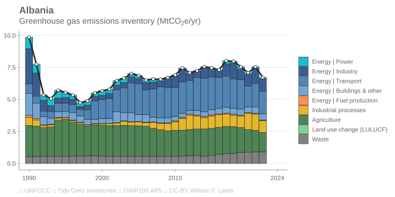
  <a target='_blank' href='https://raw.githubusercontent.com/lambwf/Tidy-GHG-Inventories/main/plots/countries/sectors/Albania-sectors.xlsx'>data</a> | <a target='_blank' href='https://raw.githubusercontent.com/lambwf/Tidy-GHG-Inventories/main/plots/countries/sectors/Albania-sectors.png'>png</a> | <a target='_blank' href='https://raw.githubusercontent.com/lambwf/Tidy-GHG-Inventories/main/plots/countries/sectors/Albania-sectors.pdf'>pdf</a> | <a target='_blank' href='https://raw.githubusercontent.com/lambwf/Tidy-GHG-Inventories/main/plots/countries/sectors/Albania-sectors.svg'>svg</a>

- 
  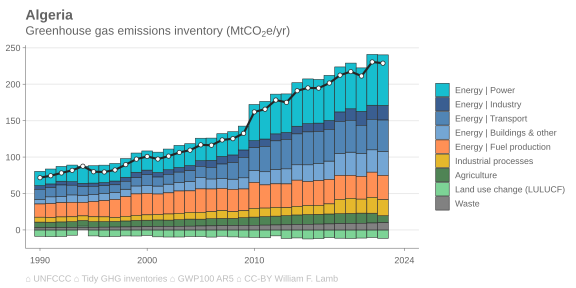
  <a target='_blank' href='https://raw.githubusercontent.com/lambwf/Tidy-GHG-Inventories/main/plots/countries/sectors/Algeria-sectors.xlsx'>data</a> | <a target='_blank' href='https://raw.githubusercontent.com/lambwf/Tidy-GHG-Inventories/main/plots/countries/sectors/Algeria-sectors.png'>png</a> | <a target='_blank' href='https://raw.githubusercontent.com/lambwf/Tidy-GHG-Inventories/main/plots/countries/sectors/Algeria-sectors.pdf'>pdf</a> | <a target='_blank' href='https://raw.githubusercontent.com/lambwf/Tidy-GHG-Inventories/main/plots/countries/sectors/Algeria-sectors.svg'>svg</a>

- 
  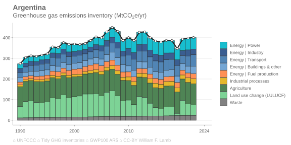
  <a target='_blank' href='https://raw.githubusercontent.com/lambwf/Tidy-GHG-Inventories/main/plots/countries/sectors/Argentina-sectors.xlsx'>data</a> | <a target='_blank' href='https://raw.githubusercontent.com/lambwf/Tidy-GHG-Inventories/main/plots/countries/sectors/Argentina-sectors.png'>png</a> | <a target='_blank' href='https://raw.githubusercontent.com/lambwf/Tidy-GHG-Inventories/main/plots/countries/sectors/Argentina-sectors.pdf'>pdf</a> | <a target='_blank' href='https://raw.githubusercontent.com/lambwf/Tidy-GHG-Inventories/main/plots/countries/sectors/Argentina-sectors.svg'>svg</a>

- 
  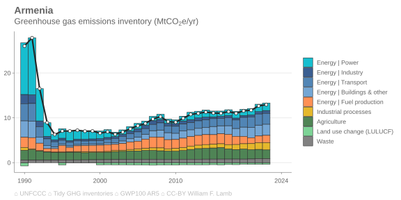
  <a target='_blank' href='https://raw.githubusercontent.com/lambwf/Tidy-GHG-Inventories/main/plots/countries/sectors/Armenia-sectors.xlsx'>data</a> | <a target='_blank' href='https://raw.githubusercontent.com/lambwf/Tidy-GHG-Inventories/main/plots/countries/sectors/Armenia-sectors.png'>png</a> | <a target='_blank' href='https://raw.githubusercontent.com/lambwf/Tidy-GHG-Inventories/main/plots/countries/sectors/Armenia-sectors.pdf'>pdf</a> | <a target='_blank' href='https://raw.githubusercontent.com/lambwf/Tidy-GHG-Inventories/main/plots/countries/sectors/Armenia-sectors.svg'>svg</a>

- 
  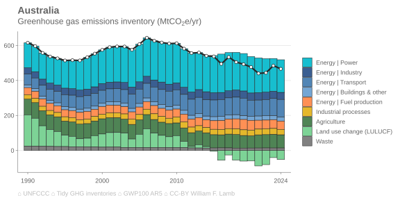
  <a target='_blank' href='https://raw.githubusercontent.com/lambwf/Tidy-GHG-Inventories/main/plots/countries/sectors/Australia-sectors.xlsx'>data</a> | <a target='_blank' href='https://raw.githubusercontent.com/lambwf/Tidy-GHG-Inventories/main/plots/countries/sectors/Australia-sectors.png'>png</a> | <a target='_blank' href='https://raw.githubusercontent.com/lambwf/Tidy-GHG-Inventories/main/plots/countries/sectors/Australia-sectors.pdf'>pdf</a> | <a target='_blank' href='https://raw.githubusercontent.com/lambwf/Tidy-GHG-Inventories/main/plots/countries/sectors/Australia-sectors.svg'>svg</a>

- 
  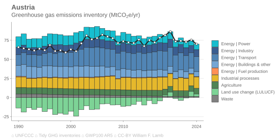
  <a target='_blank' href='https://raw.githubusercontent.com/lambwf/Tidy-GHG-Inventories/main/plots/countries/sectors/Austria-sectors.xlsx'>data</a> | <a target='_blank' href='https://raw.githubusercontent.com/lambwf/Tidy-GHG-Inventories/main/plots/countries/sectors/Austria-sectors.png'>png</a> | <a target='_blank' href='https://raw.githubusercontent.com/lambwf/Tidy-GHG-Inventories/main/plots/countries/sectors/Austria-sectors.pdf'>pdf</a> | <a target='_blank' href='https://raw.githubusercontent.com/lambwf/Tidy-GHG-Inventories/main/plots/countries/sectors/Austria-sectors.svg'>svg</a>

- 
  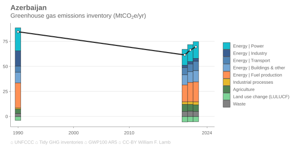
  <a target='_blank' href='https://raw.githubusercontent.com/lambwf/Tidy-GHG-Inventories/main/plots/countries/sectors/Azerbaijan-sectors.xlsx'>data</a> | <a target='_blank' href='https://raw.githubusercontent.com/lambwf/Tidy-GHG-Inventories/main/plots/countries/sectors/Azerbaijan-sectors.png'>png</a> | <a target='_blank' href='https://raw.githubusercontent.com/lambwf/Tidy-GHG-Inventories/main/plots/countries/sectors/Azerbaijan-sectors.pdf'>pdf</a> | <a target='_blank' href='https://raw.githubusercontent.com/lambwf/Tidy-GHG-Inventories/main/plots/countries/sectors/Azerbaijan-sectors.svg'>svg</a>

- 
  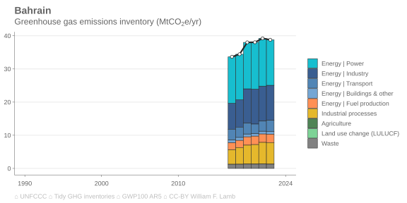
  <a target='_blank' href='https://raw.githubusercontent.com/lambwf/Tidy-GHG-Inventories/main/plots/countries/sectors/Bahrain-sectors.xlsx'>data</a> | <a target='_blank' href='https://raw.githubusercontent.com/lambwf/Tidy-GHG-Inventories/main/plots/countries/sectors/Bahrain-sectors.png'>png</a> | <a target='_blank' href='https://raw.githubusercontent.com/lambwf/Tidy-GHG-Inventories/main/plots/countries/sectors/Bahrain-sectors.pdf'>pdf</a> | <a target='_blank' href='https://raw.githubusercontent.com/lambwf/Tidy-GHG-Inventories/main/plots/countries/sectors/Bahrain-sectors.svg'>svg</a>

- 
  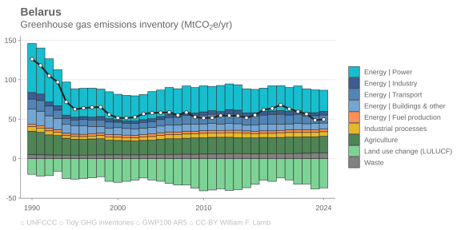
  <a target='_blank' href='https://raw.githubusercontent.com/lambwf/Tidy-GHG-Inventories/main/plots/countries/sectors/Belarus-sectors.xlsx'>data</a> | <a target='_blank' href='https://raw.githubusercontent.com/lambwf/Tidy-GHG-Inventories/main/plots/countries/sectors/Belarus-sectors.png'>png</a> | <a target='_blank' href='https://raw.githubusercontent.com/lambwf/Tidy-GHG-Inventories/main/plots/countries/sectors/Belarus-sectors.pdf'>pdf</a> | <a target='_blank' href='https://raw.githubusercontent.com/lambwf/Tidy-GHG-Inventories/main/plots/countries/sectors/Belarus-sectors.svg'>svg</a>

- 
  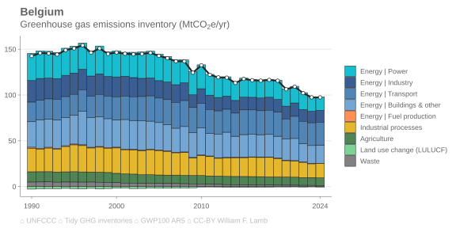
  <a target='_blank' href='https://raw.githubusercontent.com/lambwf/Tidy-GHG-Inventories/main/plots/countries/sectors/Belgium-sectors.xlsx'>data</a> | <a target='_blank' href='https://raw.githubusercontent.com/lambwf/Tidy-GHG-Inventories/main/plots/countries/sectors/Belgium-sectors.png'>png</a> | <a target='_blank' href='https://raw.githubusercontent.com/lambwf/Tidy-GHG-Inventories/main/plots/countries/sectors/Belgium-sectors.pdf'>pdf</a> | <a target='_blank' href='https://raw.githubusercontent.com/lambwf/Tidy-GHG-Inventories/main/plots/countries/sectors/Belgium-sectors.svg'>svg</a>

- 
  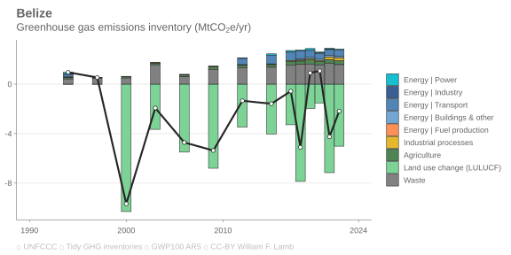
  <a target='_blank' href='https://raw.githubusercontent.com/lambwf/Tidy-GHG-Inventories/main/plots/countries/sectors/Belize-sectors.xlsx'>data</a> | <a target='_blank' href='https://raw.githubusercontent.com/lambwf/Tidy-GHG-Inventories/main/plots/countries/sectors/Belize-sectors.png'>png</a> | <a target='_blank' href='https://raw.githubusercontent.com/lambwf/Tidy-GHG-Inventories/main/plots/countries/sectors/Belize-sectors.pdf'>pdf</a> | <a target='_blank' href='https://raw.githubusercontent.com/lambwf/Tidy-GHG-Inventories/main/plots/countries/sectors/Belize-sectors.svg'>svg</a>

- 
  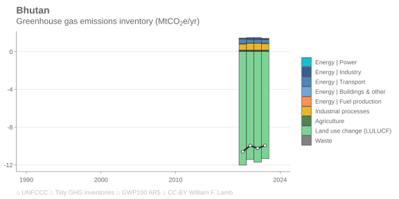
  <a target='_blank' href='https://raw.githubusercontent.com/lambwf/Tidy-GHG-Inventories/main/plots/countries/sectors/Bhutan-sectors.xlsx'>data</a> | <a target='_blank' href='https://raw.githubusercontent.com/lambwf/Tidy-GHG-Inventories/main/plots/countries/sectors/Bhutan-sectors.png'>png</a> | <a target='_blank' href='https://raw.githubusercontent.com/lambwf/Tidy-GHG-Inventories/main/plots/countries/sectors/Bhutan-sectors.pdf'>pdf</a> | <a target='_blank' href='https://raw.githubusercontent.com/lambwf/Tidy-GHG-Inventories/main/plots/countries/sectors/Bhutan-sectors.svg'>svg</a>

- 
  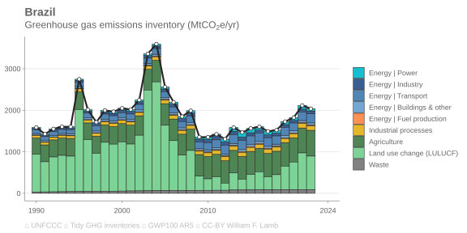
  <a target='_blank' href='https://raw.githubusercontent.com/lambwf/Tidy-GHG-Inventories/main/plots/countries/sectors/Brazil-sectors.xlsx'>data</a> | <a target='_blank' href='https://raw.githubusercontent.com/lambwf/Tidy-GHG-Inventories/main/plots/countries/sectors/Brazil-sectors.png'>png</a> | <a target='_blank' href='https://raw.githubusercontent.com/lambwf/Tidy-GHG-Inventories/main/plots/countries/sectors/Brazil-sectors.pdf'>pdf</a> | <a target='_blank' href='https://raw.githubusercontent.com/lambwf/Tidy-GHG-Inventories/main/plots/countries/sectors/Brazil-sectors.svg'>svg</a>

- 
  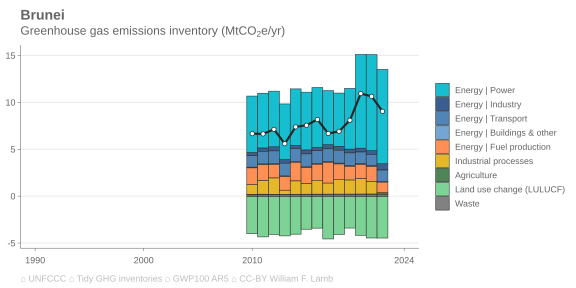
  <a target='_blank' href='https://raw.githubusercontent.com/lambwf/Tidy-GHG-Inventories/main/plots/countries/sectors/Brunei-sectors.xlsx'>data</a> | <a target='_blank' href='https://raw.githubusercontent.com/lambwf/Tidy-GHG-Inventories/main/plots/countries/sectors/Brunei-sectors.png'>png</a> | <a target='_blank' href='https://raw.githubusercontent.com/lambwf/Tidy-GHG-Inventories/main/plots/countries/sectors/Brunei-sectors.pdf'>pdf</a> | <a target='_blank' href='https://raw.githubusercontent.com/lambwf/Tidy-GHG-Inventories/main/plots/countries/sectors/Brunei-sectors.svg'>svg</a>

- 
  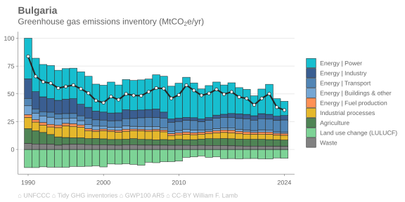
  <a target='_blank' href='https://raw.githubusercontent.com/lambwf/Tidy-GHG-Inventories/main/plots/countries/sectors/Bulgaria-sectors.xlsx'>data</a> | <a target='_blank' href='https://raw.githubusercontent.com/lambwf/Tidy-GHG-Inventories/main/plots/countries/sectors/Bulgaria-sectors.png'>png</a> | <a target='_blank' href='https://raw.githubusercontent.com/lambwf/Tidy-GHG-Inventories/main/plots/countries/sectors/Bulgaria-sectors.pdf'>pdf</a> | <a target='_blank' href='https://raw.githubusercontent.com/lambwf/Tidy-GHG-Inventories/main/plots/countries/sectors/Bulgaria-sectors.svg'>svg</a>

- 
  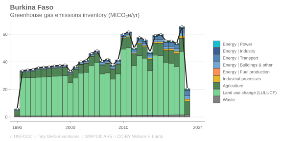
  <a target='_blank' href='https://raw.githubusercontent.com/lambwf/Tidy-GHG-Inventories/main/plots/countries/sectors/Burkina Faso-sectors.xlsx'>data</a> | <a target='_blank' href='https://raw.githubusercontent.com/lambwf/Tidy-GHG-Inventories/main/plots/countries/sectors/Burkina Faso-sectors.png'>png</a> | <a target='_blank' href='https://raw.githubusercontent.com/lambwf/Tidy-GHG-Inventories/main/plots/countries/sectors/Burkina Faso-sectors.pdf'>pdf</a> | <a target='_blank' href='https://raw.githubusercontent.com/lambwf/Tidy-GHG-Inventories/main/plots/countries/sectors/Burkina Faso-sectors.svg'>svg</a>

- 
  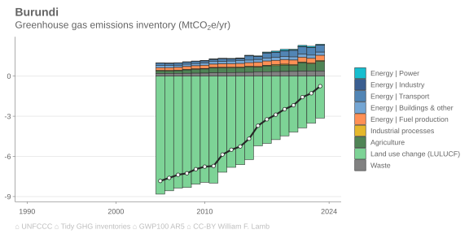
  <a target='_blank' href='https://raw.githubusercontent.com/lambwf/Tidy-GHG-Inventories/main/plots/countries/sectors/Burundi-sectors.xlsx'>data</a> | <a target='_blank' href='https://raw.githubusercontent.com/lambwf/Tidy-GHG-Inventories/main/plots/countries/sectors/Burundi-sectors.png'>png</a> | <a target='_blank' href='https://raw.githubusercontent.com/lambwf/Tidy-GHG-Inventories/main/plots/countries/sectors/Burundi-sectors.pdf'>pdf</a> | <a target='_blank' href='https://raw.githubusercontent.com/lambwf/Tidy-GHG-Inventories/main/plots/countries/sectors/Burundi-sectors.svg'>svg</a>

- 
  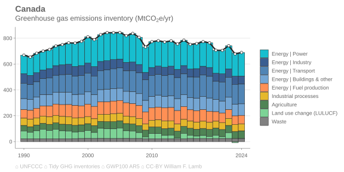
  <a target='_blank' href='https://raw.githubusercontent.com/lambwf/Tidy-GHG-Inventories/main/plots/countries/sectors/Canada-sectors.xlsx'>data</a> | <a target='_blank' href='https://raw.githubusercontent.com/lambwf/Tidy-GHG-Inventories/main/plots/countries/sectors/Canada-sectors.png'>png</a> | <a target='_blank' href='https://raw.githubusercontent.com/lambwf/Tidy-GHG-Inventories/main/plots/countries/sectors/Canada-sectors.pdf'>pdf</a> | <a target='_blank' href='https://raw.githubusercontent.com/lambwf/Tidy-GHG-Inventories/main/plots/countries/sectors/Canada-sectors.svg'>svg</a>

- 
  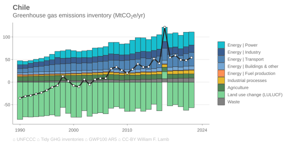
  <a target='_blank' href='https://raw.githubusercontent.com/lambwf/Tidy-GHG-Inventories/main/plots/countries/sectors/Chile-sectors.xlsx'>data</a> | <a target='_blank' href='https://raw.githubusercontent.com/lambwf/Tidy-GHG-Inventories/main/plots/countries/sectors/Chile-sectors.png'>png</a> | <a target='_blank' href='https://raw.githubusercontent.com/lambwf/Tidy-GHG-Inventories/main/plots/countries/sectors/Chile-sectors.pdf'>pdf</a> | <a target='_blank' href='https://raw.githubusercontent.com/lambwf/Tidy-GHG-Inventories/main/plots/countries/sectors/Chile-sectors.svg'>svg</a>

- 
  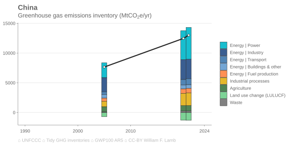
  <a target='_blank' href='https://raw.githubusercontent.com/lambwf/Tidy-GHG-Inventories/main/plots/countries/sectors/China-sectors.xlsx'>data</a> | <a target='_blank' href='https://raw.githubusercontent.com/lambwf/Tidy-GHG-Inventories/main/plots/countries/sectors/China-sectors.png'>png</a> | <a target='_blank' href='https://raw.githubusercontent.com/lambwf/Tidy-GHG-Inventories/main/plots/countries/sectors/China-sectors.pdf'>pdf</a> | <a target='_blank' href='https://raw.githubusercontent.com/lambwf/Tidy-GHG-Inventories/main/plots/countries/sectors/China-sectors.svg'>svg</a>

- 
  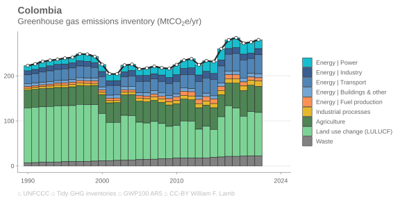
  <a target='_blank' href='https://raw.githubusercontent.com/lambwf/Tidy-GHG-Inventories/main/plots/countries/sectors/Colombia-sectors.xlsx'>data</a> | <a target='_blank' href='https://raw.githubusercontent.com/lambwf/Tidy-GHG-Inventories/main/plots/countries/sectors/Colombia-sectors.png'>png</a> | <a target='_blank' href='https://raw.githubusercontent.com/lambwf/Tidy-GHG-Inventories/main/plots/countries/sectors/Colombia-sectors.pdf'>pdf</a> | <a target='_blank' href='https://raw.githubusercontent.com/lambwf/Tidy-GHG-Inventories/main/plots/countries/sectors/Colombia-sectors.svg'>svg</a>

- 
  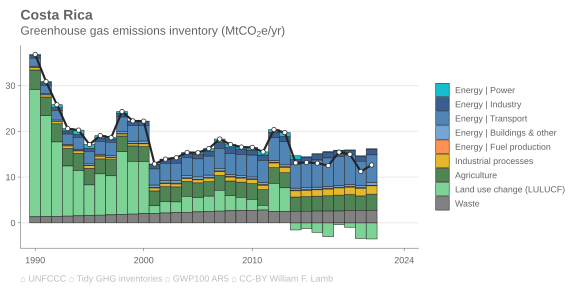
  <a target='_blank' href='https://raw.githubusercontent.com/lambwf/Tidy-GHG-Inventories/main/plots/countries/sectors/Costa Rica-sectors.xlsx'>data</a> | <a target='_blank' href='https://raw.githubusercontent.com/lambwf/Tidy-GHG-Inventories/main/plots/countries/sectors/Costa Rica-sectors.png'>png</a> | <a target='_blank' href='https://raw.githubusercontent.com/lambwf/Tidy-GHG-Inventories/main/plots/countries/sectors/Costa Rica-sectors.pdf'>pdf</a> | <a target='_blank' href='https://raw.githubusercontent.com/lambwf/Tidy-GHG-Inventories/main/plots/countries/sectors/Costa Rica-sectors.svg'>svg</a>

- 
  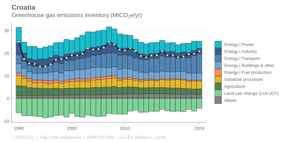
  <a target='_blank' href='https://raw.githubusercontent.com/lambwf/Tidy-GHG-Inventories/main/plots/countries/sectors/Croatia-sectors.xlsx'>data</a> | <a target='_blank' href='https://raw.githubusercontent.com/lambwf/Tidy-GHG-Inventories/main/plots/countries/sectors/Croatia-sectors.png'>png</a> | <a target='_blank' href='https://raw.githubusercontent.com/lambwf/Tidy-GHG-Inventories/main/plots/countries/sectors/Croatia-sectors.pdf'>pdf</a> | <a target='_blank' href='https://raw.githubusercontent.com/lambwf/Tidy-GHG-Inventories/main/plots/countries/sectors/Croatia-sectors.svg'>svg</a>

- 
  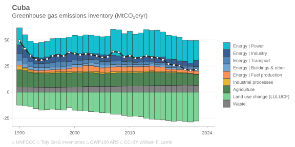
  <a target='_blank' href='https://raw.githubusercontent.com/lambwf/Tidy-GHG-Inventories/main/plots/countries/sectors/Cuba-sectors.xlsx'>data</a> | <a target='_blank' href='https://raw.githubusercontent.com/lambwf/Tidy-GHG-Inventories/main/plots/countries/sectors/Cuba-sectors.png'>png</a> | <a target='_blank' href='https://raw.githubusercontent.com/lambwf/Tidy-GHG-Inventories/main/plots/countries/sectors/Cuba-sectors.pdf'>pdf</a> | <a target='_blank' href='https://raw.githubusercontent.com/lambwf/Tidy-GHG-Inventories/main/plots/countries/sectors/Cuba-sectors.svg'>svg</a>

- 
  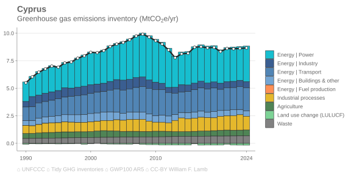
  <a target='_blank' href='https://raw.githubusercontent.com/lambwf/Tidy-GHG-Inventories/main/plots/countries/sectors/Cyprus-sectors.xlsx'>data</a> | <a target='_blank' href='https://raw.githubusercontent.com/lambwf/Tidy-GHG-Inventories/main/plots/countries/sectors/Cyprus-sectors.png'>png</a> | <a target='_blank' href='https://raw.githubusercontent.com/lambwf/Tidy-GHG-Inventories/main/plots/countries/sectors/Cyprus-sectors.pdf'>pdf</a> | <a target='_blank' href='https://raw.githubusercontent.com/lambwf/Tidy-GHG-Inventories/main/plots/countries/sectors/Cyprus-sectors.svg'>svg</a>

- 
  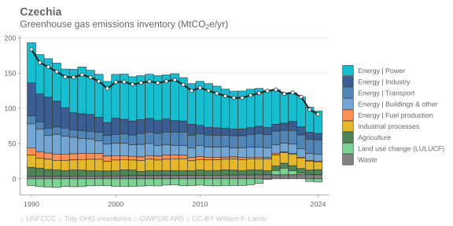
  <a target='_blank' href='https://raw.githubusercontent.com/lambwf/Tidy-GHG-Inventories/main/plots/countries/sectors/Czechia-sectors.xlsx'>data</a> | <a target='_blank' href='https://raw.githubusercontent.com/lambwf/Tidy-GHG-Inventories/main/plots/countries/sectors/Czechia-sectors.png'>png</a> | <a target='_blank' href='https://raw.githubusercontent.com/lambwf/Tidy-GHG-Inventories/main/plots/countries/sectors/Czechia-sectors.pdf'>pdf</a> | <a target='_blank' href='https://raw.githubusercontent.com/lambwf/Tidy-GHG-Inventories/main/plots/countries/sectors/Czechia-sectors.svg'>svg</a>

- 
  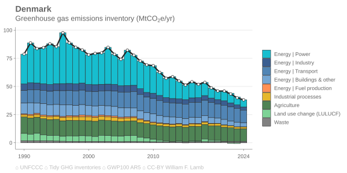
  <a target='_blank' href='https://raw.githubusercontent.com/lambwf/Tidy-GHG-Inventories/main/plots/countries/sectors/Denmark-sectors.xlsx'>data</a> | <a target='_blank' href='https://raw.githubusercontent.com/lambwf/Tidy-GHG-Inventories/main/plots/countries/sectors/Denmark-sectors.png'>png</a> | <a target='_blank' href='https://raw.githubusercontent.com/lambwf/Tidy-GHG-Inventories/main/plots/countries/sectors/Denmark-sectors.pdf'>pdf</a> | <a target='_blank' href='https://raw.githubusercontent.com/lambwf/Tidy-GHG-Inventories/main/plots/countries/sectors/Denmark-sectors.svg'>svg</a>

- 
  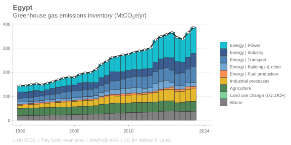
  <a target='_blank' href='https://raw.githubusercontent.com/lambwf/Tidy-GHG-Inventories/main/plots/countries/sectors/Egypt-sectors.xlsx'>data</a> | <a target='_blank' href='https://raw.githubusercontent.com/lambwf/Tidy-GHG-Inventories/main/plots/countries/sectors/Egypt-sectors.png'>png</a> | <a target='_blank' href='https://raw.githubusercontent.com/lambwf/Tidy-GHG-Inventories/main/plots/countries/sectors/Egypt-sectors.pdf'>pdf</a> | <a target='_blank' href='https://raw.githubusercontent.com/lambwf/Tidy-GHG-Inventories/main/plots/countries/sectors/Egypt-sectors.svg'>svg</a>

- 
  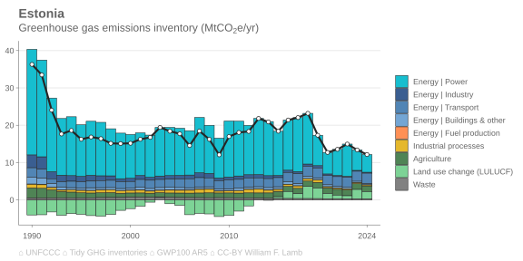
  <a target='_blank' href='https://raw.githubusercontent.com/lambwf/Tidy-GHG-Inventories/main/plots/countries/sectors/Estonia-sectors.xlsx'>data</a> | <a target='_blank' href='https://raw.githubusercontent.com/lambwf/Tidy-GHG-Inventories/main/plots/countries/sectors/Estonia-sectors.png'>png</a> | <a target='_blank' href='https://raw.githubusercontent.com/lambwf/Tidy-GHG-Inventories/main/plots/countries/sectors/Estonia-sectors.pdf'>pdf</a> | <a target='_blank' href='https://raw.githubusercontent.com/lambwf/Tidy-GHG-Inventories/main/plots/countries/sectors/Estonia-sectors.svg'>svg</a>

- 
  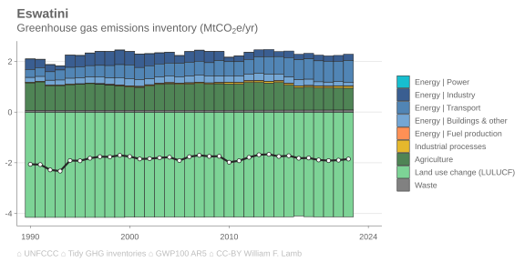
  <a target='_blank' href='https://raw.githubusercontent.com/lambwf/Tidy-GHG-Inventories/main/plots/countries/sectors/Eswatini-sectors.xlsx'>data</a> | <a target='_blank' href='https://raw.githubusercontent.com/lambwf/Tidy-GHG-Inventories/main/plots/countries/sectors/Eswatini-sectors.png'>png</a> | <a target='_blank' href='https://raw.githubusercontent.com/lambwf/Tidy-GHG-Inventories/main/plots/countries/sectors/Eswatini-sectors.pdf'>pdf</a> | <a target='_blank' href='https://raw.githubusercontent.com/lambwf/Tidy-GHG-Inventories/main/plots/countries/sectors/Eswatini-sectors.svg'>svg</a>

- 
  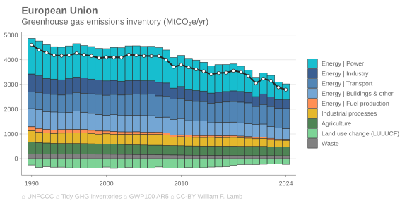
  <a target='_blank' href='https://raw.githubusercontent.com/lambwf/Tidy-GHG-Inventories/main/plots/countries/sectors/European Union-sectors.xlsx'>data</a> | <a target='_blank' href='https://raw.githubusercontent.com/lambwf/Tidy-GHG-Inventories/main/plots/countries/sectors/European Union-sectors.png'>png</a> | <a target='_blank' href='https://raw.githubusercontent.com/lambwf/Tidy-GHG-Inventories/main/plots/countries/sectors/European Union-sectors.pdf'>pdf</a> | <a target='_blank' href='https://raw.githubusercontent.com/lambwf/Tidy-GHG-Inventories/main/plots/countries/sectors/European Union-sectors.svg'>svg</a>

- 
  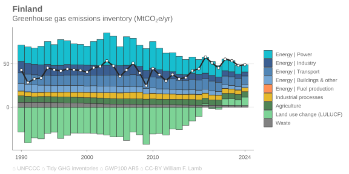
  <a target='_blank' href='https://raw.githubusercontent.com/lambwf/Tidy-GHG-Inventories/main/plots/countries/sectors/Finland-sectors.xlsx'>data</a> | <a target='_blank' href='https://raw.githubusercontent.com/lambwf/Tidy-GHG-Inventories/main/plots/countries/sectors/Finland-sectors.png'>png</a> | <a target='_blank' href='https://raw.githubusercontent.com/lambwf/Tidy-GHG-Inventories/main/plots/countries/sectors/Finland-sectors.pdf'>pdf</a> | <a target='_blank' href='https://raw.githubusercontent.com/lambwf/Tidy-GHG-Inventories/main/plots/countries/sectors/Finland-sectors.svg'>svg</a>

- 
  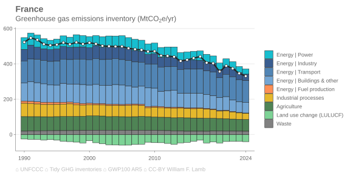
  <a target='_blank' href='https://raw.githubusercontent.com/lambwf/Tidy-GHG-Inventories/main/plots/countries/sectors/France-sectors.xlsx'>data</a> | <a target='_blank' href='https://raw.githubusercontent.com/lambwf/Tidy-GHG-Inventories/main/plots/countries/sectors/France-sectors.png'>png</a> | <a target='_blank' href='https://raw.githubusercontent.com/lambwf/Tidy-GHG-Inventories/main/plots/countries/sectors/France-sectors.pdf'>pdf</a> | <a target='_blank' href='https://raw.githubusercontent.com/lambwf/Tidy-GHG-Inventories/main/plots/countries/sectors/France-sectors.svg'>svg</a>

- 
  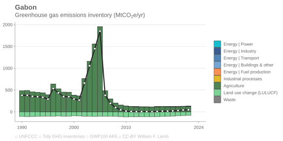
  <a target='_blank' href='https://raw.githubusercontent.com/lambwf/Tidy-GHG-Inventories/main/plots/countries/sectors/Gabon-sectors.xlsx'>data</a> | <a target='_blank' href='https://raw.githubusercontent.com/lambwf/Tidy-GHG-Inventories/main/plots/countries/sectors/Gabon-sectors.png'>png</a> | <a target='_blank' href='https://raw.githubusercontent.com/lambwf/Tidy-GHG-Inventories/main/plots/countries/sectors/Gabon-sectors.pdf'>pdf</a> | <a target='_blank' href='https://raw.githubusercontent.com/lambwf/Tidy-GHG-Inventories/main/plots/countries/sectors/Gabon-sectors.svg'>svg</a>

- 
  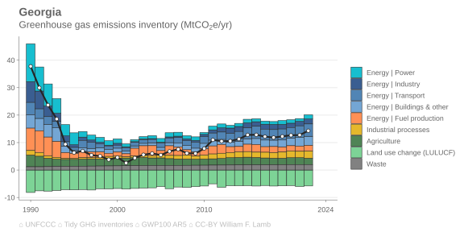
  <a target='_blank' href='https://raw.githubusercontent.com/lambwf/Tidy-GHG-Inventories/main/plots/countries/sectors/Georgia-sectors.xlsx'>data</a> | <a target='_blank' href='https://raw.githubusercontent.com/lambwf/Tidy-GHG-Inventories/main/plots/countries/sectors/Georgia-sectors.png'>png</a> | <a target='_blank' href='https://raw.githubusercontent.com/lambwf/Tidy-GHG-Inventories/main/plots/countries/sectors/Georgia-sectors.pdf'>pdf</a> | <a target='_blank' href='https://raw.githubusercontent.com/lambwf/Tidy-GHG-Inventories/main/plots/countries/sectors/Georgia-sectors.svg'>svg</a>

- 
  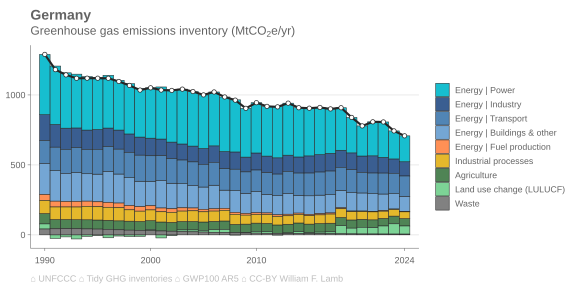
  <a target='_blank' href='https://raw.githubusercontent.com/lambwf/Tidy-GHG-Inventories/main/plots/countries/sectors/Germany-sectors.xlsx'>data</a> | <a target='_blank' href='https://raw.githubusercontent.com/lambwf/Tidy-GHG-Inventories/main/plots/countries/sectors/Germany-sectors.png'>png</a> | <a target='_blank' href='https://raw.githubusercontent.com/lambwf/Tidy-GHG-Inventories/main/plots/countries/sectors/Germany-sectors.pdf'>pdf</a> | <a target='_blank' href='https://raw.githubusercontent.com/lambwf/Tidy-GHG-Inventories/main/plots/countries/sectors/Germany-sectors.svg'>svg</a>

- 
  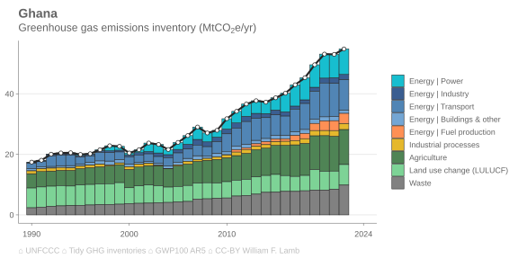
  <a target='_blank' href='https://raw.githubusercontent.com/lambwf/Tidy-GHG-Inventories/main/plots/countries/sectors/Ghana-sectors.xlsx'>data</a> | <a target='_blank' href='https://raw.githubusercontent.com/lambwf/Tidy-GHG-Inventories/main/plots/countries/sectors/Ghana-sectors.png'>png</a> | <a target='_blank' href='https://raw.githubusercontent.com/lambwf/Tidy-GHG-Inventories/main/plots/countries/sectors/Ghana-sectors.pdf'>pdf</a> | <a target='_blank' href='https://raw.githubusercontent.com/lambwf/Tidy-GHG-Inventories/main/plots/countries/sectors/Ghana-sectors.svg'>svg</a>

- 
  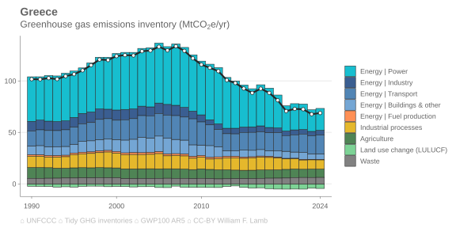
  <a target='_blank' href='https://raw.githubusercontent.com/lambwf/Tidy-GHG-Inventories/main/plots/countries/sectors/Greece-sectors.xlsx'>data</a> | <a target='_blank' href='https://raw.githubusercontent.com/lambwf/Tidy-GHG-Inventories/main/plots/countries/sectors/Greece-sectors.png'>png</a> | <a target='_blank' href='https://raw.githubusercontent.com/lambwf/Tidy-GHG-Inventories/main/plots/countries/sectors/Greece-sectors.pdf'>pdf</a> | <a target='_blank' href='https://raw.githubusercontent.com/lambwf/Tidy-GHG-Inventories/main/plots/countries/sectors/Greece-sectors.svg'>svg</a>

- 
  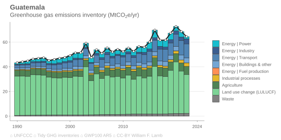
  <a target='_blank' href='https://raw.githubusercontent.com/lambwf/Tidy-GHG-Inventories/main/plots/countries/sectors/Guatemala-sectors.xlsx'>data</a> | <a target='_blank' href='https://raw.githubusercontent.com/lambwf/Tidy-GHG-Inventories/main/plots/countries/sectors/Guatemala-sectors.png'>png</a> | <a target='_blank' href='https://raw.githubusercontent.com/lambwf/Tidy-GHG-Inventories/main/plots/countries/sectors/Guatemala-sectors.pdf'>pdf</a> | <a target='_blank' href='https://raw.githubusercontent.com/lambwf/Tidy-GHG-Inventories/main/plots/countries/sectors/Guatemala-sectors.svg'>svg</a>

- 
  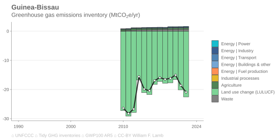
  <a target='_blank' href='https://raw.githubusercontent.com/lambwf/Tidy-GHG-Inventories/main/plots/countries/sectors/Guinea-Bissau-sectors.xlsx'>data</a> | <a target='_blank' href='https://raw.githubusercontent.com/lambwf/Tidy-GHG-Inventories/main/plots/countries/sectors/Guinea-Bissau-sectors.png'>png</a> | <a target='_blank' href='https://raw.githubusercontent.com/lambwf/Tidy-GHG-Inventories/main/plots/countries/sectors/Guinea-Bissau-sectors.pdf'>pdf</a> | <a target='_blank' href='https://raw.githubusercontent.com/lambwf/Tidy-GHG-Inventories/main/plots/countries/sectors/Guinea-Bissau-sectors.svg'>svg</a>

- 
  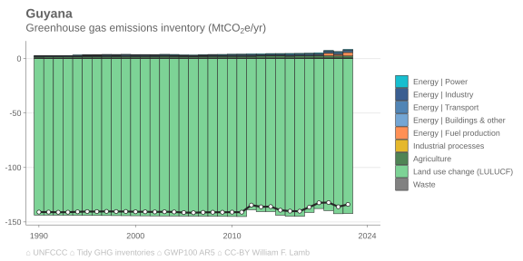
  <a target='_blank' href='https://raw.githubusercontent.com/lambwf/Tidy-GHG-Inventories/main/plots/countries/sectors/Guyana-sectors.xlsx'>data</a> | <a target='_blank' href='https://raw.githubusercontent.com/lambwf/Tidy-GHG-Inventories/main/plots/countries/sectors/Guyana-sectors.png'>png</a> | <a target='_blank' href='https://raw.githubusercontent.com/lambwf/Tidy-GHG-Inventories/main/plots/countries/sectors/Guyana-sectors.pdf'>pdf</a> | <a target='_blank' href='https://raw.githubusercontent.com/lambwf/Tidy-GHG-Inventories/main/plots/countries/sectors/Guyana-sectors.svg'>svg</a>

- 
  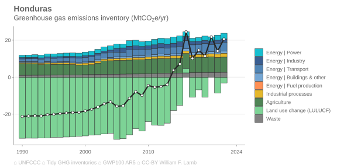
  <a target='_blank' href='https://raw.githubusercontent.com/lambwf/Tidy-GHG-Inventories/main/plots/countries/sectors/Honduras-sectors.xlsx'>data</a> | <a target='_blank' href='https://raw.githubusercontent.com/lambwf/Tidy-GHG-Inventories/main/plots/countries/sectors/Honduras-sectors.png'>png</a> | <a target='_blank' href='https://raw.githubusercontent.com/lambwf/Tidy-GHG-Inventories/main/plots/countries/sectors/Honduras-sectors.pdf'>pdf</a> | <a target='_blank' href='https://raw.githubusercontent.com/lambwf/Tidy-GHG-Inventories/main/plots/countries/sectors/Honduras-sectors.svg'>svg</a>

- 
  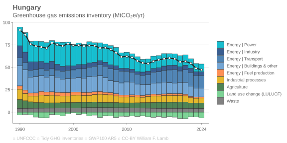
  <a target='_blank' href='https://raw.githubusercontent.com/lambwf/Tidy-GHG-Inventories/main/plots/countries/sectors/Hungary-sectors.xlsx'>data</a> | <a target='_blank' href='https://raw.githubusercontent.com/lambwf/Tidy-GHG-Inventories/main/plots/countries/sectors/Hungary-sectors.png'>png</a> | <a target='_blank' href='https://raw.githubusercontent.com/lambwf/Tidy-GHG-Inventories/main/plots/countries/sectors/Hungary-sectors.pdf'>pdf</a> | <a target='_blank' href='https://raw.githubusercontent.com/lambwf/Tidy-GHG-Inventories/main/plots/countries/sectors/Hungary-sectors.svg'>svg</a>

- 
  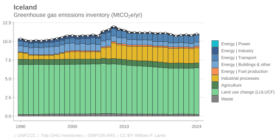
  <a target='_blank' href='https://raw.githubusercontent.com/lambwf/Tidy-GHG-Inventories/main/plots/countries/sectors/Iceland-sectors.xlsx'>data</a> | <a target='_blank' href='https://raw.githubusercontent.com/lambwf/Tidy-GHG-Inventories/main/plots/countries/sectors/Iceland-sectors.png'>png</a> | <a target='_blank' href='https://raw.githubusercontent.com/lambwf/Tidy-GHG-Inventories/main/plots/countries/sectors/Iceland-sectors.pdf'>pdf</a> | <a target='_blank' href='https://raw.githubusercontent.com/lambwf/Tidy-GHG-Inventories/main/plots/countries/sectors/Iceland-sectors.svg'>svg</a>

- 
  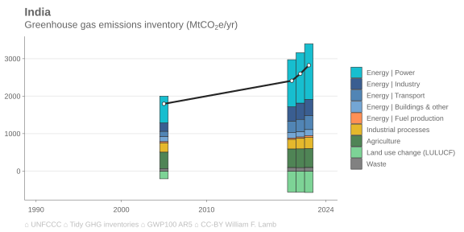
  <a target='_blank' href='https://raw.githubusercontent.com/lambwf/Tidy-GHG-Inventories/main/plots/countries/sectors/India-sectors.xlsx'>data</a> | <a target='_blank' href='https://raw.githubusercontent.com/lambwf/Tidy-GHG-Inventories/main/plots/countries/sectors/India-sectors.png'>png</a> | <a target='_blank' href='https://raw.githubusercontent.com/lambwf/Tidy-GHG-Inventories/main/plots/countries/sectors/India-sectors.pdf'>pdf</a> | <a target='_blank' href='https://raw.githubusercontent.com/lambwf/Tidy-GHG-Inventories/main/plots/countries/sectors/India-sectors.svg'>svg</a>

- 
  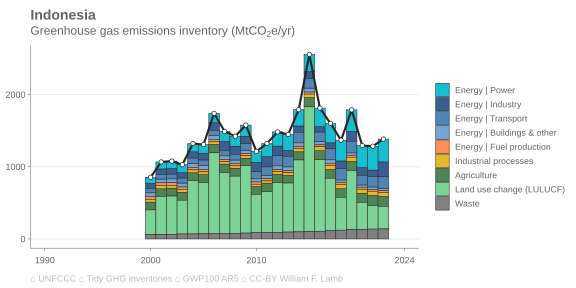
  <a target='_blank' href='https://raw.githubusercontent.com/lambwf/Tidy-GHG-Inventories/main/plots/countries/sectors/Indonesia-sectors.xlsx'>data</a> | <a target='_blank' href='https://raw.githubusercontent.com/lambwf/Tidy-GHG-Inventories/main/plots/countries/sectors/Indonesia-sectors.png'>png</a> | <a target='_blank' href='https://raw.githubusercontent.com/lambwf/Tidy-GHG-Inventories/main/plots/countries/sectors/Indonesia-sectors.pdf'>pdf</a> | <a target='_blank' href='https://raw.githubusercontent.com/lambwf/Tidy-GHG-Inventories/main/plots/countries/sectors/Indonesia-sectors.svg'>svg</a>

- 
  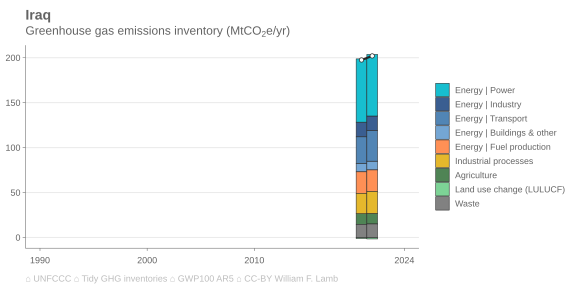
  <a target='_blank' href='https://raw.githubusercontent.com/lambwf/Tidy-GHG-Inventories/main/plots/countries/sectors/Iraq-sectors.xlsx'>data</a> | <a target='_blank' href='https://raw.githubusercontent.com/lambwf/Tidy-GHG-Inventories/main/plots/countries/sectors/Iraq-sectors.png'>png</a> | <a target='_blank' href='https://raw.githubusercontent.com/lambwf/Tidy-GHG-Inventories/main/plots/countries/sectors/Iraq-sectors.pdf'>pdf</a> | <a target='_blank' href='https://raw.githubusercontent.com/lambwf/Tidy-GHG-Inventories/main/plots/countries/sectors/Iraq-sectors.svg'>svg</a>

- 
  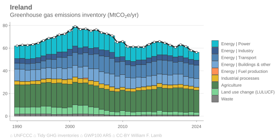
  <a target='_blank' href='https://raw.githubusercontent.com/lambwf/Tidy-GHG-Inventories/main/plots/countries/sectors/Ireland-sectors.xlsx'>data</a> | <a target='_blank' href='https://raw.githubusercontent.com/lambwf/Tidy-GHG-Inventories/main/plots/countries/sectors/Ireland-sectors.png'>png</a> | <a target='_blank' href='https://raw.githubusercontent.com/lambwf/Tidy-GHG-Inventories/main/plots/countries/sectors/Ireland-sectors.pdf'>pdf</a> | <a target='_blank' href='https://raw.githubusercontent.com/lambwf/Tidy-GHG-Inventories/main/plots/countries/sectors/Ireland-sectors.svg'>svg</a>

- 
  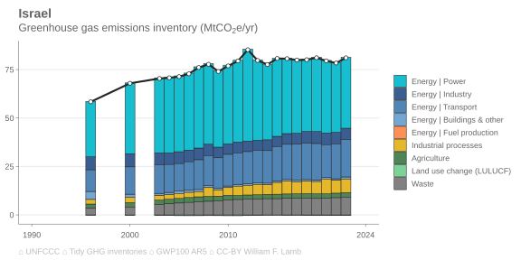
  <a target='_blank' href='https://raw.githubusercontent.com/lambwf/Tidy-GHG-Inventories/main/plots/countries/sectors/Israel-sectors.xlsx'>data</a> | <a target='_blank' href='https://raw.githubusercontent.com/lambwf/Tidy-GHG-Inventories/main/plots/countries/sectors/Israel-sectors.png'>png</a> | <a target='_blank' href='https://raw.githubusercontent.com/lambwf/Tidy-GHG-Inventories/main/plots/countries/sectors/Israel-sectors.pdf'>pdf</a> | <a target='_blank' href='https://raw.githubusercontent.com/lambwf/Tidy-GHG-Inventories/main/plots/countries/sectors/Israel-sectors.svg'>svg</a>

- 
  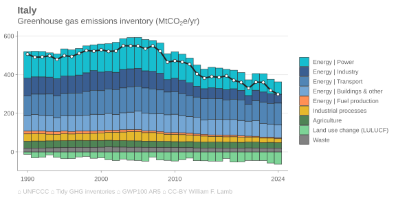
  <a target='_blank' href='https://raw.githubusercontent.com/lambwf/Tidy-GHG-Inventories/main/plots/countries/sectors/Italy-sectors.xlsx'>data</a> | <a target='_blank' href='https://raw.githubusercontent.com/lambwf/Tidy-GHG-Inventories/main/plots/countries/sectors/Italy-sectors.png'>png</a> | <a target='_blank' href='https://raw.githubusercontent.com/lambwf/Tidy-GHG-Inventories/main/plots/countries/sectors/Italy-sectors.pdf'>pdf</a> | <a target='_blank' href='https://raw.githubusercontent.com/lambwf/Tidy-GHG-Inventories/main/plots/countries/sectors/Italy-sectors.svg'>svg</a>

- 
  
  <a target='_blank' href='https://raw.githubusercontent.com/lambwf/Tidy-GHG-Inventories/main/plots/countries/sectors/Japan-sectors.xlsx'>data</a> | <a target='_blank' href='https://raw.githubusercontent.com/lambwf/Tidy-GHG-Inventories/main/plots/countries/sectors/Japan-sectors.png'>png</a> | <a target='_blank' href='https://raw.githubusercontent.com/lambwf/Tidy-GHG-Inventories/main/plots/countries/sectors/Japan-sectors.pdf'>pdf</a> | <a target='_blank' href='https://raw.githubusercontent.com/lambwf/Tidy-GHG-Inventories/main/plots/countries/sectors/Japan-sectors.svg'>svg</a>

- 
  
  <a target='_blank' href='https://raw.githubusercontent.com/lambwf/Tidy-GHG-Inventories/main/plots/countries/sectors/Jordan-sectors.xlsx'>data</a> | <a target='_blank' href='https://raw.githubusercontent.com/lambwf/Tidy-GHG-Inventories/main/plots/countries/sectors/Jordan-sectors.png'>png</a> | <a target='_blank' href='https://raw.githubusercontent.com/lambwf/Tidy-GHG-Inventories/main/plots/countries/sectors/Jordan-sectors.pdf'>pdf</a> | <a target='_blank' href='https://raw.githubusercontent.com/lambwf/Tidy-GHG-Inventories/main/plots/countries/sectors/Jordan-sectors.svg'>svg</a>

- 
  
  <a target='_blank' href='https://raw.githubusercontent.com/lambwf/Tidy-GHG-Inventories/main/plots/countries/sectors/Kazakhstan-sectors.xlsx'>data</a> | <a target='_blank' href='https://raw.githubusercontent.com/lambwf/Tidy-GHG-Inventories/main/plots/countries/sectors/Kazakhstan-sectors.png'>png</a> | <a target='_blank' href='https://raw.githubusercontent.com/lambwf/Tidy-GHG-Inventories/main/plots/countries/sectors/Kazakhstan-sectors.pdf'>pdf</a> | <a target='_blank' href='https://raw.githubusercontent.com/lambwf/Tidy-GHG-Inventories/main/plots/countries/sectors/Kazakhstan-sectors.svg'>svg</a>

- 
  
  <a target='_blank' href='https://raw.githubusercontent.com/lambwf/Tidy-GHG-Inventories/main/plots/countries/sectors/Kenya-sectors.xlsx'>data</a> | <a target='_blank' href='https://raw.githubusercontent.com/lambwf/Tidy-GHG-Inventories/main/plots/countries/sectors/Kenya-sectors.png'>png</a> | <a target='_blank' href='https://raw.githubusercontent.com/lambwf/Tidy-GHG-Inventories/main/plots/countries/sectors/Kenya-sectors.pdf'>pdf</a> | <a target='_blank' href='https://raw.githubusercontent.com/lambwf/Tidy-GHG-Inventories/main/plots/countries/sectors/Kenya-sectors.svg'>svg</a>

- 
  
  <a target='_blank' href='https://raw.githubusercontent.com/lambwf/Tidy-GHG-Inventories/main/plots/countries/sectors/Laos-sectors.xlsx'>data</a> | <a target='_blank' href='https://raw.githubusercontent.com/lambwf/Tidy-GHG-Inventories/main/plots/countries/sectors/Laos-sectors.png'>png</a> | <a target='_blank' href='https://raw.githubusercontent.com/lambwf/Tidy-GHG-Inventories/main/plots/countries/sectors/Laos-sectors.pdf'>pdf</a> | <a target='_blank' href='https://raw.githubusercontent.com/lambwf/Tidy-GHG-Inventories/main/plots/countries/sectors/Laos-sectors.svg'>svg</a>

- 
  
  <a target='_blank' href='https://raw.githubusercontent.com/lambwf/Tidy-GHG-Inventories/main/plots/countries/sectors/Latvia-sectors.xlsx'>data</a> | <a target='_blank' href='https://raw.githubusercontent.com/lambwf/Tidy-GHG-Inventories/main/plots/countries/sectors/Latvia-sectors.png'>png</a> | <a target='_blank' href='https://raw.githubusercontent.com/lambwf/Tidy-GHG-Inventories/main/plots/countries/sectors/Latvia-sectors.pdf'>pdf</a> | <a target='_blank' href='https://raw.githubusercontent.com/lambwf/Tidy-GHG-Inventories/main/plots/countries/sectors/Latvia-sectors.svg'>svg</a>

- 
  
  <a target='_blank' href='https://raw.githubusercontent.com/lambwf/Tidy-GHG-Inventories/main/plots/countries/sectors/Lebanon-sectors.xlsx'>data</a> | <a target='_blank' href='https://raw.githubusercontent.com/lambwf/Tidy-GHG-Inventories/main/plots/countries/sectors/Lebanon-sectors.png'>png</a> | <a target='_blank' href='https://raw.githubusercontent.com/lambwf/Tidy-GHG-Inventories/main/plots/countries/sectors/Lebanon-sectors.pdf'>pdf</a> | <a target='_blank' href='https://raw.githubusercontent.com/lambwf/Tidy-GHG-Inventories/main/plots/countries/sectors/Lebanon-sectors.svg'>svg</a>

- 
  
  <a target='_blank' href='https://raw.githubusercontent.com/lambwf/Tidy-GHG-Inventories/main/plots/countries/sectors/Liechtenstein-sectors.xlsx'>data</a> | <a target='_blank' href='https://raw.githubusercontent.com/lambwf/Tidy-GHG-Inventories/main/plots/countries/sectors/Liechtenstein-sectors.png'>png</a> | <a target='_blank' href='https://raw.githubusercontent.com/lambwf/Tidy-GHG-Inventories/main/plots/countries/sectors/Liechtenstein-sectors.pdf'>pdf</a> | <a target='_blank' href='https://raw.githubusercontent.com/lambwf/Tidy-GHG-Inventories/main/plots/countries/sectors/Liechtenstein-sectors.svg'>svg</a>

- 
  
  <a target='_blank' href='https://raw.githubusercontent.com/lambwf/Tidy-GHG-Inventories/main/plots/countries/sectors/Lithuania-sectors.xlsx'>data</a> | <a target='_blank' href='https://raw.githubusercontent.com/lambwf/Tidy-GHG-Inventories/main/plots/countries/sectors/Lithuania-sectors.png'>png</a> | <a target='_blank' href='https://raw.githubusercontent.com/lambwf/Tidy-GHG-Inventories/main/plots/countries/sectors/Lithuania-sectors.pdf'>pdf</a> | <a target='_blank' href='https://raw.githubusercontent.com/lambwf/Tidy-GHG-Inventories/main/plots/countries/sectors/Lithuania-sectors.svg'>svg</a>

- 
  
  <a target='_blank' href='https://raw.githubusercontent.com/lambwf/Tidy-GHG-Inventories/main/plots/countries/sectors/Luxembourg-sectors.xlsx'>data</a> | <a target='_blank' href='https://raw.githubusercontent.com/lambwf/Tidy-GHG-Inventories/main/plots/countries/sectors/Luxembourg-sectors.png'>png</a> | <a target='_blank' href='https://raw.githubusercontent.com/lambwf/Tidy-GHG-Inventories/main/plots/countries/sectors/Luxembourg-sectors.pdf'>pdf</a> | <a target='_blank' href='https://raw.githubusercontent.com/lambwf/Tidy-GHG-Inventories/main/plots/countries/sectors/Luxembourg-sectors.svg'>svg</a>

- 
  
  <a target='_blank' href='https://raw.githubusercontent.com/lambwf/Tidy-GHG-Inventories/main/plots/countries/sectors/Malaysia-sectors.xlsx'>data</a> | <a target='_blank' href='https://raw.githubusercontent.com/lambwf/Tidy-GHG-Inventories/main/plots/countries/sectors/Malaysia-sectors.png'>png</a> | <a target='_blank' href='https://raw.githubusercontent.com/lambwf/Tidy-GHG-Inventories/main/plots/countries/sectors/Malaysia-sectors.pdf'>pdf</a> | <a target='_blank' href='https://raw.githubusercontent.com/lambwf/Tidy-GHG-Inventories/main/plots/countries/sectors/Malaysia-sectors.svg'>svg</a>

- 
  
  <a target='_blank' href='https://raw.githubusercontent.com/lambwf/Tidy-GHG-Inventories/main/plots/countries/sectors/Maldives-sectors.xlsx'>data</a> | <a target='_blank' href='https://raw.githubusercontent.com/lambwf/Tidy-GHG-Inventories/main/plots/countries/sectors/Maldives-sectors.png'>png</a> | <a target='_blank' href='https://raw.githubusercontent.com/lambwf/Tidy-GHG-Inventories/main/plots/countries/sectors/Maldives-sectors.pdf'>pdf</a> | <a target='_blank' href='https://raw.githubusercontent.com/lambwf/Tidy-GHG-Inventories/main/plots/countries/sectors/Maldives-sectors.svg'>svg</a>

- 
  
  <a target='_blank' href='https://raw.githubusercontent.com/lambwf/Tidy-GHG-Inventories/main/plots/countries/sectors/Malta-sectors.xlsx'>data</a> | <a target='_blank' href='https://raw.githubusercontent.com/lambwf/Tidy-GHG-Inventories/main/plots/countries/sectors/Malta-sectors.png'>png</a> | <a target='_blank' href='https://raw.githubusercontent.com/lambwf/Tidy-GHG-Inventories/main/plots/countries/sectors/Malta-sectors.pdf'>pdf</a> | <a target='_blank' href='https://raw.githubusercontent.com/lambwf/Tidy-GHG-Inventories/main/plots/countries/sectors/Malta-sectors.svg'>svg</a>

- 
  
  <a target='_blank' href='https://raw.githubusercontent.com/lambwf/Tidy-GHG-Inventories/main/plots/countries/sectors/Mauritius-sectors.xlsx'>data</a> | <a target='_blank' href='https://raw.githubusercontent.com/lambwf/Tidy-GHG-Inventories/main/plots/countries/sectors/Mauritius-sectors.png'>png</a> | <a target='_blank' href='https://raw.githubusercontent.com/lambwf/Tidy-GHG-Inventories/main/plots/countries/sectors/Mauritius-sectors.pdf'>pdf</a> | <a target='_blank' href='https://raw.githubusercontent.com/lambwf/Tidy-GHG-Inventories/main/plots/countries/sectors/Mauritius-sectors.svg'>svg</a>

- 
  
  <a target='_blank' href='https://raw.githubusercontent.com/lambwf/Tidy-GHG-Inventories/main/plots/countries/sectors/Mexico-sectors.xlsx'>data</a> | <a target='_blank' href='https://raw.githubusercontent.com/lambwf/Tidy-GHG-Inventories/main/plots/countries/sectors/Mexico-sectors.png'>png</a> | <a target='_blank' href='https://raw.githubusercontent.com/lambwf/Tidy-GHG-Inventories/main/plots/countries/sectors/Mexico-sectors.pdf'>pdf</a> | <a target='_blank' href='https://raw.githubusercontent.com/lambwf/Tidy-GHG-Inventories/main/plots/countries/sectors/Mexico-sectors.svg'>svg</a>

- 
  
  <a target='_blank' href='https://raw.githubusercontent.com/lambwf/Tidy-GHG-Inventories/main/plots/countries/sectors/Moldova-sectors.xlsx'>data</a> | <a target='_blank' href='https://raw.githubusercontent.com/lambwf/Tidy-GHG-Inventories/main/plots/countries/sectors/Moldova-sectors.png'>png</a> | <a target='_blank' href='https://raw.githubusercontent.com/lambwf/Tidy-GHG-Inventories/main/plots/countries/sectors/Moldova-sectors.pdf'>pdf</a> | <a target='_blank' href='https://raw.githubusercontent.com/lambwf/Tidy-GHG-Inventories/main/plots/countries/sectors/Moldova-sectors.svg'>svg</a>

- 
  
  <a target='_blank' href='https://raw.githubusercontent.com/lambwf/Tidy-GHG-Inventories/main/plots/countries/sectors/Monaco-sectors.xlsx'>data</a> | <a target='_blank' href='https://raw.githubusercontent.com/lambwf/Tidy-GHG-Inventories/main/plots/countries/sectors/Monaco-sectors.png'>png</a> | <a target='_blank' href='https://raw.githubusercontent.com/lambwf/Tidy-GHG-Inventories/main/plots/countries/sectors/Monaco-sectors.pdf'>pdf</a> | <a target='_blank' href='https://raw.githubusercontent.com/lambwf/Tidy-GHG-Inventories/main/plots/countries/sectors/Monaco-sectors.svg'>svg</a>

- 
  
  <a target='_blank' href='https://raw.githubusercontent.com/lambwf/Tidy-GHG-Inventories/main/plots/countries/sectors/Mongolia-sectors.xlsx'>data</a> | <a target='_blank' href='https://raw.githubusercontent.com/lambwf/Tidy-GHG-Inventories/main/plots/countries/sectors/Mongolia-sectors.png'>png</a> | <a target='_blank' href='https://raw.githubusercontent.com/lambwf/Tidy-GHG-Inventories/main/plots/countries/sectors/Mongolia-sectors.pdf'>pdf</a> | <a target='_blank' href='https://raw.githubusercontent.com/lambwf/Tidy-GHG-Inventories/main/plots/countries/sectors/Mongolia-sectors.svg'>svg</a>

- 
  
  <a target='_blank' href='https://raw.githubusercontent.com/lambwf/Tidy-GHG-Inventories/main/plots/countries/sectors/Morocco-sectors.xlsx'>data</a> | <a target='_blank' href='https://raw.githubusercontent.com/lambwf/Tidy-GHG-Inventories/main/plots/countries/sectors/Morocco-sectors.png'>png</a> | <a target='_blank' href='https://raw.githubusercontent.com/lambwf/Tidy-GHG-Inventories/main/plots/countries/sectors/Morocco-sectors.pdf'>pdf</a> | <a target='_blank' href='https://raw.githubusercontent.com/lambwf/Tidy-GHG-Inventories/main/plots/countries/sectors/Morocco-sectors.svg'>svg</a>

- 
  
  <a target='_blank' href='https://raw.githubusercontent.com/lambwf/Tidy-GHG-Inventories/main/plots/countries/sectors/Namibia-sectors.xlsx'>data</a> | <a target='_blank' href='https://raw.githubusercontent.com/lambwf/Tidy-GHG-Inventories/main/plots/countries/sectors/Namibia-sectors.png'>png</a> | <a target='_blank' href='https://raw.githubusercontent.com/lambwf/Tidy-GHG-Inventories/main/plots/countries/sectors/Namibia-sectors.pdf'>pdf</a> | <a target='_blank' href='https://raw.githubusercontent.com/lambwf/Tidy-GHG-Inventories/main/plots/countries/sectors/Namibia-sectors.svg'>svg</a>

- 
  
  <a target='_blank' href='https://raw.githubusercontent.com/lambwf/Tidy-GHG-Inventories/main/plots/countries/sectors/Nepal-sectors.xlsx'>data</a> | <a target='_blank' href='https://raw.githubusercontent.com/lambwf/Tidy-GHG-Inventories/main/plots/countries/sectors/Nepal-sectors.png'>png</a> | <a target='_blank' href='https://raw.githubusercontent.com/lambwf/Tidy-GHG-Inventories/main/plots/countries/sectors/Nepal-sectors.pdf'>pdf</a> | <a target='_blank' href='https://raw.githubusercontent.com/lambwf/Tidy-GHG-Inventories/main/plots/countries/sectors/Nepal-sectors.svg'>svg</a>

- 
  
  <a target='_blank' href='https://raw.githubusercontent.com/lambwf/Tidy-GHG-Inventories/main/plots/countries/sectors/Netherlands-sectors.xlsx'>data</a> | <a target='_blank' href='https://raw.githubusercontent.com/lambwf/Tidy-GHG-Inventories/main/plots/countries/sectors/Netherlands-sectors.png'>png</a> | <a target='_blank' href='https://raw.githubusercontent.com/lambwf/Tidy-GHG-Inventories/main/plots/countries/sectors/Netherlands-sectors.pdf'>pdf</a> | <a target='_blank' href='https://raw.githubusercontent.com/lambwf/Tidy-GHG-Inventories/main/plots/countries/sectors/Netherlands-sectors.svg'>svg</a>

- 
  
  <a target='_blank' href='https://raw.githubusercontent.com/lambwf/Tidy-GHG-Inventories/main/plots/countries/sectors/New Zealand-sectors.xlsx'>data</a> | <a target='_blank' href='https://raw.githubusercontent.com/lambwf/Tidy-GHG-Inventories/main/plots/countries/sectors/New Zealand-sectors.png'>png</a> | <a target='_blank' href='https://raw.githubusercontent.com/lambwf/Tidy-GHG-Inventories/main/plots/countries/sectors/New Zealand-sectors.pdf'>pdf</a> | <a target='_blank' href='https://raw.githubusercontent.com/lambwf/Tidy-GHG-Inventories/main/plots/countries/sectors/New Zealand-sectors.svg'>svg</a>

- 
  
  <a target='_blank' href='https://raw.githubusercontent.com/lambwf/Tidy-GHG-Inventories/main/plots/countries/sectors/Nigeria-sectors.xlsx'>data</a> | <a target='_blank' href='https://raw.githubusercontent.com/lambwf/Tidy-GHG-Inventories/main/plots/countries/sectors/Nigeria-sectors.png'>png</a> | <a target='_blank' href='https://raw.githubusercontent.com/lambwf/Tidy-GHG-Inventories/main/plots/countries/sectors/Nigeria-sectors.pdf'>pdf</a> | <a target='_blank' href='https://raw.githubusercontent.com/lambwf/Tidy-GHG-Inventories/main/plots/countries/sectors/Nigeria-sectors.svg'>svg</a>

- 
  
  <a target='_blank' href='https://raw.githubusercontent.com/lambwf/Tidy-GHG-Inventories/main/plots/countries/sectors/Norway-sectors.xlsx'>data</a> | <a target='_blank' href='https://raw.githubusercontent.com/lambwf/Tidy-GHG-Inventories/main/plots/countries/sectors/Norway-sectors.png'>png</a> | <a target='_blank' href='https://raw.githubusercontent.com/lambwf/Tidy-GHG-Inventories/main/plots/countries/sectors/Norway-sectors.pdf'>pdf</a> | <a target='_blank' href='https://raw.githubusercontent.com/lambwf/Tidy-GHG-Inventories/main/plots/countries/sectors/Norway-sectors.svg'>svg</a>

- 
  
  <a target='_blank' href='https://raw.githubusercontent.com/lambwf/Tidy-GHG-Inventories/main/plots/countries/sectors/Oman-sectors.xlsx'>data</a> | <a target='_blank' href='https://raw.githubusercontent.com/lambwf/Tidy-GHG-Inventories/main/plots/countries/sectors/Oman-sectors.png'>png</a> | <a target='_blank' href='https://raw.githubusercontent.com/lambwf/Tidy-GHG-Inventories/main/plots/countries/sectors/Oman-sectors.pdf'>pdf</a> | <a target='_blank' href='https://raw.githubusercontent.com/lambwf/Tidy-GHG-Inventories/main/plots/countries/sectors/Oman-sectors.svg'>svg</a>

- 
  
  <a target='_blank' href='https://raw.githubusercontent.com/lambwf/Tidy-GHG-Inventories/main/plots/countries/sectors/Panama-sectors.xlsx'>data</a> | <a target='_blank' href='https://raw.githubusercontent.com/lambwf/Tidy-GHG-Inventories/main/plots/countries/sectors/Panama-sectors.png'>png</a> | <a target='_blank' href='https://raw.githubusercontent.com/lambwf/Tidy-GHG-Inventories/main/plots/countries/sectors/Panama-sectors.pdf'>pdf</a> | <a target='_blank' href='https://raw.githubusercontent.com/lambwf/Tidy-GHG-Inventories/main/plots/countries/sectors/Panama-sectors.svg'>svg</a>

- 
  
  <a target='_blank' href='https://raw.githubusercontent.com/lambwf/Tidy-GHG-Inventories/main/plots/countries/sectors/Peru-sectors.xlsx'>data</a> | <a target='_blank' href='https://raw.githubusercontent.com/lambwf/Tidy-GHG-Inventories/main/plots/countries/sectors/Peru-sectors.png'>png</a> | <a target='_blank' href='https://raw.githubusercontent.com/lambwf/Tidy-GHG-Inventories/main/plots/countries/sectors/Peru-sectors.pdf'>pdf</a> | <a target='_blank' href='https://raw.githubusercontent.com/lambwf/Tidy-GHG-Inventories/main/plots/countries/sectors/Peru-sectors.svg'>svg</a>

- 
  
  <a target='_blank' href='https://raw.githubusercontent.com/lambwf/Tidy-GHG-Inventories/main/plots/countries/sectors/Poland-sectors.xlsx'>data</a> | <a target='_blank' href='https://raw.githubusercontent.com/lambwf/Tidy-GHG-Inventories/main/plots/countries/sectors/Poland-sectors.png'>png</a> | <a target='_blank' href='https://raw.githubusercontent.com/lambwf/Tidy-GHG-Inventories/main/plots/countries/sectors/Poland-sectors.pdf'>pdf</a> | <a target='_blank' href='https://raw.githubusercontent.com/lambwf/Tidy-GHG-Inventories/main/plots/countries/sectors/Poland-sectors.svg'>svg</a>

- 
  
  <a target='_blank' href='https://raw.githubusercontent.com/lambwf/Tidy-GHG-Inventories/main/plots/countries/sectors/Portugal-sectors.xlsx'>data</a> | <a target='_blank' href='https://raw.githubusercontent.com/lambwf/Tidy-GHG-Inventories/main/plots/countries/sectors/Portugal-sectors.png'>png</a> | <a target='_blank' href='https://raw.githubusercontent.com/lambwf/Tidy-GHG-Inventories/main/plots/countries/sectors/Portugal-sectors.pdf'>pdf</a> | <a target='_blank' href='https://raw.githubusercontent.com/lambwf/Tidy-GHG-Inventories/main/plots/countries/sectors/Portugal-sectors.svg'>svg</a>

- 
  
  <a target='_blank' href='https://raw.githubusercontent.com/lambwf/Tidy-GHG-Inventories/main/plots/countries/sectors/Romania-sectors.xlsx'>data</a> | <a target='_blank' href='https://raw.githubusercontent.com/lambwf/Tidy-GHG-Inventories/main/plots/countries/sectors/Romania-sectors.png'>png</a> | <a target='_blank' href='https://raw.githubusercontent.com/lambwf/Tidy-GHG-Inventories/main/plots/countries/sectors/Romania-sectors.pdf'>pdf</a> | <a target='_blank' href='https://raw.githubusercontent.com/lambwf/Tidy-GHG-Inventories/main/plots/countries/sectors/Romania-sectors.svg'>svg</a>

- 
  
  <a target='_blank' href='https://raw.githubusercontent.com/lambwf/Tidy-GHG-Inventories/main/plots/countries/sectors/Russia-sectors.xlsx'>data</a> | <a target='_blank' href='https://raw.githubusercontent.com/lambwf/Tidy-GHG-Inventories/main/plots/countries/sectors/Russia-sectors.png'>png</a> | <a target='_blank' href='https://raw.githubusercontent.com/lambwf/Tidy-GHG-Inventories/main/plots/countries/sectors/Russia-sectors.pdf'>pdf</a> | <a target='_blank' href='https://raw.githubusercontent.com/lambwf/Tidy-GHG-Inventories/main/plots/countries/sectors/Russia-sectors.svg'>svg</a>

- 
  
  <a target='_blank' href='https://raw.githubusercontent.com/lambwf/Tidy-GHG-Inventories/main/plots/countries/sectors/Rwanda-sectors.xlsx'>data</a> | <a target='_blank' href='https://raw.githubusercontent.com/lambwf/Tidy-GHG-Inventories/main/plots/countries/sectors/Rwanda-sectors.png'>png</a> | <a target='_blank' href='https://raw.githubusercontent.com/lambwf/Tidy-GHG-Inventories/main/plots/countries/sectors/Rwanda-sectors.pdf'>pdf</a> | <a target='_blank' href='https://raw.githubusercontent.com/lambwf/Tidy-GHG-Inventories/main/plots/countries/sectors/Rwanda-sectors.svg'>svg</a>

- 
  
  <a target='_blank' href='https://raw.githubusercontent.com/lambwf/Tidy-GHG-Inventories/main/plots/countries/sectors/Saudi Arabia-sectors.xlsx'>data</a> | <a target='_blank' href='https://raw.githubusercontent.com/lambwf/Tidy-GHG-Inventories/main/plots/countries/sectors/Saudi Arabia-sectors.png'>png</a> | <a target='_blank' href='https://raw.githubusercontent.com/lambwf/Tidy-GHG-Inventories/main/plots/countries/sectors/Saudi Arabia-sectors.pdf'>pdf</a> | <a target='_blank' href='https://raw.githubusercontent.com/lambwf/Tidy-GHG-Inventories/main/plots/countries/sectors/Saudi Arabia-sectors.svg'>svg</a>

- 
  
  <a target='_blank' href='https://raw.githubusercontent.com/lambwf/Tidy-GHG-Inventories/main/plots/countries/sectors/Serbia-sectors.xlsx'>data</a> | <a target='_blank' href='https://raw.githubusercontent.com/lambwf/Tidy-GHG-Inventories/main/plots/countries/sectors/Serbia-sectors.png'>png</a> | <a target='_blank' href='https://raw.githubusercontent.com/lambwf/Tidy-GHG-Inventories/main/plots/countries/sectors/Serbia-sectors.pdf'>pdf</a> | <a target='_blank' href='https://raw.githubusercontent.com/lambwf/Tidy-GHG-Inventories/main/plots/countries/sectors/Serbia-sectors.svg'>svg</a>

- 
  
  <a target='_blank' href='https://raw.githubusercontent.com/lambwf/Tidy-GHG-Inventories/main/plots/countries/sectors/Singapore-sectors.xlsx'>data</a> | <a target='_blank' href='https://raw.githubusercontent.com/lambwf/Tidy-GHG-Inventories/main/plots/countries/sectors/Singapore-sectors.png'>png</a> | <a target='_blank' href='https://raw.githubusercontent.com/lambwf/Tidy-GHG-Inventories/main/plots/countries/sectors/Singapore-sectors.pdf'>pdf</a> | <a target='_blank' href='https://raw.githubusercontent.com/lambwf/Tidy-GHG-Inventories/main/plots/countries/sectors/Singapore-sectors.svg'>svg</a>

- 
  
  <a target='_blank' href='https://raw.githubusercontent.com/lambwf/Tidy-GHG-Inventories/main/plots/countries/sectors/Slovakia-sectors.xlsx'>data</a> | <a target='_blank' href='https://raw.githubusercontent.com/lambwf/Tidy-GHG-Inventories/main/plots/countries/sectors/Slovakia-sectors.png'>png</a> | <a target='_blank' href='https://raw.githubusercontent.com/lambwf/Tidy-GHG-Inventories/main/plots/countries/sectors/Slovakia-sectors.pdf'>pdf</a> | <a target='_blank' href='https://raw.githubusercontent.com/lambwf/Tidy-GHG-Inventories/main/plots/countries/sectors/Slovakia-sectors.svg'>svg</a>

- 
  
  <a target='_blank' href='https://raw.githubusercontent.com/lambwf/Tidy-GHG-Inventories/main/plots/countries/sectors/Slovenia-sectors.xlsx'>data</a> | <a target='_blank' href='https://raw.githubusercontent.com/lambwf/Tidy-GHG-Inventories/main/plots/countries/sectors/Slovenia-sectors.png'>png</a> | <a target='_blank' href='https://raw.githubusercontent.com/lambwf/Tidy-GHG-Inventories/main/plots/countries/sectors/Slovenia-sectors.pdf'>pdf</a> | <a target='_blank' href='https://raw.githubusercontent.com/lambwf/Tidy-GHG-Inventories/main/plots/countries/sectors/Slovenia-sectors.svg'>svg</a>

- 
  
  <a target='_blank' href='https://raw.githubusercontent.com/lambwf/Tidy-GHG-Inventories/main/plots/countries/sectors/Solomon Islands-sectors.xlsx'>data</a> | <a target='_blank' href='https://raw.githubusercontent.com/lambwf/Tidy-GHG-Inventories/main/plots/countries/sectors/Solomon Islands-sectors.png'>png</a> | <a target='_blank' href='https://raw.githubusercontent.com/lambwf/Tidy-GHG-Inventories/main/plots/countries/sectors/Solomon Islands-sectors.pdf'>pdf</a> | <a target='_blank' href='https://raw.githubusercontent.com/lambwf/Tidy-GHG-Inventories/main/plots/countries/sectors/Solomon Islands-sectors.svg'>svg</a>

- 
  
  <a target='_blank' href='https://raw.githubusercontent.com/lambwf/Tidy-GHG-Inventories/main/plots/countries/sectors/South Africa-sectors.xlsx'>data</a> | <a target='_blank' href='https://raw.githubusercontent.com/lambwf/Tidy-GHG-Inventories/main/plots/countries/sectors/South Africa-sectors.png'>png</a> | <a target='_blank' href='https://raw.githubusercontent.com/lambwf/Tidy-GHG-Inventories/main/plots/countries/sectors/South Africa-sectors.pdf'>pdf</a> | <a target='_blank' href='https://raw.githubusercontent.com/lambwf/Tidy-GHG-Inventories/main/plots/countries/sectors/South Africa-sectors.svg'>svg</a>

- 
  
  <a target='_blank' href='https://raw.githubusercontent.com/lambwf/Tidy-GHG-Inventories/main/plots/countries/sectors/South Korea-sectors.xlsx'>data</a> | <a target='_blank' href='https://raw.githubusercontent.com/lambwf/Tidy-GHG-Inventories/main/plots/countries/sectors/South Korea-sectors.png'>png</a> | <a target='_blank' href='https://raw.githubusercontent.com/lambwf/Tidy-GHG-Inventories/main/plots/countries/sectors/South Korea-sectors.pdf'>pdf</a> | <a target='_blank' href='https://raw.githubusercontent.com/lambwf/Tidy-GHG-Inventories/main/plots/countries/sectors/South Korea-sectors.svg'>svg</a>

- 
  
  <a target='_blank' href='https://raw.githubusercontent.com/lambwf/Tidy-GHG-Inventories/main/plots/countries/sectors/Spain-sectors.xlsx'>data</a> | <a target='_blank' href='https://raw.githubusercontent.com/lambwf/Tidy-GHG-Inventories/main/plots/countries/sectors/Spain-sectors.png'>png</a> | <a target='_blank' href='https://raw.githubusercontent.com/lambwf/Tidy-GHG-Inventories/main/plots/countries/sectors/Spain-sectors.pdf'>pdf</a> | <a target='_blank' href='https://raw.githubusercontent.com/lambwf/Tidy-GHG-Inventories/main/plots/countries/sectors/Spain-sectors.svg'>svg</a>

- 
  
  <a target='_blank' href='https://raw.githubusercontent.com/lambwf/Tidy-GHG-Inventories/main/plots/countries/sectors/Sweden-sectors.xlsx'>data</a> | <a target='_blank' href='https://raw.githubusercontent.com/lambwf/Tidy-GHG-Inventories/main/plots/countries/sectors/Sweden-sectors.png'>png</a> | <a target='_blank' href='https://raw.githubusercontent.com/lambwf/Tidy-GHG-Inventories/main/plots/countries/sectors/Sweden-sectors.pdf'>pdf</a> | <a target='_blank' href='https://raw.githubusercontent.com/lambwf/Tidy-GHG-Inventories/main/plots/countries/sectors/Sweden-sectors.svg'>svg</a>

- 
  
  <a target='_blank' href='https://raw.githubusercontent.com/lambwf/Tidy-GHG-Inventories/main/plots/countries/sectors/Switzerland-sectors.xlsx'>data</a> | <a target='_blank' href='https://raw.githubusercontent.com/lambwf/Tidy-GHG-Inventories/main/plots/countries/sectors/Switzerland-sectors.png'>png</a> | <a target='_blank' href='https://raw.githubusercontent.com/lambwf/Tidy-GHG-Inventories/main/plots/countries/sectors/Switzerland-sectors.pdf'>pdf</a> | <a target='_blank' href='https://raw.githubusercontent.com/lambwf/Tidy-GHG-Inventories/main/plots/countries/sectors/Switzerland-sectors.svg'>svg</a>

- 
  
  <a target='_blank' href='https://raw.githubusercontent.com/lambwf/Tidy-GHG-Inventories/main/plots/countries/sectors/Tajikistan-sectors.xlsx'>data</a> | <a target='_blank' href='https://raw.githubusercontent.com/lambwf/Tidy-GHG-Inventories/main/plots/countries/sectors/Tajikistan-sectors.png'>png</a> | <a target='_blank' href='https://raw.githubusercontent.com/lambwf/Tidy-GHG-Inventories/main/plots/countries/sectors/Tajikistan-sectors.pdf'>pdf</a> | <a target='_blank' href='https://raw.githubusercontent.com/lambwf/Tidy-GHG-Inventories/main/plots/countries/sectors/Tajikistan-sectors.svg'>svg</a>

- 
  
  <a target='_blank' href='https://raw.githubusercontent.com/lambwf/Tidy-GHG-Inventories/main/plots/countries/sectors/Thailand-sectors.xlsx'>data</a> | <a target='_blank' href='https://raw.githubusercontent.com/lambwf/Tidy-GHG-Inventories/main/plots/countries/sectors/Thailand-sectors.png'>png</a> | <a target='_blank' href='https://raw.githubusercontent.com/lambwf/Tidy-GHG-Inventories/main/plots/countries/sectors/Thailand-sectors.pdf'>pdf</a> | <a target='_blank' href='https://raw.githubusercontent.com/lambwf/Tidy-GHG-Inventories/main/plots/countries/sectors/Thailand-sectors.svg'>svg</a>

- 
  
  <a target='_blank' href='https://raw.githubusercontent.com/lambwf/Tidy-GHG-Inventories/main/plots/countries/sectors/Turkey-sectors.xlsx'>data</a> | <a target='_blank' href='https://raw.githubusercontent.com/lambwf/Tidy-GHG-Inventories/main/plots/countries/sectors/Turkey-sectors.png'>png</a> | <a target='_blank' href='https://raw.githubusercontent.com/lambwf/Tidy-GHG-Inventories/main/plots/countries/sectors/Turkey-sectors.pdf'>pdf</a> | <a target='_blank' href='https://raw.githubusercontent.com/lambwf/Tidy-GHG-Inventories/main/plots/countries/sectors/Turkey-sectors.svg'>svg</a>

- 
  
  <a target='_blank' href='https://raw.githubusercontent.com/lambwf/Tidy-GHG-Inventories/main/plots/countries/sectors/Ukraine-sectors.xlsx'>data</a> | <a target='_blank' href='https://raw.githubusercontent.com/lambwf/Tidy-GHG-Inventories/main/plots/countries/sectors/Ukraine-sectors.png'>png</a> | <a target='_blank' href='https://raw.githubusercontent.com/lambwf/Tidy-GHG-Inventories/main/plots/countries/sectors/Ukraine-sectors.pdf'>pdf</a> | <a target='_blank' href='https://raw.githubusercontent.com/lambwf/Tidy-GHG-Inventories/main/plots/countries/sectors/Ukraine-sectors.svg'>svg</a>

- 
  
  <a target='_blank' href='https://raw.githubusercontent.com/lambwf/Tidy-GHG-Inventories/main/plots/countries/sectors/United Arab Emirates-sectors.xlsx'>data</a> | <a target='_blank' href='https://raw.githubusercontent.com/lambwf/Tidy-GHG-Inventories/main/plots/countries/sectors/United Arab Emirates-sectors.png'>png</a> | <a target='_blank' href='https://raw.githubusercontent.com/lambwf/Tidy-GHG-Inventories/main/plots/countries/sectors/United Arab Emirates-sectors.pdf'>pdf</a> | <a target='_blank' href='https://raw.githubusercontent.com/lambwf/Tidy-GHG-Inventories/main/plots/countries/sectors/United Arab Emirates-sectors.svg'>svg</a>

- 
  
  <a target='_blank' href='https://raw.githubusercontent.com/lambwf/Tidy-GHG-Inventories/main/plots/countries/sectors/United Kingdom-sectors.xlsx'>data</a> | <a target='_blank' href='https://raw.githubusercontent.com/lambwf/Tidy-GHG-Inventories/main/plots/countries/sectors/United Kingdom-sectors.png'>png</a> | <a target='_blank' href='https://raw.githubusercontent.com/lambwf/Tidy-GHG-Inventories/main/plots/countries/sectors/United Kingdom-sectors.pdf'>pdf</a> | <a target='_blank' href='https://raw.githubusercontent.com/lambwf/Tidy-GHG-Inventories/main/plots/countries/sectors/United Kingdom-sectors.svg'>svg</a>

- 
  
  <a target='_blank' href='https://raw.githubusercontent.com/lambwf/Tidy-GHG-Inventories/main/plots/countries/sectors/United States-sectors.xlsx'>data</a> | <a target='_blank' href='https://raw.githubusercontent.com/lambwf/Tidy-GHG-Inventories/main/plots/countries/sectors/United States-sectors.png'>png</a> | <a target='_blank' href='https://raw.githubusercontent.com/lambwf/Tidy-GHG-Inventories/main/plots/countries/sectors/United States-sectors.pdf'>pdf</a> | <a target='_blank' href='https://raw.githubusercontent.com/lambwf/Tidy-GHG-Inventories/main/plots/countries/sectors/United States-sectors.svg'>svg</a>

- 
  
  <a target='_blank' href='https://raw.githubusercontent.com/lambwf/Tidy-GHG-Inventories/main/plots/countries/sectors/Uruguay-sectors.xlsx'>data</a> | <a target='_blank' href='https://raw.githubusercontent.com/lambwf/Tidy-GHG-Inventories/main/plots/countries/sectors/Uruguay-sectors.png'>png</a> | <a target='_blank' href='https://raw.githubusercontent.com/lambwf/Tidy-GHG-Inventories/main/plots/countries/sectors/Uruguay-sectors.pdf'>pdf</a> | <a target='_blank' href='https://raw.githubusercontent.com/lambwf/Tidy-GHG-Inventories/main/plots/countries/sectors/Uruguay-sectors.svg'>svg</a>

- 
  
  <a target='_blank' href='https://raw.githubusercontent.com/lambwf/Tidy-GHG-Inventories/main/plots/countries/sectors/Uzbekistan-sectors.xlsx'>data</a> | <a target='_blank' href='https://raw.githubusercontent.com/lambwf/Tidy-GHG-Inventories/main/plots/countries/sectors/Uzbekistan-sectors.png'>png</a> | <a target='_blank' href='https://raw.githubusercontent.com/lambwf/Tidy-GHG-Inventories/main/plots/countries/sectors/Uzbekistan-sectors.pdf'>pdf</a> | <a target='_blank' href='https://raw.githubusercontent.com/lambwf/Tidy-GHG-Inventories/main/plots/countries/sectors/Uzbekistan-sectors.svg'>svg</a>

- 
  
  <a target='_blank' href='https://raw.githubusercontent.com/lambwf/Tidy-GHG-Inventories/main/plots/countries/sectors/Vatican City-sectors.xlsx'>data</a> | <a target='_blank' href='https://raw.githubusercontent.com/lambwf/Tidy-GHG-Inventories/main/plots/countries/sectors/Vatican City-sectors.png'>png</a> | <a target='_blank' href='https://raw.githubusercontent.com/lambwf/Tidy-GHG-Inventories/main/plots/countries/sectors/Vatican City-sectors.pdf'>pdf</a> | <a target='_blank' href='https://raw.githubusercontent.com/lambwf/Tidy-GHG-Inventories/main/plots/countries/sectors/Vatican City-sectors.svg'>svg</a>

- 
  
  <a target='_blank' href='https://raw.githubusercontent.com/lambwf/Tidy-GHG-Inventories/main/plots/countries/sectors/Zambia-sectors.xlsx'>data</a> | <a target='_blank' href='https://raw.githubusercontent.com/lambwf/Tidy-GHG-Inventories/main/plots/countries/sectors/Zambia-sectors.png'>png</a> | <a target='_blank' href='https://raw.githubusercontent.com/lambwf/Tidy-GHG-Inventories/main/plots/countries/sectors/Zambia-sectors.pdf'>pdf</a> | <a target='_blank' href='https://raw.githubusercontent.com/lambwf/Tidy-GHG-Inventories/main/plots/countries/sectors/Zambia-sectors.svg'>svg</a>

