These figures show aggregate emissions across different national GHG inventory submissions. More non-Annex I countries will become available once they submit new Biennial Transparency Reports.

Please cite the figures or data as follows: Lamb, W. F. (2026). Tidy GHG Inventories (v2) [Data set]. Zenodo. https://doi.org/10.5281/zenodo.14512139

<select onchange="if (this.value) window.location.hash=this.value"><option value=''>Jump to country…</option><option value='australia'>Australia</option>
<option value='austria'>Austria</option>
<option value='belarus'>Belarus</option>
<option value='belgium'>Belgium</option>
<option value='bulgaria'>Bulgaria</option>
<option value='canada'>Canada</option>
<option value='croatia'>Croatia</option>
<option value='cyprus'>Cyprus</option>
<option value='czechia'>Czechia</option>
<option value='denmark'>Denmark</option>
<option value='estonia'>Estonia</option>
<option value='finland'>Finland</option>
<option value='france'>France</option>
<option value='germany'>Germany</option>
<option value='greece'>Greece</option>
<option value='hungary'>Hungary</option>
<option value='iceland'>Iceland</option>
<option value='ireland'>Ireland</option>
<option value='italy'>Italy</option>
<option value='japan'>Japan</option>
<option value='latvia'>Latvia</option>
<option value='liechtenstein'>Liechtenstein</option>
<option value='lithuania'>Lithuania</option>
<option value='luxembourg'>Luxembourg</option>
<option value='malta'>Malta</option>
<option value='monaco'>Monaco</option>
<option value='netherlands'>Netherlands</option>
<option value='new-zealand'>New Zealand</option>
<option value='norway'>Norway</option>
<option value='poland'>Poland</option>
<option value='portugal'>Portugal</option>
<option value='romania'>Romania</option>
<option value='russia'>Russia</option>
<option value='slovakia'>Slovakia</option>
<option value='slovenia'>Slovenia</option>
<option value='spain'>Spain</option>
<option value='sweden'>Sweden</option>
<option value='switzerland'>Switzerland</option>
<option value='turkey'>Turkey</option>
<option value='ukraine'>Ukraine</option>
<option value='united-kingdom'>United Kingdom</option></select>

- 
  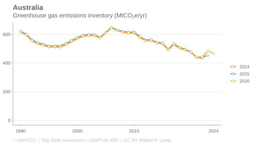
  <a target='_blank' href='https://raw.githubusercontent.com/lambwf/Tidy-GHG-Inventories/main/plots/countries/versions/Australia-versions.xlsx'>data</a> | <a target='_blank' href='https://raw.githubusercontent.com/lambwf/Tidy-GHG-Inventories/main/plots/countries/versions/Australia-versions.png'>png</a> | <a target='_blank' href='https://raw.githubusercontent.com/lambwf/Tidy-GHG-Inventories/main/plots/countries/versions/Australia-versions.pdf'>pdf</a> | <a target='_blank' href='https://raw.githubusercontent.com/lambwf/Tidy-GHG-Inventories/main/plots/countries/versions/Australia-versions.svg'>svg</a>

- 
  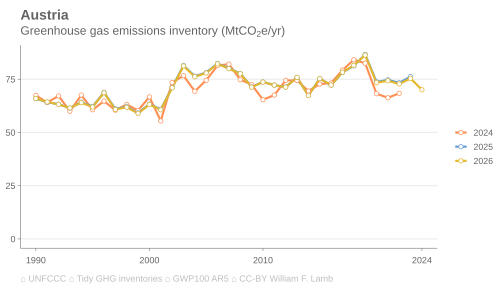
  <a target='_blank' href='https://raw.githubusercontent.com/lambwf/Tidy-GHG-Inventories/main/plots/countries/versions/Austria-versions.xlsx'>data</a> | <a target='_blank' href='https://raw.githubusercontent.com/lambwf/Tidy-GHG-Inventories/main/plots/countries/versions/Austria-versions.png'>png</a> | <a target='_blank' href='https://raw.githubusercontent.com/lambwf/Tidy-GHG-Inventories/main/plots/countries/versions/Austria-versions.pdf'>pdf</a> | <a target='_blank' href='https://raw.githubusercontent.com/lambwf/Tidy-GHG-Inventories/main/plots/countries/versions/Austria-versions.svg'>svg</a>

- 
  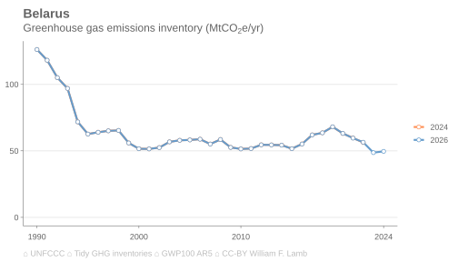
  <a target='_blank' href='https://raw.githubusercontent.com/lambwf/Tidy-GHG-Inventories/main/plots/countries/versions/Belarus-versions.xlsx'>data</a> | <a target='_blank' href='https://raw.githubusercontent.com/lambwf/Tidy-GHG-Inventories/main/plots/countries/versions/Belarus-versions.png'>png</a> | <a target='_blank' href='https://raw.githubusercontent.com/lambwf/Tidy-GHG-Inventories/main/plots/countries/versions/Belarus-versions.pdf'>pdf</a> | <a target='_blank' href='https://raw.githubusercontent.com/lambwf/Tidy-GHG-Inventories/main/plots/countries/versions/Belarus-versions.svg'>svg</a>

- 
  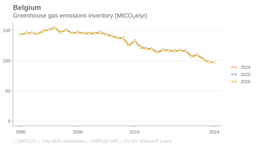
  <a target='_blank' href='https://raw.githubusercontent.com/lambwf/Tidy-GHG-Inventories/main/plots/countries/versions/Belgium-versions.xlsx'>data</a> | <a target='_blank' href='https://raw.githubusercontent.com/lambwf/Tidy-GHG-Inventories/main/plots/countries/versions/Belgium-versions.png'>png</a> | <a target='_blank' href='https://raw.githubusercontent.com/lambwf/Tidy-GHG-Inventories/main/plots/countries/versions/Belgium-versions.pdf'>pdf</a> | <a target='_blank' href='https://raw.githubusercontent.com/lambwf/Tidy-GHG-Inventories/main/plots/countries/versions/Belgium-versions.svg'>svg</a>

- 
  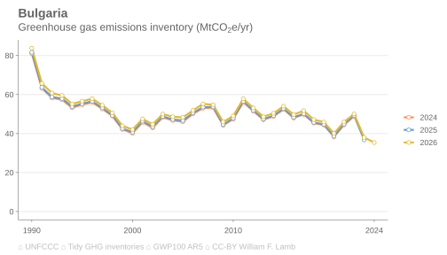
  <a target='_blank' href='https://raw.githubusercontent.com/lambwf/Tidy-GHG-Inventories/main/plots/countries/versions/Bulgaria-versions.xlsx'>data</a> | <a target='_blank' href='https://raw.githubusercontent.com/lambwf/Tidy-GHG-Inventories/main/plots/countries/versions/Bulgaria-versions.png'>png</a> | <a target='_blank' href='https://raw.githubusercontent.com/lambwf/Tidy-GHG-Inventories/main/plots/countries/versions/Bulgaria-versions.pdf'>pdf</a> | <a target='_blank' href='https://raw.githubusercontent.com/lambwf/Tidy-GHG-Inventories/main/plots/countries/versions/Bulgaria-versions.svg'>svg</a>

- 
  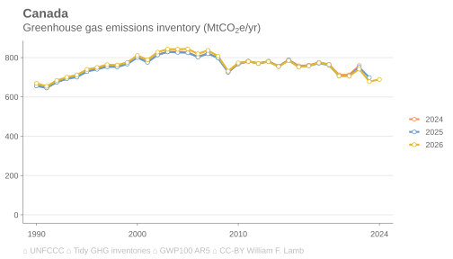
  <a target='_blank' href='https://raw.githubusercontent.com/lambwf/Tidy-GHG-Inventories/main/plots/countries/versions/Canada-versions.xlsx'>data</a> | <a target='_blank' href='https://raw.githubusercontent.com/lambwf/Tidy-GHG-Inventories/main/plots/countries/versions/Canada-versions.png'>png</a> | <a target='_blank' href='https://raw.githubusercontent.com/lambwf/Tidy-GHG-Inventories/main/plots/countries/versions/Canada-versions.pdf'>pdf</a> | <a target='_blank' href='https://raw.githubusercontent.com/lambwf/Tidy-GHG-Inventories/main/plots/countries/versions/Canada-versions.svg'>svg</a>

- 
  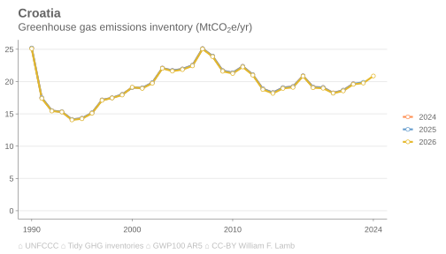
  <a target='_blank' href='https://raw.githubusercontent.com/lambwf/Tidy-GHG-Inventories/main/plots/countries/versions/Croatia-versions.xlsx'>data</a> | <a target='_blank' href='https://raw.githubusercontent.com/lambwf/Tidy-GHG-Inventories/main/plots/countries/versions/Croatia-versions.png'>png</a> | <a target='_blank' href='https://raw.githubusercontent.com/lambwf/Tidy-GHG-Inventories/main/plots/countries/versions/Croatia-versions.pdf'>pdf</a> | <a target='_blank' href='https://raw.githubusercontent.com/lambwf/Tidy-GHG-Inventories/main/plots/countries/versions/Croatia-versions.svg'>svg</a>

- 
  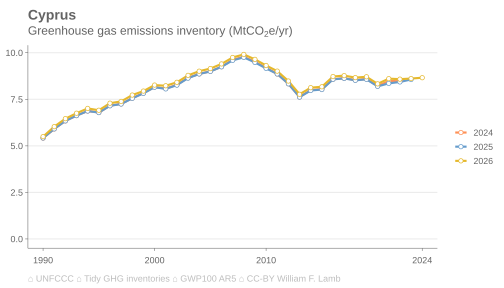
  <a target='_blank' href='https://raw.githubusercontent.com/lambwf/Tidy-GHG-Inventories/main/plots/countries/versions/Cyprus-versions.xlsx'>data</a> | <a target='_blank' href='https://raw.githubusercontent.com/lambwf/Tidy-GHG-Inventories/main/plots/countries/versions/Cyprus-versions.png'>png</a> | <a target='_blank' href='https://raw.githubusercontent.com/lambwf/Tidy-GHG-Inventories/main/plots/countries/versions/Cyprus-versions.pdf'>pdf</a> | <a target='_blank' href='https://raw.githubusercontent.com/lambwf/Tidy-GHG-Inventories/main/plots/countries/versions/Cyprus-versions.svg'>svg</a>

- 
  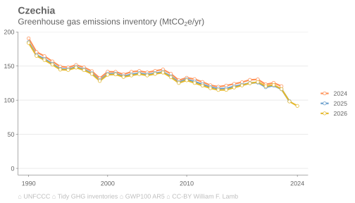
  <a target='_blank' href='https://raw.githubusercontent.com/lambwf/Tidy-GHG-Inventories/main/plots/countries/versions/Czechia-versions.xlsx'>data</a> | <a target='_blank' href='https://raw.githubusercontent.com/lambwf/Tidy-GHG-Inventories/main/plots/countries/versions/Czechia-versions.png'>png</a> | <a target='_blank' href='https://raw.githubusercontent.com/lambwf/Tidy-GHG-Inventories/main/plots/countries/versions/Czechia-versions.pdf'>pdf</a> | <a target='_blank' href='https://raw.githubusercontent.com/lambwf/Tidy-GHG-Inventories/main/plots/countries/versions/Czechia-versions.svg'>svg</a>

- 
  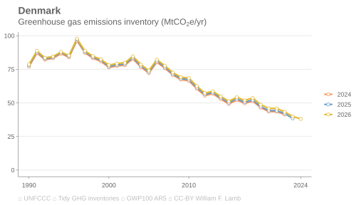
  <a target='_blank' href='https://raw.githubusercontent.com/lambwf/Tidy-GHG-Inventories/main/plots/countries/versions/Denmark-versions.xlsx'>data</a> | <a target='_blank' href='https://raw.githubusercontent.com/lambwf/Tidy-GHG-Inventories/main/plots/countries/versions/Denmark-versions.png'>png</a> | <a target='_blank' href='https://raw.githubusercontent.com/lambwf/Tidy-GHG-Inventories/main/plots/countries/versions/Denmark-versions.pdf'>pdf</a> | <a target='_blank' href='https://raw.githubusercontent.com/lambwf/Tidy-GHG-Inventories/main/plots/countries/versions/Denmark-versions.svg'>svg</a>

- 
  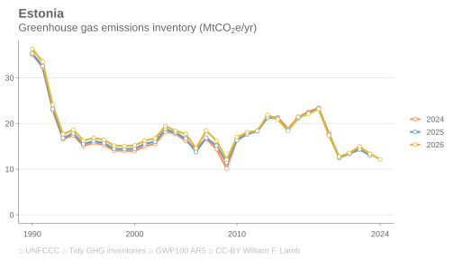
  <a target='_blank' href='https://raw.githubusercontent.com/lambwf/Tidy-GHG-Inventories/main/plots/countries/versions/Estonia-versions.xlsx'>data</a> | <a target='_blank' href='https://raw.githubusercontent.com/lambwf/Tidy-GHG-Inventories/main/plots/countries/versions/Estonia-versions.png'>png</a> | <a target='_blank' href='https://raw.githubusercontent.com/lambwf/Tidy-GHG-Inventories/main/plots/countries/versions/Estonia-versions.pdf'>pdf</a> | <a target='_blank' href='https://raw.githubusercontent.com/lambwf/Tidy-GHG-Inventories/main/plots/countries/versions/Estonia-versions.svg'>svg</a>

- 
  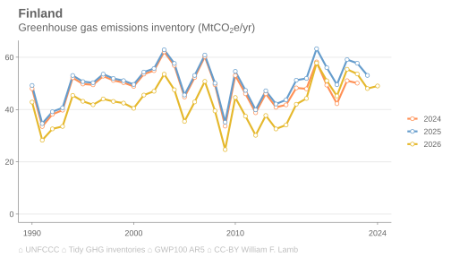
  <a target='_blank' href='https://raw.githubusercontent.com/lambwf/Tidy-GHG-Inventories/main/plots/countries/versions/Finland-versions.xlsx'>data</a> | <a target='_blank' href='https://raw.githubusercontent.com/lambwf/Tidy-GHG-Inventories/main/plots/countries/versions/Finland-versions.png'>png</a> | <a target='_blank' href='https://raw.githubusercontent.com/lambwf/Tidy-GHG-Inventories/main/plots/countries/versions/Finland-versions.pdf'>pdf</a> | <a target='_blank' href='https://raw.githubusercontent.com/lambwf/Tidy-GHG-Inventories/main/plots/countries/versions/Finland-versions.svg'>svg</a>

- 
  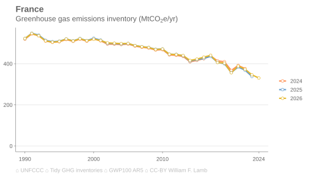
  <a target='_blank' href='https://raw.githubusercontent.com/lambwf/Tidy-GHG-Inventories/main/plots/countries/versions/France-versions.xlsx'>data</a> | <a target='_blank' href='https://raw.githubusercontent.com/lambwf/Tidy-GHG-Inventories/main/plots/countries/versions/France-versions.png'>png</a> | <a target='_blank' href='https://raw.githubusercontent.com/lambwf/Tidy-GHG-Inventories/main/plots/countries/versions/France-versions.pdf'>pdf</a> | <a target='_blank' href='https://raw.githubusercontent.com/lambwf/Tidy-GHG-Inventories/main/plots/countries/versions/France-versions.svg'>svg</a>

- 
  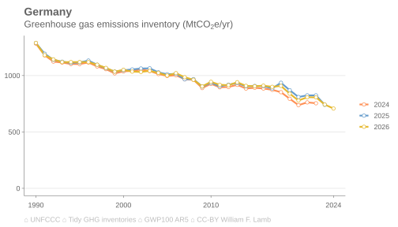
  <a target='_blank' href='https://raw.githubusercontent.com/lambwf/Tidy-GHG-Inventories/main/plots/countries/versions/Germany-versions.xlsx'>data</a> | <a target='_blank' href='https://raw.githubusercontent.com/lambwf/Tidy-GHG-Inventories/main/plots/countries/versions/Germany-versions.png'>png</a> | <a target='_blank' href='https://raw.githubusercontent.com/lambwf/Tidy-GHG-Inventories/main/plots/countries/versions/Germany-versions.pdf'>pdf</a> | <a target='_blank' href='https://raw.githubusercontent.com/lambwf/Tidy-GHG-Inventories/main/plots/countries/versions/Germany-versions.svg'>svg</a>

- 
  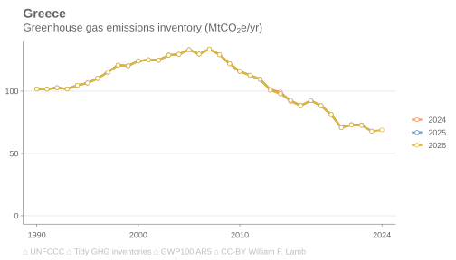
  <a target='_blank' href='https://raw.githubusercontent.com/lambwf/Tidy-GHG-Inventories/main/plots/countries/versions/Greece-versions.xlsx'>data</a> | <a target='_blank' href='https://raw.githubusercontent.com/lambwf/Tidy-GHG-Inventories/main/plots/countries/versions/Greece-versions.png'>png</a> | <a target='_blank' href='https://raw.githubusercontent.com/lambwf/Tidy-GHG-Inventories/main/plots/countries/versions/Greece-versions.pdf'>pdf</a> | <a target='_blank' href='https://raw.githubusercontent.com/lambwf/Tidy-GHG-Inventories/main/plots/countries/versions/Greece-versions.svg'>svg</a>

- 
  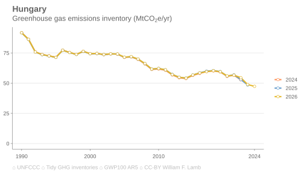
  <a target='_blank' href='https://raw.githubusercontent.com/lambwf/Tidy-GHG-Inventories/main/plots/countries/versions/Hungary-versions.xlsx'>data</a> | <a target='_blank' href='https://raw.githubusercontent.com/lambwf/Tidy-GHG-Inventories/main/plots/countries/versions/Hungary-versions.png'>png</a> | <a target='_blank' href='https://raw.githubusercontent.com/lambwf/Tidy-GHG-Inventories/main/plots/countries/versions/Hungary-versions.pdf'>pdf</a> | <a target='_blank' href='https://raw.githubusercontent.com/lambwf/Tidy-GHG-Inventories/main/plots/countries/versions/Hungary-versions.svg'>svg</a>

- 
  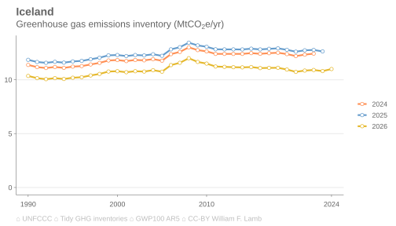
  <a target='_blank' href='https://raw.githubusercontent.com/lambwf/Tidy-GHG-Inventories/main/plots/countries/versions/Iceland-versions.xlsx'>data</a> | <a target='_blank' href='https://raw.githubusercontent.com/lambwf/Tidy-GHG-Inventories/main/plots/countries/versions/Iceland-versions.png'>png</a> | <a target='_blank' href='https://raw.githubusercontent.com/lambwf/Tidy-GHG-Inventories/main/plots/countries/versions/Iceland-versions.pdf'>pdf</a> | <a target='_blank' href='https://raw.githubusercontent.com/lambwf/Tidy-GHG-Inventories/main/plots/countries/versions/Iceland-versions.svg'>svg</a>

- 
  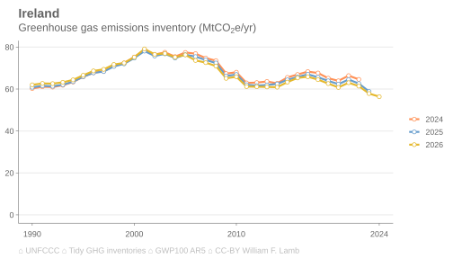
  <a target='_blank' href='https://raw.githubusercontent.com/lambwf/Tidy-GHG-Inventories/main/plots/countries/versions/Ireland-versions.xlsx'>data</a> | <a target='_blank' href='https://raw.githubusercontent.com/lambwf/Tidy-GHG-Inventories/main/plots/countries/versions/Ireland-versions.png'>png</a> | <a target='_blank' href='https://raw.githubusercontent.com/lambwf/Tidy-GHG-Inventories/main/plots/countries/versions/Ireland-versions.pdf'>pdf</a> | <a target='_blank' href='https://raw.githubusercontent.com/lambwf/Tidy-GHG-Inventories/main/plots/countries/versions/Ireland-versions.svg'>svg</a>

- 
  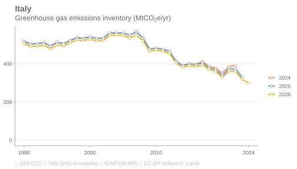
  <a target='_blank' href='https://raw.githubusercontent.com/lambwf/Tidy-GHG-Inventories/main/plots/countries/versions/Italy-versions.xlsx'>data</a> | <a target='_blank' href='https://raw.githubusercontent.com/lambwf/Tidy-GHG-Inventories/main/plots/countries/versions/Italy-versions.png'>png</a> | <a target='_blank' href='https://raw.githubusercontent.com/lambwf/Tidy-GHG-Inventories/main/plots/countries/versions/Italy-versions.pdf'>pdf</a> | <a target='_blank' href='https://raw.githubusercontent.com/lambwf/Tidy-GHG-Inventories/main/plots/countries/versions/Italy-versions.svg'>svg</a>

- 
  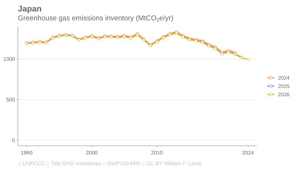
  <a target='_blank' href='https://raw.githubusercontent.com/lambwf/Tidy-GHG-Inventories/main/plots/countries/versions/Japan-versions.xlsx'>data</a> | <a target='_blank' href='https://raw.githubusercontent.com/lambwf/Tidy-GHG-Inventories/main/plots/countries/versions/Japan-versions.png'>png</a> | <a target='_blank' href='https://raw.githubusercontent.com/lambwf/Tidy-GHG-Inventories/main/plots/countries/versions/Japan-versions.pdf'>pdf</a> | <a target='_blank' href='https://raw.githubusercontent.com/lambwf/Tidy-GHG-Inventories/main/plots/countries/versions/Japan-versions.svg'>svg</a>

- 
  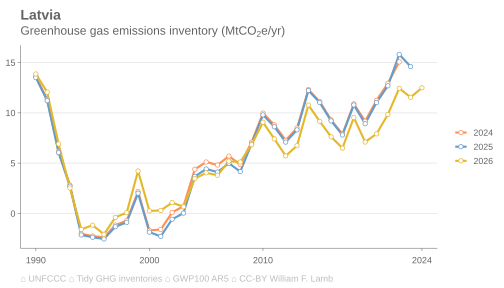
  <a target='_blank' href='https://raw.githubusercontent.com/lambwf/Tidy-GHG-Inventories/main/plots/countries/versions/Latvia-versions.xlsx'>data</a> | <a target='_blank' href='https://raw.githubusercontent.com/lambwf/Tidy-GHG-Inventories/main/plots/countries/versions/Latvia-versions.png'>png</a> | <a target='_blank' href='https://raw.githubusercontent.com/lambwf/Tidy-GHG-Inventories/main/plots/countries/versions/Latvia-versions.pdf'>pdf</a> | <a target='_blank' href='https://raw.githubusercontent.com/lambwf/Tidy-GHG-Inventories/main/plots/countries/versions/Latvia-versions.svg'>svg</a>

- 
  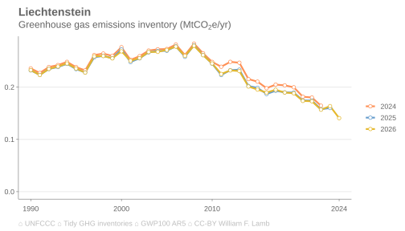
  <a target='_blank' href='https://raw.githubusercontent.com/lambwf/Tidy-GHG-Inventories/main/plots/countries/versions/Liechtenstein-versions.xlsx'>data</a> | <a target='_blank' href='https://raw.githubusercontent.com/lambwf/Tidy-GHG-Inventories/main/plots/countries/versions/Liechtenstein-versions.png'>png</a> | <a target='_blank' href='https://raw.githubusercontent.com/lambwf/Tidy-GHG-Inventories/main/plots/countries/versions/Liechtenstein-versions.pdf'>pdf</a> | <a target='_blank' href='https://raw.githubusercontent.com/lambwf/Tidy-GHG-Inventories/main/plots/countries/versions/Liechtenstein-versions.svg'>svg</a>

- 
  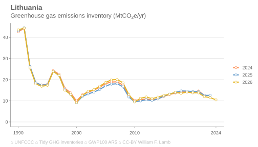
  <a target='_blank' href='https://raw.githubusercontent.com/lambwf/Tidy-GHG-Inventories/main/plots/countries/versions/Lithuania-versions.xlsx'>data</a> | <a target='_blank' href='https://raw.githubusercontent.com/lambwf/Tidy-GHG-Inventories/main/plots/countries/versions/Lithuania-versions.png'>png</a> | <a target='_blank' href='https://raw.githubusercontent.com/lambwf/Tidy-GHG-Inventories/main/plots/countries/versions/Lithuania-versions.pdf'>pdf</a> | <a target='_blank' href='https://raw.githubusercontent.com/lambwf/Tidy-GHG-Inventories/main/plots/countries/versions/Lithuania-versions.svg'>svg</a>

- 
  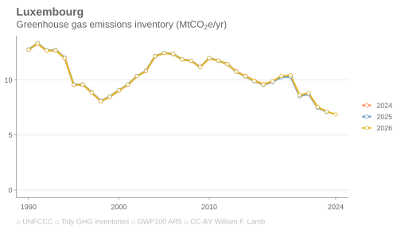
  <a target='_blank' href='https://raw.githubusercontent.com/lambwf/Tidy-GHG-Inventories/main/plots/countries/versions/Luxembourg-versions.xlsx'>data</a> | <a target='_blank' href='https://raw.githubusercontent.com/lambwf/Tidy-GHG-Inventories/main/plots/countries/versions/Luxembourg-versions.png'>png</a> | <a target='_blank' href='https://raw.githubusercontent.com/lambwf/Tidy-GHG-Inventories/main/plots/countries/versions/Luxembourg-versions.pdf'>pdf</a> | <a target='_blank' href='https://raw.githubusercontent.com/lambwf/Tidy-GHG-Inventories/main/plots/countries/versions/Luxembourg-versions.svg'>svg</a>

- 
  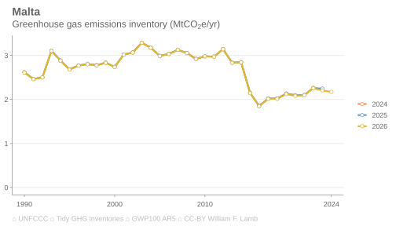
  <a target='_blank' href='https://raw.githubusercontent.com/lambwf/Tidy-GHG-Inventories/main/plots/countries/versions/Malta-versions.xlsx'>data</a> | <a target='_blank' href='https://raw.githubusercontent.com/lambwf/Tidy-GHG-Inventories/main/plots/countries/versions/Malta-versions.png'>png</a> | <a target='_blank' href='https://raw.githubusercontent.com/lambwf/Tidy-GHG-Inventories/main/plots/countries/versions/Malta-versions.pdf'>pdf</a> | <a target='_blank' href='https://raw.githubusercontent.com/lambwf/Tidy-GHG-Inventories/main/plots/countries/versions/Malta-versions.svg'>svg</a>

- 
  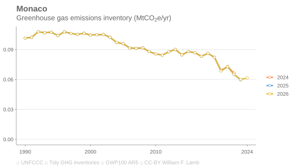
  <a target='_blank' href='https://raw.githubusercontent.com/lambwf/Tidy-GHG-Inventories/main/plots/countries/versions/Monaco-versions.xlsx'>data</a> | <a target='_blank' href='https://raw.githubusercontent.com/lambwf/Tidy-GHG-Inventories/main/plots/countries/versions/Monaco-versions.png'>png</a> | <a target='_blank' href='https://raw.githubusercontent.com/lambwf/Tidy-GHG-Inventories/main/plots/countries/versions/Monaco-versions.pdf'>pdf</a> | <a target='_blank' href='https://raw.githubusercontent.com/lambwf/Tidy-GHG-Inventories/main/plots/countries/versions/Monaco-versions.svg'>svg</a>

- 
  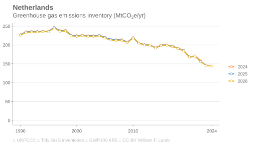
  <a target='_blank' href='https://raw.githubusercontent.com/lambwf/Tidy-GHG-Inventories/main/plots/countries/versions/Netherlands-versions.xlsx'>data</a> | <a target='_blank' href='https://raw.githubusercontent.com/lambwf/Tidy-GHG-Inventories/main/plots/countries/versions/Netherlands-versions.png'>png</a> | <a target='_blank' href='https://raw.githubusercontent.com/lambwf/Tidy-GHG-Inventories/main/plots/countries/versions/Netherlands-versions.pdf'>pdf</a> | <a target='_blank' href='https://raw.githubusercontent.com/lambwf/Tidy-GHG-Inventories/main/plots/countries/versions/Netherlands-versions.svg'>svg</a>

- 
  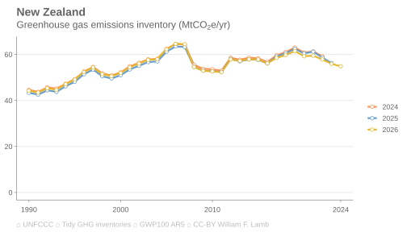
  <a target='_blank' href='https://raw.githubusercontent.com/lambwf/Tidy-GHG-Inventories/main/plots/countries/versions/New Zealand-versions.xlsx'>data</a> | <a target='_blank' href='https://raw.githubusercontent.com/lambwf/Tidy-GHG-Inventories/main/plots/countries/versions/New Zealand-versions.png'>png</a> | <a target='_blank' href='https://raw.githubusercontent.com/lambwf/Tidy-GHG-Inventories/main/plots/countries/versions/New Zealand-versions.pdf'>pdf</a> | <a target='_blank' href='https://raw.githubusercontent.com/lambwf/Tidy-GHG-Inventories/main/plots/countries/versions/New Zealand-versions.svg'>svg</a>

- 
  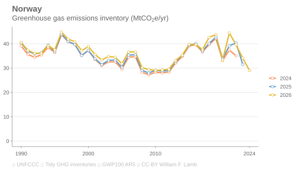
  <a target='_blank' href='https://raw.githubusercontent.com/lambwf/Tidy-GHG-Inventories/main/plots/countries/versions/Norway-versions.xlsx'>data</a> | <a target='_blank' href='https://raw.githubusercontent.com/lambwf/Tidy-GHG-Inventories/main/plots/countries/versions/Norway-versions.png'>png</a> | <a target='_blank' href='https://raw.githubusercontent.com/lambwf/Tidy-GHG-Inventories/main/plots/countries/versions/Norway-versions.pdf'>pdf</a> | <a target='_blank' href='https://raw.githubusercontent.com/lambwf/Tidy-GHG-Inventories/main/plots/countries/versions/Norway-versions.svg'>svg</a>

- 
  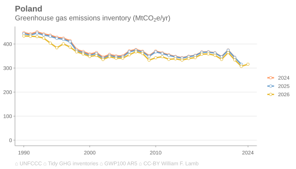
  <a target='_blank' href='https://raw.githubusercontent.com/lambwf/Tidy-GHG-Inventories/main/plots/countries/versions/Poland-versions.xlsx'>data</a> | <a target='_blank' href='https://raw.githubusercontent.com/lambwf/Tidy-GHG-Inventories/main/plots/countries/versions/Poland-versions.png'>png</a> | <a target='_blank' href='https://raw.githubusercontent.com/lambwf/Tidy-GHG-Inventories/main/plots/countries/versions/Poland-versions.pdf'>pdf</a> | <a target='_blank' href='https://raw.githubusercontent.com/lambwf/Tidy-GHG-Inventories/main/plots/countries/versions/Poland-versions.svg'>svg</a>

- 
  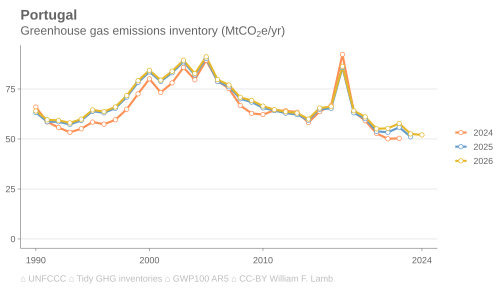
  <a target='_blank' href='https://raw.githubusercontent.com/lambwf/Tidy-GHG-Inventories/main/plots/countries/versions/Portugal-versions.xlsx'>data</a> | <a target='_blank' href='https://raw.githubusercontent.com/lambwf/Tidy-GHG-Inventories/main/plots/countries/versions/Portugal-versions.png'>png</a> | <a target='_blank' href='https://raw.githubusercontent.com/lambwf/Tidy-GHG-Inventories/main/plots/countries/versions/Portugal-versions.pdf'>pdf</a> | <a target='_blank' href='https://raw.githubusercontent.com/lambwf/Tidy-GHG-Inventories/main/plots/countries/versions/Portugal-versions.svg'>svg</a>

- 
  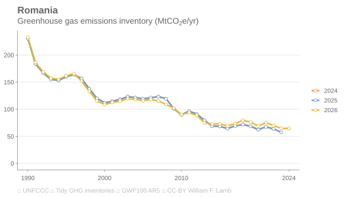
  <a target='_blank' href='https://raw.githubusercontent.com/lambwf/Tidy-GHG-Inventories/main/plots/countries/versions/Romania-versions.xlsx'>data</a> | <a target='_blank' href='https://raw.githubusercontent.com/lambwf/Tidy-GHG-Inventories/main/plots/countries/versions/Romania-versions.png'>png</a> | <a target='_blank' href='https://raw.githubusercontent.com/lambwf/Tidy-GHG-Inventories/main/plots/countries/versions/Romania-versions.pdf'>pdf</a> | <a target='_blank' href='https://raw.githubusercontent.com/lambwf/Tidy-GHG-Inventories/main/plots/countries/versions/Romania-versions.svg'>svg</a>

- 
  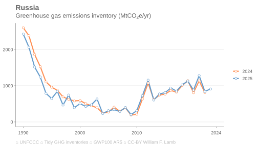
  <a target='_blank' href='https://raw.githubusercontent.com/lambwf/Tidy-GHG-Inventories/main/plots/countries/versions/Russia-versions.xlsx'>data</a> | <a target='_blank' href='https://raw.githubusercontent.com/lambwf/Tidy-GHG-Inventories/main/plots/countries/versions/Russia-versions.png'>png</a> | <a target='_blank' href='https://raw.githubusercontent.com/lambwf/Tidy-GHG-Inventories/main/plots/countries/versions/Russia-versions.pdf'>pdf</a> | <a target='_blank' href='https://raw.githubusercontent.com/lambwf/Tidy-GHG-Inventories/main/plots/countries/versions/Russia-versions.svg'>svg</a>

- 
  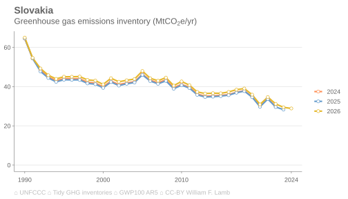
  <a target='_blank' href='https://raw.githubusercontent.com/lambwf/Tidy-GHG-Inventories/main/plots/countries/versions/Slovakia-versions.xlsx'>data</a> | <a target='_blank' href='https://raw.githubusercontent.com/lambwf/Tidy-GHG-Inventories/main/plots/countries/versions/Slovakia-versions.png'>png</a> | <a target='_blank' href='https://raw.githubusercontent.com/lambwf/Tidy-GHG-Inventories/main/plots/countries/versions/Slovakia-versions.pdf'>pdf</a> | <a target='_blank' href='https://raw.githubusercontent.com/lambwf/Tidy-GHG-Inventories/main/plots/countries/versions/Slovakia-versions.svg'>svg</a>

- 
  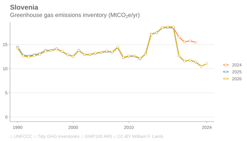
  <a target='_blank' href='https://raw.githubusercontent.com/lambwf/Tidy-GHG-Inventories/main/plots/countries/versions/Slovenia-versions.xlsx'>data</a> | <a target='_blank' href='https://raw.githubusercontent.com/lambwf/Tidy-GHG-Inventories/main/plots/countries/versions/Slovenia-versions.png'>png</a> | <a target='_blank' href='https://raw.githubusercontent.com/lambwf/Tidy-GHG-Inventories/main/plots/countries/versions/Slovenia-versions.pdf'>pdf</a> | <a target='_blank' href='https://raw.githubusercontent.com/lambwf/Tidy-GHG-Inventories/main/plots/countries/versions/Slovenia-versions.svg'>svg</a>

- 
  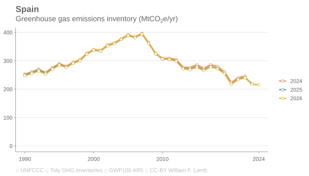
  <a target='_blank' href='https://raw.githubusercontent.com/lambwf/Tidy-GHG-Inventories/main/plots/countries/versions/Spain-versions.xlsx'>data</a> | <a target='_blank' href='https://raw.githubusercontent.com/lambwf/Tidy-GHG-Inventories/main/plots/countries/versions/Spain-versions.png'>png</a> | <a target='_blank' href='https://raw.githubusercontent.com/lambwf/Tidy-GHG-Inventories/main/plots/countries/versions/Spain-versions.pdf'>pdf</a> | <a target='_blank' href='https://raw.githubusercontent.com/lambwf/Tidy-GHG-Inventories/main/plots/countries/versions/Spain-versions.svg'>svg</a>

- 
  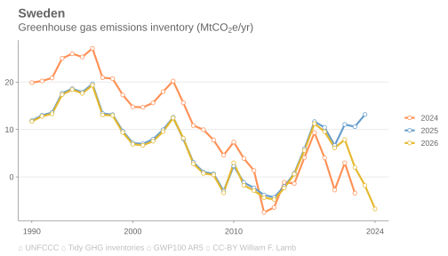
  <a target='_blank' href='https://raw.githubusercontent.com/lambwf/Tidy-GHG-Inventories/main/plots/countries/versions/Sweden-versions.xlsx'>data</a> | <a target='_blank' href='https://raw.githubusercontent.com/lambwf/Tidy-GHG-Inventories/main/plots/countries/versions/Sweden-versions.png'>png</a> | <a target='_blank' href='https://raw.githubusercontent.com/lambwf/Tidy-GHG-Inventories/main/plots/countries/versions/Sweden-versions.pdf'>pdf</a> | <a target='_blank' href='https://raw.githubusercontent.com/lambwf/Tidy-GHG-Inventories/main/plots/countries/versions/Sweden-versions.svg'>svg</a>

- 
  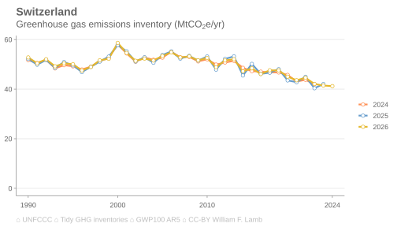
  <a target='_blank' href='https://raw.githubusercontent.com/lambwf/Tidy-GHG-Inventories/main/plots/countries/versions/Switzerland-versions.xlsx'>data</a> | <a target='_blank' href='https://raw.githubusercontent.com/lambwf/Tidy-GHG-Inventories/main/plots/countries/versions/Switzerland-versions.png'>png</a> | <a target='_blank' href='https://raw.githubusercontent.com/lambwf/Tidy-GHG-Inventories/main/plots/countries/versions/Switzerland-versions.pdf'>pdf</a> | <a target='_blank' href='https://raw.githubusercontent.com/lambwf/Tidy-GHG-Inventories/main/plots/countries/versions/Switzerland-versions.svg'>svg</a>

- 
  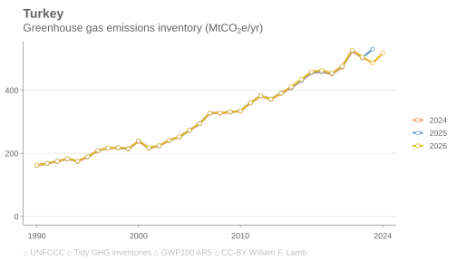
  <a target='_blank' href='https://raw.githubusercontent.com/lambwf/Tidy-GHG-Inventories/main/plots/countries/versions/Turkey-versions.xlsx'>data</a> | <a target='_blank' href='https://raw.githubusercontent.com/lambwf/Tidy-GHG-Inventories/main/plots/countries/versions/Turkey-versions.png'>png</a> | <a target='_blank' href='https://raw.githubusercontent.com/lambwf/Tidy-GHG-Inventories/main/plots/countries/versions/Turkey-versions.pdf'>pdf</a> | <a target='_blank' href='https://raw.githubusercontent.com/lambwf/Tidy-GHG-Inventories/main/plots/countries/versions/Turkey-versions.svg'>svg</a>

- 
  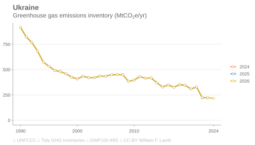
  <a target='_blank' href='https://raw.githubusercontent.com/lambwf/Tidy-GHG-Inventories/main/plots/countries/versions/Ukraine-versions.xlsx'>data</a> | <a target='_blank' href='https://raw.githubusercontent.com/lambwf/Tidy-GHG-Inventories/main/plots/countries/versions/Ukraine-versions.png'>png</a> | <a target='_blank' href='https://raw.githubusercontent.com/lambwf/Tidy-GHG-Inventories/main/plots/countries/versions/Ukraine-versions.pdf'>pdf</a> | <a target='_blank' href='https://raw.githubusercontent.com/lambwf/Tidy-GHG-Inventories/main/plots/countries/versions/Ukraine-versions.svg'>svg</a>

- 
  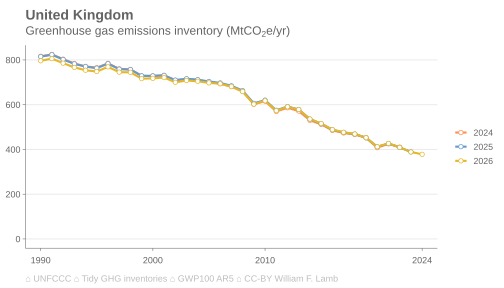
  <a target='_blank' href='https://raw.githubusercontent.com/lambwf/Tidy-GHG-Inventories/main/plots/countries/versions/United Kingdom-versions.xlsx'>data</a> | <a target='_blank' href='https://raw.githubusercontent.com/lambwf/Tidy-GHG-Inventories/main/plots/countries/versions/United Kingdom-versions.png'>png</a> | <a target='_blank' href='https://raw.githubusercontent.com/lambwf/Tidy-GHG-Inventories/main/plots/countries/versions/United Kingdom-versions.pdf'>pdf</a> | <a target='_blank' href='https://raw.githubusercontent.com/lambwf/Tidy-GHG-Inventories/main/plots/countries/versions/United Kingdom-versions.svg'>svg</a>

